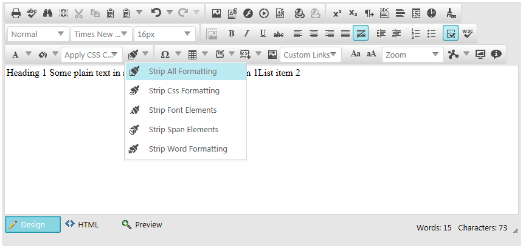

# Strip Formatting Tools


This article provides information about the built-in **Format Stripper** dropdown,	and the Strip Formatting tools exposed inside.

## 

The **Strip Formatting** tools enable the end-user to strip the formatting from existing content.The built-in **Format Stripper** dropdown exposes a list of **Strip Formatting** tools for the user tochoose from (**Figure 1**). The following list specifies each tool’s purpose:

* **Strip All Formatting**—removes all styles and formatting applied to the content (i.e., transforms it to plain text).

* **Strip Css Formatting**—removes all inline CSS rules (i.e., the style attribute).

* **Strip Font Elements**—strips all <font< tags from the HTML content.

* **Strip Span Elements**—strips all <span< tags from the HTML content.

* **Strip Word Formatting**—cleans the HTML content from unnecessary XML tags and comments inserted by[pasting MS Word content]().
>caption Figure 1: Plain HTML content, later (in Figure 2) stripped to plain text.


>caption Figure 2: Transforming HTML content to plain text via Strip All Formatting tool.



## Adding Format Stripper Tool to a Custom Tool-set

In a custom collection of tools, the build-in **Format Stripper** dropdowncan be added by [adding a plain tool]() with a name set to	**FormatStripper** (**Example 1**).

**Example 1**: Adding the PasteStrip dropdown to a tools collection.


````ASPNET
			<telerik:RadEditor runat="server" ID="RadEditor1">
				<telerik:EditorToolGroup>
					<telerik:EditorTool Name="FormatStripper" />
				</telerik:EditorToolGroup>
			</telerik:RadEditor>
````
````XML
			<root>
			  <tools>
				<tool name="FormatStripper" />
			  </tools>
			</root>
````


Optionally, you can further enable stand-alone **Strip Formatting** tools in a toolbar or fine tune the collectioninside the **PasteStrip** dropdown (**Example 2**).
>caption Figure 2: The result of the tools collection configuration in Example 2.


**Example 2**: Defining stand-alone Strip Formatting tools in a toolbar and a custom set of tools in the PasteStrip dropdown.


````ASPNET
			<telerik:RadEditor runat="server" ID="RadEditor1" Skin="Silk" Width="500px" Height="250px">
				<Tools>
					<telerik:EditorToolGroup>
						<telerik:EditorToolStrip Name="FormatStripper">
							<telerik:EditorTool Name="StripAll" />
							<telerik:EditorTool Name="StripCss" />
							<telerik:EditorTool Name="StripWord" />
						</telerik:EditorToolStrip>
					</telerik:EditorToolGroup>
					<telerik:EditorToolGroup>
						<telerik:EditorTool Name="StripSpan" />
						<telerik:EditorTool Name="StripFont" />       
					</telerik:EditorToolGroup>
				</Tools>
			</telerik:RadEditor>
	
````
````XML
			<root>
			  <tools>
				<tool name="FormatStripper" >
				  <tool name="StripAll"/>
				  <tool name="StripCss"/>
				  <tool name="StripWord"/>
				</tool>
			  </tools>
			  <tools>
				  <tool name="StripSpan"/>
				  <tool name="StripFont"/>
			  </tools>
			</root>
	
	
````


# See Also

 * [Overview]()

 * [Add Standard Buttons]()

 * [Remove Toolbar Buttons]()

 * [Using ToolsFile.xml]()
