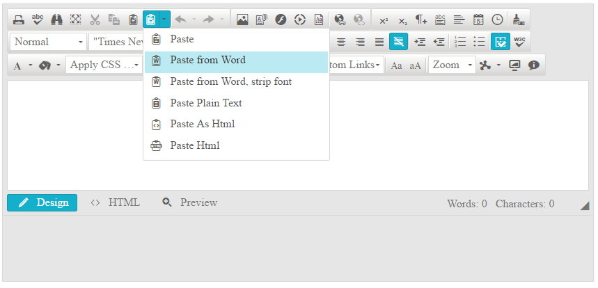
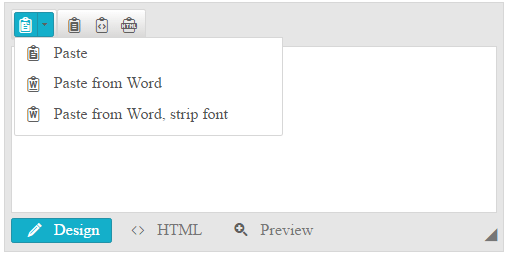

# Strip Pasting Tools

This article provides information about the built-in **Paste Strip** dropdown, and the Paste Strip tools exposed inside.

* [Overview](#overview)

* [Adding the Paste Strip Tool to a Custom Toolset](#adding-paste-strip-tool-to-a-custom-tool-set)

## Overview

The **Paste Strip** tools enable the end user to strip the pasting of the content in the editor. The built-in **Paste Strip** dropdown exposes a list of **Paste Strip** tools for the user to choose from (**Figure 1**). The following list specifies each tool’s purpose:

* **Paste**: Performs a clipboard paste operation.

* **[Paste from Word]()**: Pastes the content and strips unnecessary XML, HTML and comment elements.

* **Paste from Word, strip font**: Performs the same operation as Paste from Word tool and additionally removes any font-related formatting (e.g., font size, color, etc.).

* **Paste Plain Text**: Pastes the copied data as plain text, HTML tags are stripped down, and all styles are removed.

* **Paste as Html*: Pastes the copied content as HTML markup.

* **Paste Html**: Enables the user to either type or paste HTML markup and insert it into the content. This tool opens a dialog for the content to be pasted.

>caption Figure 1: Paste from Word via the Paste Strip tool.



## Adding Paste Strip Tool to a Custom Toolset

In a custom collection of tools, the build-in **Paste Strip** dropdown can be added by [adding a plain tool]() with a name set to **PasteStrip** (**Example 1**).

>caption Example 1: Adding the PasteStrip dropdown to a tools collection.

````ASP.NET
//Defining PasteStrip with Tools collection:
<telerik:RadEditor RenderMode="Lightweight" runat="server" ID="RadEditor1">
	<Tools>
		<telerik:EditorToolGroup>
			<telerik:EditorTool Name="PasteStrip" />
		</telerik:EditorToolGroup>
	</Tools>
</telerik:RadEditor>
//Defining PasteStrip with ToolsFile property:
<telerik:RadEditor RenderMode="Lightweight" runat="server" ID="RadEditor2" ToolsFile="Tools.xml">
</telerik:RadEditor>
````
````XML
<!--Tools.xml-->
<root>
  <tools>
	<tool name="PasteStrip" />
  </tools>
</root>
````

Optionally, you can further enable stand-alone **Paste Strip** tools in a toolbar or fine tune the collection inside the **Paste Strip** dropdown (**Example 2**).

>caption Figure 2: The result of the tools collection configuration in Example 2.



>caption Example 2: Defining stand-alone Paste Strip tools in a toolbar and a custom set of tools in the PasteStrip dropdown.

````ASP.NET
//Defining PasteStrip with Tools collection:
<telerik:RadEditor RenderMode="Lightweight" runat="server" ID="RadEditor1" Skin="Silk" Width="500px" Height="250px">
	<Tools>
		<telerik:EditorToolGroup>
			<telerik:EditorToolStrip Name="PasteStrip">
				<telerik:EditorTool Name="Paste" />
				<telerik:EditorTool Name="PasteFromWord" />
				<telerik:EditorTool Name="PasteFromWordNoFontsNoSizes" />
			</telerik:EditorToolStrip>
		</telerik:EditorToolGroup>
		<telerik:EditorToolGroup>
			<telerik:EditorTool Name="PastePlainText" />
			<telerik:EditorTool Name="PasteAsHtml" />
			<telerik:EditorTool Name="PasteHtml" />
		</telerik:EditorToolGroup>
	</Tools>
</telerik:RadEditor>
//Defining PasteStrip with ToolsFile property:
<telerik:RadEditor RenderMode="Lightweight" runat="server" ID="RadEditor2" Skin="Silk" Width="500px" Height="250px" ToolsFile="Tools.xml">
</telerik:RadEditor>
````
````XML
<!--Tools.xml-->
<root>
  <tools>
	<tool name="PasteStrip" >
	<tool name="Paste"/>
	<tool name="PasteFromWord"/>
	<tool name="PasteFromWordNoFontsNoSizes"/>
	</tool>
  </tools>
  <tools>
	<tool name="PastePlainText"/>
	<tool name="PasteAsHtml"/>
	<tool name="PasteHtml"/>
  </tools>
</root>	
````

## See Also

 * [Overview]()
 
 * [Paste from Word]()

 * [Add Standard Buttons]()

 * [Remove Toolbar Buttons]()

 * [Using ToolsFile.xml]()
