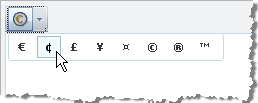
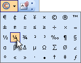
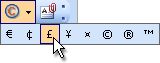

# Symbols


The RadEditor Symbols dropdown by default displays a predefined set of symbols. They are kept in the *Symbols* Collection. You can add to the Symbols collection declaratively, programmatically and using the ToolsFile.
>caption 



## Using the Symbols Collection Declaratively

````ASPNET
	<telerik:RadEditor runat="server" ID="RadEditor1" Skin="WebBlue">
	   <Symbols>
	       <telerik:EditorSymbol Char="\u20AC" />
	       <telerik:EditorSymbol Char="\u00A2" />
	       <telerik:EditorSymbol Char="\u00A3" />
	       <telerik:EditorSymbol Char="\u00A5" />
	       <telerik:EditorSymbol Char="\u00A9" />
	       <telerik:EditorSymbol Char="\u00AE" />
	   </Symbols>
	</telerik:RadEditor> 
````


## Using Symbols Programmatically

Use the RealFontSizes collection __Add()__method to include new items in the list. You can add a character using the unicode escape character "\u" plus the number of the character or use the symbol literals directly.

>tabbedCode

````C#
	
	// Use the unicode escape character "\u"
		RadEditor1.Symbols.Add("\u00A2");
		RadEditor1.Symbols.Add("\u00A3");
		RadEditor1.Symbols.Add("\u00A5");
		RadEditor1.Symbols.Add("\u00A4");
		RadEditor1.Symbols.Add("\u00A9");
		RadEditor1.Symbols.Add("\u00AE");
	
	// Use the symbol literals directly
		RadEditor1.Symbols.Add("£"); 
		RadEditor1.Symbols.Add("©"); 
		RadEditor1.Symbols.Add("®");
	          
````
````VB.NET
	
		'Use the unicode escape character "\u"
		RadEditor1.Symbols.Add("\u00A2")
		RadEditor1.Symbols.Add("\u00A3")
		RadEditor1.Symbols.Add("\u00A5")
		RadEditor1.Symbols.Add("\u00A4")
		RadEditor1.Symbols.Add("\u00A9")
		RadEditor1.Symbols.Add("\u00AE")
		'Use the symbol literals directly
		RadEditor1.Symbols.Add("£")
		RadEditor1.Symbols.Add("©")
		RadEditor1.Symbols.Add("®")
	
````
>end

When using the Symbols Collection __Add()__the Symbols dropdown will be reset, so the symbols you add will not be appended to the default set, but will rather create a new Symbol set. See the example below:


>caption  

|  __Default state__  |  __Programmatic population__  |
| ------ | ------ |
|
>caption 

|
>caption 

|
|(The Symbols dropdown contains the default set of symbols)|(The Symbols dropdown contains only those added using the __Add ** __ method)|

## Using the ToolsFile

You can also populate the Symbols dropdown using __ToolsFile.xml__, as shown in the example below:

````XML
	<root>
	 <tools name="MainToolbar" enabled="true">
	   <tool name="InsertSymbol" />
	 </tools>
	 <symbols>
	   <symbol value="\u20AC" />
	   <symbol value="\u00A2" />
	   <symbol value="\u00A3" />
	   <symbol value="\u00A5" />
	   <symbol value="\u00A4" />
	   <symbol value="\u00A9" />
	   <symbol value="\u00AE" />
	   <symbol value="\u2122" />
	 </symbols>
	</root> 
````


Here is a complete list of the symbols populating by default the "Insert Symbols" dropdown:\u20AC, \u00A, \u00A3, \u00A5, \u00A4, \u00A9, \u00AE, \u2122, u00B1, \u2260, \u2248, \u2264, \u2265, \u00F7, \u00D7, \u221E, \u00BD, \u00BC, \u00BE, \u00B2, \u00B3, \u2030, \u00B6, \u00A7, \u03B1, \u03B2, \u03B1, \u002E, \u0394, \u00B5, \u03A9, \u2211, \u00D8, \u2220, \u00BA, u00AB, \u00BB, \u00B7, \u2022, \u2020, \u2021, \u0192

>note Please bear in mind that RadEditor persists its state (including the Symbols set) between postbacks. To create a new set of symbols (e.g. for different users), clear the collection first using the Symbols __Remove()__ or __Clear()__ methods.
>

