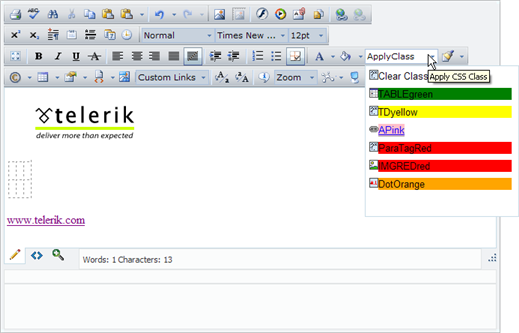

# Using CSS Styles

By default the CSS class dropdown will display all global CSS styles and CSS styles that are directly related to the object - e.g. **a.class** for the Hyperlink Manager. The same holds true for the Table Properties dialog and any other RadEditor dialogs where CSS classes can be applied. The example style markup shown below includes six styles:

````XML
<pre xmlns="http://ddue.schemas.microsoft.com/authoring/2003/5">
	<head>
	   <style>
		  TABLE.TABLEgreen {background-color: green;}
		  td.TDyellow {background-color:yellow;}
		  a.APink {background-color: pink;}
		  p.ParaTagRed {background-color: red;}
		  img.IMGREDred {background-color:red;}
		 .DotOrange{background-color: orange;}
	   </style>
	</head>
</pre>          
````

>tip The styles can also be set via an external stylesheet. For more information see [External CSS Files]().

The screenshots below show that no HTML elements are selected and the CSS class dropdown displays all six styles.



When an image is selected, the styles related to that image and any global styles are shown in the dropdown.


More information about CSS styles - global and specific for an element, can be found in various internet sites. For example - [www.w3c.org](http://www.w3c.org/).
