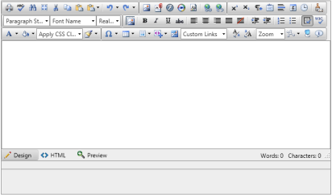
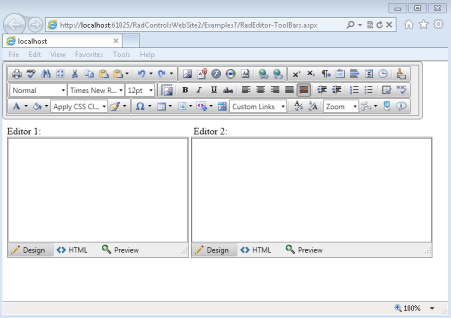
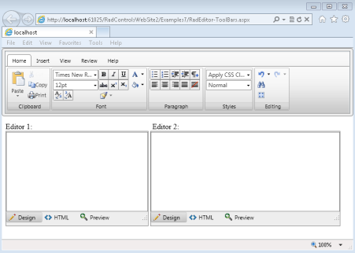
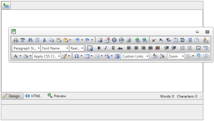

# Modes

RadEditor for ASP.NET AJAX introduces a property named **ToolbarMode**, which specifies the behavior of the toolbar/ribbonbar. Here are the different options for setting the ToolbarMode:


|  **ToolBar** related: |  **RibbonBar** related: |
| ------ | ------ |
| **Default** - the toolbar is static and positioned over the	content area| **RibbonBar** - the ribbonbar is static and positioned over the	content area |
| **PageTop** - in this mode, when a particular editor gets the	focus its toolbar will appear docked at the top of the page | **RibbonBarPageTop** - in this mode, when a particular editor gets the	focus its ribbonbar will appear docked at the top of the page|
| **ShowOnFocus** - here the toolbar will appear	right above the editor when it gets focus| **RibbonBarShowOnFocus** - here the ribbonbar will appear	right above the editor when it gets focus.|
| **Floating** - the toolbar will pop up in a window and	will allow the user to move it over the page| **RibbonBarFloating** - the ribbonbar will pop up in a window and	will allow the user to move it over the page|


The **ToolbarMode** property is a **EditorToolbarMode** enumeration that can be set at runtime to:

* Default
* Floating
* PageTop
* ShowOnFocus
* RibbonBar
* RibbonBarFloating
* RibbonBarPageTop
* RibbonBarShowOnFocus

````C#
protected void Page_Load(object sender, EventArgs e)
{
	RadEditor1.ToolbarMode = Telerik.Web.UI.EditorToolbarMode.Floating;
} 			
````
````VB
Protected Sub Page_Load(ByVal sender As Object, ByVal e As EventArgs)
	RadEditor1.ToolbarMode = Telerik.Web.UI.EditorToolbarMode.Floating
End Sub
````

## See Also

 * [Set Properties]()

 * [Toolbar Modes](https://demos.telerik.com/aspnet/prometheus/Editor/Examples/ToolbarMode/DefaultCS.aspx)
