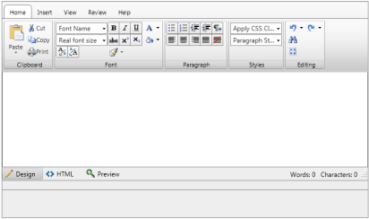
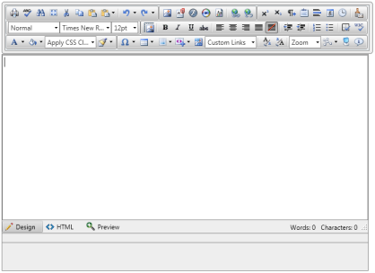
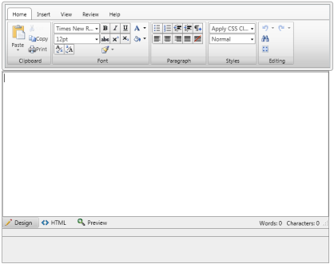
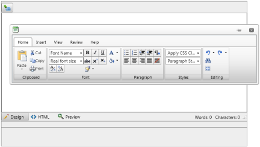

# Modes


## 

RadEditor for ASP.NET AJAX introduces a property named __ToolbarMode__, whichspecifies the behavior of the toolbar/ribbonbar. Here are the different options for settingthe ToolbarMode:


|  __ToolBar__ related: |  __RibbonBar__ related: |
| ------ | ------ |
| __Default__ - the toolbar is static and positioned over the	content area| __RibbonBar__ - the ribbonbar is static and positioned over the	content area|
| __PageTop__ - in this mode, when a particular editor gets the	focus its toolbar will appear docked at the top of the page| __RibbonBarPageTop__ - in this mode, when a particular editor gets the	focus its ribbonbar will appear docked at the top of the page|
| __ShowOnFocus__ - here the toolbar will appear	right above the editor when it gets focus| __RibbonBarShowOnFocus__ - here the ribbonbar will appear	right above the editor when it gets focus.|
| __Floating__ - the toolbar will pop up in a window and	will allow the user to move it over the page| __RibbonBarFloating__ - the ribbonbar will pop up in a window and	will allow the user to move it over the page|


The __ToolbarMode__property is a __EditorToolbarMode__enumeration that can be set at runtime to:

* Default

* Floating

* PageTop

* ShowOnFocus

* RibbonBar

* RibbonBarFloating

* RibbonBarPageTop

* RibbonBarShowOnFocus

````C#
	
	
		protected void Page_Load(object sender, EventArgs e)
		{
			RadEditor1.ToolbarMode = Telerik.Web.UI.EditorToolbarMode.Floating;
		} 
				
````


````VB.NET
	     
		Protected Sub Page_Load(ByVal sender As Object, ByVal e As EventArgs)
			RadEditor1.ToolbarMode = Telerik.Web.UI.EditorToolbarMode.Floating
		End Sub
````


# See Also

 * [Set Properties]()

 * [Toolbar Modes](http://demos.telerik.com/aspnet/prometheus/Editor/Examples/ToolbarMode/DefaultCS.aspx)
