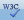

# Toolbars Overview


__RadEditor__ Toolbars are containers that accommodate the buttons and dropdown lists of the various tools.	Developers can group buttons in a number of toolbars according to the specific purpose of the __RadEditor__ implementation.	The figure below shows an editor with its full set of tools, distributed in five toolbars. You can configure a toolbar	with as few or as many tools as your application requires.

You can learn how to add standard or custom tools to a toolbar in the following Help articles:

* [Adding Standard Buttons]()

* [Adding Your Own Buttons]()

You can also configure the toolbar using an XML [ToolsFile](), which	defines:

* the number of toolbars and system [modules]()

* the collection of buttons in each toolbar and their order

* the specific options (if any) for the respective tools (i.e., Fonts collections, Colors collection, etc.)

* the [dockability]() of each toolbar

* the default docking zone for each toolbar

You can group tools with similar logic in ToolStrips. You can find more information in the following	article: [How to create a ToolStrip]().

## RadEditor Toolset Reference

The lists below show the icon image, the name of the tool, a description of what the tool does, and the tagformat used to declare that tool in the ToolsFile.xml file.

## General Buttons


>caption 

|  __Icon__  |  __Tool Name__  |  __Description__  |  __ToolsFile Declaration__  |
| ------ | ------ | ------ | ------ |
|| __ConvertToUpper__ |Convert the text of the current selection to upper case, preserving the non-text elements such as	images and tables.|<toolname=" __ConvertToUpper__ " />|
|| __ConvertToLower__ |Convert the text of the current selection to lower case, preserving the non-text	elements such as images and tables.|<tool name=" __ConvertToLower__ " />|
|| __RealFontSize__ |Allows the user to apply to the current selection, the font size measured in pixels (px) or points (pt),	rather than a fixed-size 1 to 7 (as does the FontSize tool).|<tool name=" __RealFontSize__ "/>|
|| __ToggleScreenMode__ |Toggle Screen Mode - Switches Telerik __RadEditor__ into full screen mode.|<tool name=" __ToggleScreenMode__ " shortcut="F11"/>|
|| __ToggleTableBorder__ |Show/Hide Border - Shows or hides borders around tables in the content area.|<tool name=" __ToggleTableBorder__ " />|
|| __Zoom__ |Zoom - Changes the level of text magnification.|<tool name=" __Zoom__ " />|
|| __ModuleManager__ |Module Manager - Activates /Deactivates modules from a drop-down list of available modules.|<tool name=" __ModuleManager__ " />|
|| __ToggleDocking__ |Toggle Docking - Docks all floating toolbars to their respective docking areas.|<tool name=" __ToggleDocking__ " />|
|| __FindAndReplace__ |Find and Replace - Find (and replaces) text in the editor's content area.|<tool name=" __FindAndReplace__ " shortcut="CTRL+F"/>|
|| __Print__ |Print - Prints the contents of the Telerik __RadEditor__ or the whole web page.|<tool name=" __Print__ " shortcut="CTRL+P"/>|
|| __AjaxSpellCheck__ |Spell - Launches the spell checker.|<tool name=" __AjaxSpellCheck__ " shortcut="F7"/>|
|| __Cut__ |Cut - Cuts the selected content and copies it to the clipboard.|<tool name=" __Cut__ " shortcut="CTRL+X"/>|
|| __Copy__ |Copy - Copies the selected content to the clipboard.|<tool name=" __Copy__ " shortcut="CTRL+C"/>|
|| __Paste__ |Paste - Pastes the copied content from the clipboard into the editor.|<tool name=" __Paste__ " shortcut="CTRL+V"/>|
|| __PasteStrip__ |PasteStrip dropdown - Contains advanced paste options (Paste, PasteFromWord, PasteFromWordNoFontsNoSizes, PastePlainText, PasteAsHtml, PasteHtml)|<tool name=" __PasteStrip__ " />|
|| __PasteFromWord__ |Paste from Word - Pastes content copied from Word and removes the web-unfriendly tags.|<tool name=" __PasteFromWord__ " />|
|| __PasteFromWordNoFontsNoSizes__ |Paste from Word cleaning fonts and sizes - Cleans all Word-specific tags and removes font names and text sizes.|<tool name=" __PasteFromWordNoFontsNoSizes__ " />|
|| __PastePlainText__ |Paste Plain Text - Pastes plain text (no formatting) into the editor.|<tool name=" __PastePlainText__ " />|
|| __PasteHtml__ |Paste HTML - Pastes HTML code in to the current selection and renders it. It is helpful when needed to enter predefined HTML code such as media embed source.|<tool name=" __PasteHtml__ " />|
|| __PasteAsHtml__ |Paste as HTML - Pastes HTML code in the content area and keeps all the HTML tags.|<tool name=" __PasteAsHtml__ "/>|
|| __Undo__ |Undo - Undoes the last action.|<tool name=" __Undo__ " shortcut="CTRL+Z"/>|
|| __Redo__ |Redo - Redoes/repeats the last action, which has been undone.|<tool name=" __Redo__ " shortcut="CTRL+Y"/>|
|| __FormatStripper__ |Format Stripper - Removes custom or all formatting from selected text.|<tool name=" __FormatStripper__ "/>|
|| __Help__ |Quick Help - Launches the Quick Help you are currently viewing.|<tool name=" __Help__ " shortcut="F1"/>|
|| __AboutDialog__ |About Dialog - Shows the current version and credentials of Telerik __RadEditor__ .|<tool name=" __AboutDialog__ " />|
|| __XhtmlValidator__ |XhtmlValidator - Uses the W3C XHTML Validator Page to perform validation of the current editor content.|<tool name=" __XhtmlValidator__ " />|
|| __StyleBuilder__ |StyleBuilder - Provides options to define cascading style sheet (CSS) style attributes.|<tool name=" __StyleBuilder__ " />|

## Insert and Manage Links, Tables, Special Characters, Images and Media


>caption 

|  __Icon__  |  __Tool Name__  |  __Description__  |  __ToolsFile Declaration__  |
| ------ | ------ | ------ | ------ |
|| __ImageManager__ |Image Manager - Inserts an image from a predefined image folder(s).|<tool name=" __ImageManager__ " shortcut="CTRL+G"/>|
|| __InsertImage__ |Insert Image - A lite version of the Set Image Properties (Properties...) dialog.|<tool name=" __InsertImage__ "/>|
|| __ImageMapDialog__ |Image Map - Allows users to define clickable areas within an image.|<tool name=" __ImageMapDialog__ "/>|
|| __AbsolutePosition__ |Absolute Object Position - Sets an absolute position of an object (free move).|<tool name=" __AbsolutePosition__ " />|
|| __InsertTable__ |Insert Table - Inserts a table in the Telerik __RadEditor__ .|<tool name=" __InsertTable__ " />|
|| __ToggleTableBorder__ |Toggle Table Borders - Toggles borders of all tables within the editor.|<tool name=" __ToggleTableBorder__ " />|
|| __InsertSnippet__ |Insert Snippet - Inserts pre-defined code snippets.|<tool name=" __InsertSnippet__ " />|
|| __InsertFormElement__ |Insert Form Element - Inserts a form element from a drop-down list with available elements.|<tool name=" __InsertFormElement__ " />|
|| __InsertDate__ |Insert Date - Inserts current date.|<tool name=" __InsertDate__ " />|
|| __InsertTime__ |Insert Time - Inserts current time.|<tool name=" __InsertTime__ " />|
|| __InsertExternalVideo__ |Insert Video - Inserts YouTube or Vimeo video providing just the URL. Additional options for video	customization are available as well.|<tool name=" __InsertExternalVideo__ " />|
|| __FlashManager__ |Flash Manager - Inserts a Flash animation and lets you set its properties.|<tool name=" __FlashManager__ " />|
|| __MediaManager__ |Windows Media Manager - Inserts a Windows media object (AVI, MPEG, WAV, etc.) and lets you set its properties.|<tool name=" __MediaManager__ " />|
|| __DocumentManager__ |Document Manager - Inserts a link to a document on the server (PDF, DOC, etc.)|<tool name=" __DocumentManager__ " />|
|| __LinkManager__ |Hyperlink Manager - Makes the selected text or image a hyperlink.|<tool name=" __LinkManager__ " shortcut="CTRL+K"/>|
|| __InsertLink__ |Insert Link - A lite version of the __Hyperlink Manager__ , which ____ makes the selected text or image a hyperlink.|<tool name=" __InsertLink__ " />|
|| __Unlink__ |Remove Hyperlink - Removes the hyperlink from the selected text or image.|<tool name=" __Unlink__ " shortcut="CTRL+SHIFT+K"/>|
|| __InsertSymbol__ |Insert Special Character - Inserts a special character (€, ®, ©, ±, etc.)|<tool name=" __InsertSymbol__ " />|
|| __InsertCustomLink__ |Insert Custom Link - Inserts an internal or external link from a predefined list.|<tool name=" __InsertCustomLink__ "/>|
|| __TemplateManager__ |Choose HTML Template - Applies an HTML template from a predefined list of templates.|<tool name=" __TemplateManager__ " />|


## Create, Format, Edit: Paragraphs and Lines


>caption 

|  __Icon__  |  __Tool Name__  |  __Description__  |  __ToolsFile Declaration__  |
| ------ | ------ | ------ | ------ |
|| __InsertParagraph__ |Insert New Paragraph - Inserts a new paragraph.|<tool name=" __InsertParagraph__ " />|
|| __FormatBlock__ |Paragraph Style dropdown button - Applies standard text styles to selected text.|<tool name=" __FormatBlock__ "/>|
|| __Indent__ |Indent - Indents paragraphs to the right.|<tool name=" __Indent__ " />|
|| __Outdent__ |Outdent - Indents paragraphs to the left.|<tool name=" __Outdent__ " />|
|| __JustifyLeft__ |Align Left - Aligns the selected paragraph to the left.|<tool name=" __JustifyLeft__ " />|
|| __JustifyCenter__ |Center - Aligns the selected paragraph to the center.|<tool name=" __JustifyCenter__ " />|
|| __JustifyRight__ |Align Right - Aligns the selected paragraph to the right.|<tool name=" __JustifyRight__ " />|
|| __JustifyFull__ |Justify - Justifies the selected paragraph.|<tool name=" __JustifyFull__ " />|
|| __JustifyNone__ |Justify None - Removes the alignment.|<tool name=" __JustifyNone__ " />|
|| __InsertUnorderedList__ |Bulleted List - Creates a bulleted list from the selection.|<tool name=" __InsertUnorderedList__ " />|
|| __InsertOrderedList__ |Numbered List - Creates a numbered list from the selection.|<tool name=" __InsertOrderedList__ " />|
|| __InsertHorizontalRule__ |Insert Horizontal Line (e.g. Horizontal Ruler) - Inserts a horizontal line at the cursor position.|<tool name=" __InsertHorizontalRule__ " />|


## Create, Format, Edit: Text, Font and Lists


>caption  

|  __Icon__  |  __Tool Name__  |  __Description__  |  __ToolsFile Declaration__  |
| ------ | ------ | ------ | ------ |
|| __Bold__ |Bold - Applies bold formatting to the selected text.|<tool name=" __Bold__ " shortcut="CTRL+B"/>|
|| __Italic__ |Italic - Applies italic formatting to the selected text.|<tool name=" __Italic__ " shortcut="CTRL+I"/>|
|| __Underline__ |Underline - Applies underline formatting to the selected text.|<tool name=" __Underline__ " shortcut="CTRL+U"/>|
|| __StrikeThrough__ |Strikethrough - Applies strikethrough formatting to the selected text.|<tool name=" __StrikeThrough__ " />|
|| __Superscript__ |Superscript - Makes the selected text superscript.|<tool name=" __Superscript__ " />|
|| __Subscript__ |Subscript - Makes the selected text subscript.|<tool name=" __Subscript__ " />|
|| __FontName__ |Font Select - Sets the font typeface.|<tool name=" __FontName__ "/>|
|| __FontSize__ |Font Size - Sets the font size.|<tool name=" __FontSize__ "/>|
|| __ForeColor__ |Text Color (foreground) - Changes the foreground color of the selected text.|<tool name=" __ForeColor__ "/>|
|| __BackColor__ |Text Color (background) - Changes the background color of the selected text.|<tool name=" __BackColor__ "/>|
|| __FormatCodeBlock__ |Formats the selected text as a code block.|<tool name=" __FormatCodeBlock__ " />|
|| __ApplyClass__ |Custom Styles - Applies custom, predefined styles to the selected text.|<tool name=" __ApplyClass__ "/>|
|| __EditorSeparator__ |Separate the tools icons on the toolbar.|<tool __separator__ =" __true__ " />|


## ToolsFile Example

Below is an example of a ToolsFile:

````XML
	     
	<root>
	 <tools name="MainToolbar" enabled="true">
	    <tool name="AjaxSpellCheck" />
	    <tool name="Print" />
	    <tool name="FindAndReplace" />
	    <tool separator="true"/>
	    <tool name="Cut" />
	    <tool name="Copy" />
	    <tool name="Paste" />
	    <tool name="PasteFromWord" />
	    <tool name="PastePlainText" />
	    <tool name="PasteAsHtml"  />
	    <tool separator="true"/>
	    <tool name="Undo" />
	    <tool name="Redo" />
	 </tools>
	</root> 
				
````


# See Also

 * [Set Properties]()

 * [Default ToolsFile.xml file of RadEditor for ASP.NET AJAX](http://www.telerik.com/support/kb/details/default-toolsfile-xml-file-of-radeditor-for-asp-net-ajax)

 * [Dialogs live example](http://demos.telerik.com/aspnet-ajax/editor/examples/built-in-dialogs/defaultcs.aspx)

 * [RadEditor End-User Manual](http://www.telerik.com/documents/RadEditorAjaxEndUserManual.pdf)
