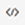
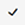

# Toolbars Overview

**RadEditor** Toolbars are containers that accommodate the buttons and dropdown lists of the various tools.	Developers can group buttons in a number of toolbars according to the specific purpose of the **RadEditor** implementation.	The figure below shows an editor with its full set of tools, distributed in five toolbars. You can configure a toolbar	with as few or as many tools as your application requires.


You can learn how to add standard or custom tools to a toolbar in the following Help articles:

* [Adding Standard Buttons]()

* [Adding Your Own Buttons]()

You can also configure the toolbar using an XML [ToolsFile](), which	defines:

* the number of toolbars and system [modules]()

* the collection of buttons in each toolbar and their order

* the specific options (if any) for the respective tools (i.e., Fonts collections, Colors collection, etc.)

* the [dockability]() of each toolbar

* the default docking zone for each toolbar

You can group tools with similar logic in ToolStrips. You can find more information in the following	article: [How to create a ToolStrip]().

As of **Q2 2015**, new phone-optimized UI is introduced in **RadEditor**—[Phone Layout of RadEditor](). You can find more details about the toolbar-related optimizations in the [Phone Layout Elements Structure]() article.   

## RadEditor Toolset Reference

The lists below show the icon image, the name of the tool, a description of what the tool does, and the tag format used to declare that tool in the ToolsFile.xml file.

## General Buttons


|  **Icon**  |  **Tool Name**  |  **Description**  |  **ToolsFile Declaration**  |
| ------ | ------ | ------ | ------ |
|| **ConvertToUpper** |Convert the text of the current selection to upper case, preserving the non-text elements such as	images and tables.|`<tool name="ConvertToUpper" />`|
|| **ConvertToLower** |Convert the text of the current selection to lower case, preserving the non-text	elements such as images and tables.|`<tool name="ConvertToLower" />`|
|| **RealFontSize** |Allows the user to apply to the current selection, the font size measured in pixels (px) or points (pt),	rather than a fixed-size 1 to 7 (as does the FontSize tool).|`<tool name="RealFontSize"/>`|
|| **ToggleScreenMode** |Toggle Screen Mode - Switches Telerik **RadEditor** into full screen mode.|`<tool name="ToggleScreenMode" shortcut="F11"/>`|
|| **ToggleTableBorder** |Show/Hide Border - Shows or hides borders around tables in the content area.|`<tool name="ToggleTableBorder" />`|
|| **Zoom** |Zoom - Changes the level of text magnification.|`<tool name="Zoom" />`|
|| **ModuleManager** |Module Manager - Activates /Deactivates modules from a drop-down list of available modules.|`<tool name="ModuleManager" />`|
|| **ToggleDocking** |Toggle Docking - Docks all floating toolbars to their respective docking areas.|`<tool name="ToggleDocking" />`|
|| **FindAndReplace** |Find and Replace - Find (and replaces) text in the editor's content area.|`<tool name="FindAndReplace" shortcut="CTRL+F"/>`|
|| **Print** |Print - Prints the contents of the Telerik **RadEditor** or the whole web page.|`<tool name="Print" shortcut="CTRL+P"/>`|
|| **AjaxSpellCheck** |Spell - Launches the spell checker.|`<tool name="AjaxSpellCheck" shortcut="F7"/>`|
|| **Cut** |Cut - Cuts the selected content and copies it to the clipboard.|`<tool name="Cut" shortcut="CTRL+X"/>`|
|| **Copy** |Copy - Copies the selected content to the clipboard.|`<tool name="Copy" shortcut="CTRL+C"/>`|
|| **Paste** |Paste - Pastes the copied content from the clipboard into the editor.|`<tool name="Paste" shortcut="CTRL+V"/>`|
|| **PasteStrip** |PasteStrip dropdown - Contains advanced paste options (Paste, PasteFromWord, PasteFromWordNoFontsNoSizes, PastePlainText, PasteAsHtml, PasteHtml)|`<tool name="PasteStrip" />`|
|| **PasteFromWord** |Paste from Word - Pastes content copied from Word and removes the web-unfriendly tags.|`<tool name="PasteFromWord" />`|
|| **PasteFromWordNoFontsNoSizes** |Paste from Word cleaning fonts and sizes - Cleans all Word-specific tags and removes font names and text sizes.|`<tool name="PasteFromWordNoFontsNoSizes" />`|
|| **PastePlainText** |Paste Plain Text - Pastes plain text (no formatting) into the editor.|`<tool name="PastePlainText" />`|
|| **PasteHtml** |Paste HTML - Pastes HTML code in to the current selection and renders it. It is helpful when needed to enter predefined HTML code such as media embed source.|`<tool name="PasteHtml" />`|
|| **PasteAsHtml** |Paste as HTML - Pastes HTML code in the content area and keeps all the HTML tags.|`<tool name="PasteAsHtml"/>`|
|| **Undo** |Undo - Undoes the last action.|`<tool name="Undo" shortcut="CTRL+Z"/>`|
|| **Redo** |Redo - Redoes/repeats the last action, which has been undone.|`<tool name="Redo" shortcut="CTRL+Y"/>`|
|| **FormatStripper** |Format Stripper - Removes custom or all formatting from selected text.|`<tool name="FormatStripper"/>`|
|| **Help** |Quick Help - Launches the Quick Help you are currently viewing.|`<tool name="Help" shortcut="F1"/>`|
|| **AboutDialog** |About Dialog - Shows the current version and credentials of Telerik **RadEditor** .|`<tool name="AboutDialog" />`|
|| **XhtmlValidator** |XhtmlValidator - Uses the W3C XHTML Validator Page to perform validation of the current editor content.|`<tool name="XhtmlValidator" />`|
|| **CSDialog** |[Accessibility Compliance Check Dialog]() - Uses HiSoftware's Compliance Sheriff tool to help the user create accessible content.|`<tool name="CSDialog" />`|
|| **StyleBuilder** |StyleBuilder - Provides options to define cascading style sheet (CSS) style attributes.|`<tool name="StyleBuilder" />`|
||**Toggle ToolZone** *(this button is [Phone-Layout-related]())*|Toggles the ToolZone in RadEditor with Phone Layout|`<tool name="MobileEdit" />`|
||**Toggle Edit Mode** *(this button is [Phone-Layout-related]())*|Switches between Design and HTML mode in RadEditor with Phone Layout.|`<tool name="ToggleEditMode" />`|
||**Toggle Screen Mode** *(this button is [Phone-Layout-related]())*|Exits the full screen mode in RadEditor with Phone layout.|`<tool name="ToggleScreenMode" />`|

## Insert and Manage Links, Tables, Special Characters, Images and Media


|  **Icon**  |  **Tool Name**  |  **Description**  |  **ToolsFile Declaration**  |
| ------ | ------ | ------ | ------ |
|| **ImageManager** |Image Manager - Inserts an image from a predefined image folder(s).|`<tool name="ImageManager" shortcut="CTRL+G"/>`|
|| **InsertImage** |Insert Image - A lite version of the Set Image Properties (Properties...) dialog.|`<tool name="InsertImage"/>`|
|| **ImageMapDialog** |Image Map - Allows users to define clickable areas within an image.|`<tool name="ImageMapDialog"/>`|
|| **AbsolutePosition** |Absolute Object Position - Sets an absolute position of an object (free move).|`<tool name="AbsolutePosition" />`|
|| **InsertTable** |Insert Table - Inserts a table in the Telerik **RadEditor** .|`<tool name="InsertTable" />`|
|| **ToggleTableBorder** |Toggle Table Borders - Toggles borders of all tables within the editor.|`<tool name="ToggleTableBorder" />`|
|| **InsertSnippet** |Insert Snippet - Inserts pre-defined code snippets.|`<tool name="InsertSnippet" />`|
|| **InsertFormElement** |Insert Form Element - Inserts a form element from a drop-down list with available elements.|`<tool name="InsertFormElement" />`|
|| **InsertDate** |Insert Date - Inserts current date.|`<tool name="InsertDate" />`|
|| **InsertTime** |Insert Time - Inserts current time.|`<tool name="InsertTime" />`|
|| **InsertExternalVideo** |Insert Video - Inserts YouTube or Vimeo video providing just the URL. Additional options for video	customization are available as well.|`<tool name="InsertExternalVideo" />`|
|| **FlashManager** |Flash Manager - Inserts a Flash animation and lets you set its properties.|`<tool name="FlashManager" />`|
|| **MediaManager** |Windows Media Manager - Inserts a Windows media object (AVI, MPEG, WAV, etc.) and lets you set its properties.|`<tool name="MediaManager" />`|
|| **DocumentManager** |Document Manager - Inserts a link to a document on the server (PDF, DOC, etc.)|`<tool name="DocumentManager" />`|
|| **LinkManager** |Hyperlink Manager - Makes the selected text or image a hyperlink.|`<tool name="LinkManager" shortcut="CTRL+K"/>`|
|| **InsertLink** |Insert Link - A lite version of the **Hyperlink Manager** , which makes the selected text or image a hyperlink.|`<tool name="InsertLink" />`|
|| **Unlink** |Remove Hyperlink - Removes the hyperlink from the selected text or image.|`<tool name="Unlink" shortcut="CTRL+SHIFT+K"/>`|
|| **InsertSymbol** |Insert Special Character - Inserts a special character (€, ®, ©, ±, etc.)|`<tool name="InsertSymbol" />`|
|| **InsertCustomLink** |Insert Custom Link - Inserts an internal or external link from a predefined list.|`<tool name="InsertCustomLink"/>`|
|| **TemplateManager** |Choose HTML Template - Applies an HTML template from a predefined list of templates.|`<tool name="TemplateManager" />`|


## Create, Format, Edit: Paragraphs and Lines


|  **Icon**  |  **Tool Name**  |  **Description**  |  **ToolsFile Declaration**  |
| ------ | ------ | ------ | ------ |
|| **InsertParagraph** |Insert New Paragraph - Inserts a new paragraph.|`<tool name="InsertParagraph" />`|
|| **FormatBlock** |Paragraph Style dropdown button - Applies standard text styles to selected text.|`<tool name="FormatBlock"/>`|
|| **Indent** |Indent - Indents paragraphs to the right.|`<tool name="Indent" />`|
|| **Outdent** |Outdent - Indents paragraphs to the left.|`<tool name="Outdent" />`|
|| **JustifyLeft** |Align Left - Aligns the selected paragraph to the left.|`<tool name="JustifyLeft" />`|
|| **JustifyCenter** |Center - Aligns the selected paragraph to the center.|`<tool name="JustifyCenter" />`|
|| **JustifyRight** |Align Right - Aligns the selected paragraph to the right.|`<tool name="JustifyRight" />`|
|| **JustifyFull** |Justify - Justifies the selected paragraph.|`<tool name="JustifyFull" />`|
|| **JustifyNone** |Justify None - Removes the alignment.|`<tool name="JustifyNone" />`|
|| **InsertUnorderedList** |Bulleted List - Creates a bulleted list from the selection.|`<tool name="InsertUnorderedList" />`|
|| **InsertOrderedList** |Numbered List - Creates a numbered list from the selection.|`<tool name="InsertOrderedList" />`|
|| **InsertHorizontalRule** |Insert Horizontal Line (e.g. Horizontal Ruler) - Inserts a horizontal line at the cursor position.|`<tool name="InsertHorizontalRule" />`|


## Create, Format, Edit: Text, Font and Lists
 

|  **Icon**  |  **Tool Name**  |  **Description**  |  **ToolsFile Declaration**  |
| ------ | ------ | ------ | ------ |
|| **Bold** |Bold - Applies bold formatting to the selected text.|`<tool name="Bold" shortcut="CTRL+B"/>`|
|| **Italic** |Italic - Applies italic formatting to the selected text.|`<tool name="Italic" shortcut="CTRL+I"/>`|
|| **Underline** |Underline - Applies underline formatting to the selected text.|`<tool name="Underline" shortcut="CTRL+U"/>`|
|| **StrikeThrough** |Strikethrough - Applies strikethrough formatting to the selected text.|`<tool name="StrikeThrough" />`|
|| **Superscript** |Superscript - Makes the selected text superscript.|`<tool name="Superscript" />`|
|| **Subscript** |Subscript - Makes the selected text subscript.|`<tool name="Subscript" />`|
|| **FontName** |Font Select - Sets the font typeface.|`<tool name="FontName"/>`|
|| **FontSize** |Font Size - Sets the font size.|`<tool name="FontSize"/>`|
|| **ForeColor** |Text Color (foreground) - Changes the foreground color of the selected text.|`<tool name="ForeColor"/>`|
|| **BackColor** |Text Color (background) - Changes the background color of the selected text.|`<tool name="BackColor"/>`|
|| **FormatCodeBlock** |Formats the selected text as a code block.|`<tool name="FormatCodeBlock" />`|
|| **ApplyClass** |Custom Styles - Applies custom, predefined styles to the selected text.|`<tool name="ApplyClass"/>`|
|| **EditorSeparator** |Separate the tools icons on the toolbar.|`<tool separator="true" />`|

## Track Changes and Comments

To have the Track Changes tools you should set the `EnableTrackChanges` property to `true`. You can refer to [Track Changes article](). And for Comment tools, set the `EnableComments` property to `true`. You can refer to [Comments article]()

|  **Icon**  |  **Tool Name**  |  **Description**  |  **ToolsFile Declaration**  |
| ------ | ------ | ------ | ------ |
|| **AcceptTrackChange** |AcceptTrackChange - Accepts the selected change.|`<tool name="AcceptTrackChange" />`|
|| **RejectTrackChange** |RejectTrackChange - Rejects the selected change.|`<tool name="RejectTrackChange" />`|
|| **AcceptAllTrackChanges** |AcceptAllTrackChanges - Accepts all changes in the document.|`<tool name="AcceptAllTrackChanges" />`|
|| **RejectAllTrackChanges** |RejectAllTrackChanges - Rejects all changes in the document.|`<tool name="RejectAllTrackChanges" />`|
|| **EnableTrackChangesOverride** |EnableTrackChangesOverride - Toggles the Track Changes feature.|`<tool name="EnableTrackChangesOverride" />`|
|| **AddComment** |AddComment - Adds comment on the highlighted text.|`<tool name="AddComment" />`|
|| **RemoveComment** |RemoveComment - Removes the comment under the selected text.|`<tool name="RemoveComment"/>`|
|| **RemoveAllComments** |RemoveAllComments - Removes all comments in the document.|`<tool name="RemoveAllComments"/>`|


## ToolsFile Example

Below is an example of a ToolsFile:

````XML
<root>
	<tools name="MainToolbar" enabled="true">
		<tool name="AjaxSpellCheck" />
		<tool name="Print" />
		<tool name="FindAndReplace" />
		<tool separator="true"/>
		<tool name="Cut" />
		<tool name="Copy" />
		<tool name="Paste" />
		<tool name="PasteFromWord" />
		<tool name="PastePlainText" />
		<tool name="PasteAsHtml"  />
		<tool separator="true"/>
		<tool name="Undo" />
		<tool name="Redo" />
	</tools>
</root> 			
````

## See Also

 * [Set Properties]()

 * [Default ToolsFile.xml file of RadEditor for ASP.NET AJAX](http://www.telerik.com/support/kb/aspnet-ajax/editor/details/default-toolsfile-xml-file-of-radeditor-for-asp-net-ajax)

 * [Dialogs live example](http://demos.telerik.com/aspnet-ajax/editor/examples/built-in-dialogs/defaultcs.aspx)

 * [RadEditor End-User Manual](http://www.telerik.com/documents/RadEditorAjaxEndUserManual.pdf)

 * [Phone Layout of RadEditor]()

 * [Phone Layout Getting Started]()

 * [Phone Layout Elements Structure]()
