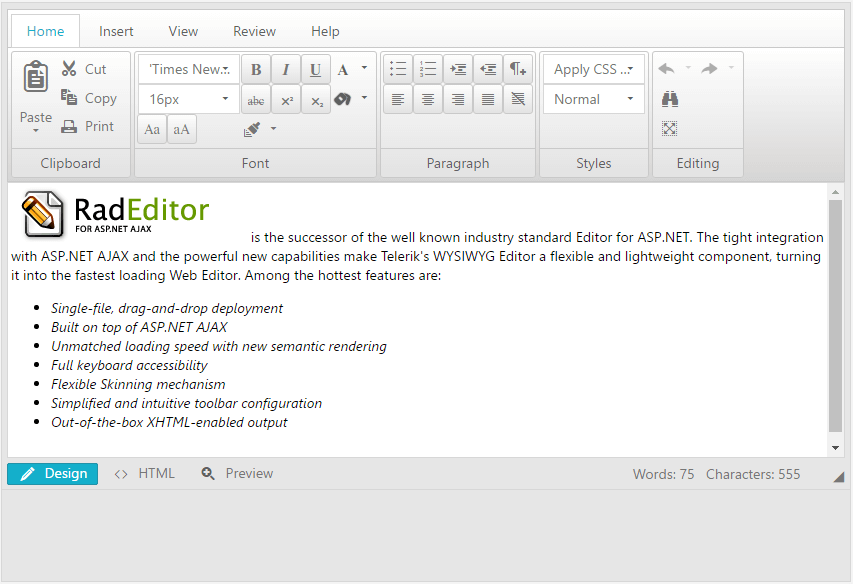

# Using RibbonBar Toolbar

In this article you can see how to configure the **RibbonBar** toolbar of **RadEditor**. 

>caption Figure 1: The default RibbonBar toolbar of RadEditor.



## Enabling RibbonBar Modes

In order to enable the RibbonBar toolbar, you need to set the `ToolbarMode` property to one of the following values: `RibbonBar`, `RibbonBarFloating`, `RibbonBarPageTop` or `RibbonBarShowOnFocus`.

>caption Example 1: Enabling RibbonBar toolbar

````ASP.NET
<telerik:RadEditor runat="server" ID="RadEditor1" ToolbarMode="RibbonBar">
</telerik:RadEditor>
````

## Changing Tools in RibbonBar

You can use the same ways to change the tools in the RibbonBar that you use in the [Default toolbar](). With **RibbonBar** it is essential to setup properly the `Tab` and `Tag` properties as these properties define the tabs and the sections to be rendered.


>caption Example 2: Changing tools in RibbonBar in the markup

````ASP.NET
<telerik:RadEditor runat="server" ID="RadEditor1" ToolbarMode="RibbonBar">
    <Tools>
        <telerik:EditorToolGroup Tag="Font" Tab="Home">
            <telerik:EditorTool name="FontName" />
            <telerik:EditorTool name="RealFontSize" />
        </telerik:EditorToolGroup>
        <telerik:EditorToolGroup Tag="Paragraph" Tab="Home">
            <telerik:EditorTool name="InsertUnorderedList" />
            <telerik:EditorTool name="InsertOrderedList" />
        </telerik:EditorToolGroup>
        <telerik:EditorToolGroup Tag="Tables" Tab="Insert">
            <telerik:EditorTool name="InsertTableLight" Size="large" />
            <telerik:EditorTool name="InsertTable" />
        </telerik:EditorToolGroup>
    </Tools>
</telerik:RadEditor>
````

>caption Example 3: Changing tools in RibbonBar by using ToolsFile.xml file

````ASP.NET
<telerik:RadEditor runat="server" ID="RadEditor1" ToolbarMode="RibbonBar" ToolsFile="ToolsFile.xml">
</telerik:RadEditor>
````
````XML
<root>
    <tools name="Font" tab="Home">
        <tool name="FontName"/>
        <tool name="RealFontSize"/>
    </tools>
    <tools name="Paragraph" tab="Home">
        <tool name="InsertUnorderedList"/>
        <tool name="InsertOrderedList"/>
    </tools>
    <tools name="Tables" tab="Insert">
        <tool name="InsertTableLight" size="large"/>
        <tool name="InsertTable" />
    </tools>
</root>
````

To examine more of the XML configuration options available refer to the [RadEditor with RibbonBar demo](https://demos.telerik.com/aspnet-ajax/controls/examples/integration/ribbonbarandeditor/defaultcs.aspx?product=editor) or the [RibbonBar - Populating from Xml demo](https://demos.telerik.com/aspnet-ajax/ribbonbar/examples/populatingfromxml/defaultcs.aspx).

>caption Example 4: Changing tools in RibbonBar from the code behind

````ASP.NET
<telerik:RadEditor runat="server" ID="RadEditor1" ToolbarMode="RibbonBar">
</telerik:RadEditor>
````
````C#
// Add new section group in Home tab 
EditorToolGroup fontGroup = new EditorToolGroup();
// Define the place of the new toolgroup via the Tab property.
fontGroup.Tab = "Home";
// And the group by using the Tag property.
fontGroup.Tag = "Font";

fontGroup.Tools.Add(new EditorTool("FontName"));
fontGroup.Tools.Add(new EditorTool("RealFontSize"));

RadEditor1.Tools.Add(fontGroup);

EditorToolGroup paragraphGroup = new EditorToolGroup();
paragraphGroup.Tab = "Home";
paragraphGroup.Tag = "Paragraph";

paragraphGroup.Tools.Add(new EditorTool("InsertUnorderedList"));
paragraphGroup.Tools.Add(new EditorTool("InsertOrderedList"));

RadEditor1.Tools.Add(paragraphGroup);

EditorToolGroup tablesGroup = new EditorToolGroup();
tablesGroup.Tab = "Insert";
tablesGroup.Tag = "Tables";

// Add tool with large size
EditorTool tableLight = new EditorTool("InsertTableLight");
tableLight.Attributes["size"] = "Large";

tablesGroup.Tools.Add(tableLight);
tablesGroup.Tools.Add(new EditorTool("InsertTable"));

RadEditor1.Tools.Add(tablesGroup);
````
````VB
' Add new section group in Home tab 
Dim fontGroup As New EditorToolGroup()
' Define the place of the new toolgroup via the Tab property.
fontGroup.Tab = "Home"
' And the group by using the Tag property.
fontGroup.Tag = "Font"

fontGroup.Tools.Add(New EditorTool("FontName"))
fontGroup.Tools.Add(New EditorTool("RealFontSize"))

RadEditor1.Tools.Add(fontGroup)

Dim paragraphGroup As New EditorToolGroup()
paragraphGroup.Tab = "Home"
paragraphGroup.Tag = "Paragraph"

paragraphGroup.Tools.Add(New EditorTool("InsertUnorderedList"))
paragraphGroup.Tools.Add(New EditorTool("InsertOrderedList"))

RadEditor1.Tools.Add(paragraphGroup)

Dim tablesGroup As New EditorToolGroup()
tablesGroup.Tab = "Insert"
tablesGroup.Tag = "Tables"

' Add tool with large size
Dim tableLight As New EditorTool("InsertTableLight")
tableLight.Attributes("size") = "Large"

tablesGroup.Tools.Add(tableLight)
tablesGroup.Tools.Add(New EditorTool("InsertTable"))

RadEditor1.Tools.Add(tablesGroup)
````

## See Also

* [Add Standard Buttons]()
* [Strip Formatting Tools]()
