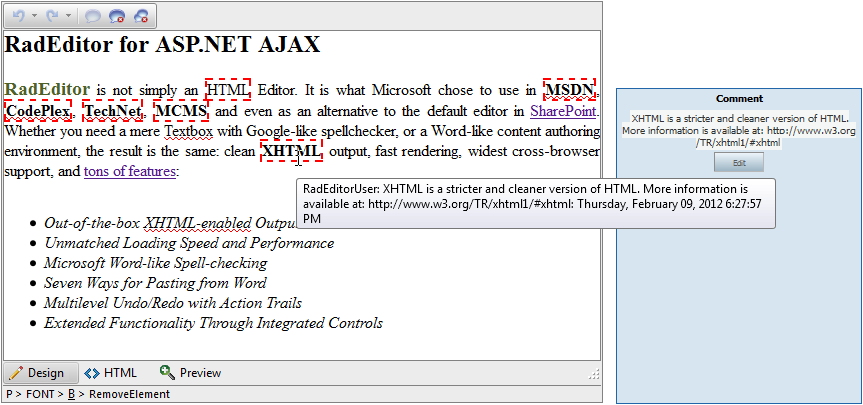

# Comments

## 

__RadEditor__ offers an easy way to add, edit or remove comments in the content area. This functionality is particularly handy when collaborating or sharing HTML content. The comments feature is based on the following three buttons:

* __Add Comment__ - highlight the area of text which you want to comment. Click on the Add Comment button to open the Comments dialog, where you can type the comment and save it via the Save dialog button. The inserted comment will be highlighted with a red dashed border in the content area. The Comments dialog will show up once a comment is selected.

* __Remove Comment__ - To remove an existing comment, select it and press the Remove Comment button.

* __Remove All Comments__ - Be careful with this button, since it will delete all existing comments in the content area.

Instructions on how to register the AddComment, RemoveComment and RemoveAllComments buttons are available in the following help article: [Adding Standard Buttons]()

An example of a RadEditor with some comments added follows:

# See Also

 * [Adding Standard Buttons]()

 * [Comments In RadEditor Online Demo](http://demos.telerik.com/aspnet-ajax/editor/examples/comments/defaultcs.aspx)
