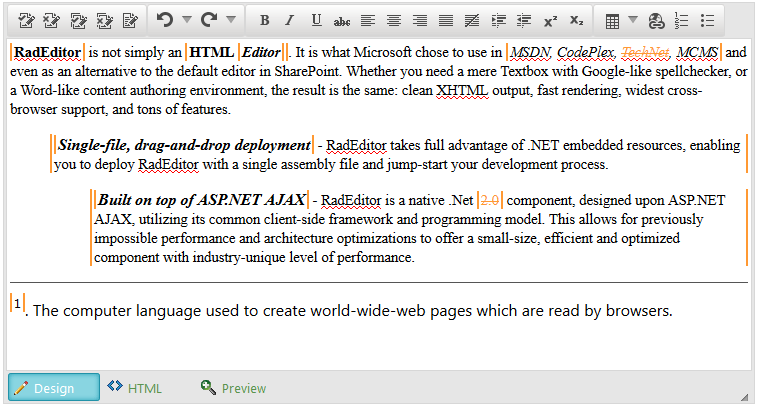
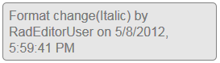

# Track Changes

This article shows how to enable, configure and use the built-in **Track Changes** feature of the **Telerik Editor for ASP.NET AJAX**.

The **Track Changes** feature is available since **Q2 2012**.

>caption Figure 1: RadEditor with Tracked Changes enabled.



Quick navigation:

1. [Overview](#overview)
1. [Enabling Track Changes Feature and Tools](#enabling-track-changes-feature-and-tools)
1. [User Configuration](#user-configuration)
1. [Generated HTML](#generated-html)
1. [Client-side Methods](#client-side-methods)
1. [Server-side Methods](#server-side-methods)
1. [Supported Commands](#supported-commands)

## Overview

The **Track Changes** feature enables end-users to keep track of the changes made when editing the content in the **RadEditor**. Changes are tracked when e.g., applying text formatting to a text selection, entering new content, deleting existing one, etc (**Figure 1**). Additionally, on selecting a tracked change a little pop up with details about it will appear at the bottom right corner of the browser or the relative positioned parent (**Figure 2**).

>caption Figure 2: Popup dialog with details about the selected tracked change.



Further, the tracked change(s) can be accepted or rejected based on the set user permissions(you can check how to configure the user settings in the [User Configuration](#user-configuration) section).

The **Track Changes** feature comes with built-in tools that enables the user to enable/disable the feature,and to accept or reject track changes in the content. The following list provides descriptions for all of the provided tools:

* **Accept Track Change** - click the button to accept the last change
* **Reject Track Change** - press the button to reject the selected change
* **Accept All Track Changes** - accepts all changes in the document
* **Reject All Track Changes** - rejects all changes in the document
* **Enable Track Changes Override** - turns Track Changes on or off

## Enabling Track Changes Feature and Tools

The following steps will guide you on enabling the **Track Changes** feature and adding the tools in the **RadEditor** toolbar:

1. Set the **EnableTrackChanges** property to **true**:

	**ASP.NET**
	
		<telerik:RadEditor runat="server" ID="RadEditor1" EnableTrackChanges="true">
		</telerik:RadEditor>
	

1. Enable the built-in **Track Changes** tools:

````ASP.NET
<telerik:RadEditor runat="server" ID="RadEditor1" EnableTrackChanges="true">
	<Tools>
		<telerik:EditorToolGroup>
			<telerik:EditorTool Name="AcceptTrackChange" />
			<telerik:EditorTool Name="RejectTrackChange" />
			<telerik:EditorTool Name="AcceptAllTrackChanges" />
			<telerik:EditorTool Name="RejectAllTrackChanges" />
			<telerik:EditorTool Name="EnableTrackChangesOverride" />
		</telerik:EditorToolGroup>
	</Tools>
</telerik:RadEditor>
````

````C#
RadEditor1.EnsureToolsFileLoaded(); // Load default set of tools
EditorToolGroup trackChangesTools = new EditorToolGroup();

trackChangesTools.Tools.Add(new EditorTool("AcceptTrackChange"));
trackChangesTools.Tools.Add(new EditorTool("RejectTrackChange"));
trackChangesTools.Tools.Add(new EditorTool("AcceptAllTrackChanges"));
trackChangesTools.Tools.Add(new EditorTool("RejectAllTrackChanges"));
trackChangesTools.Tools.Add(new EditorTool("EnableTrackChangesOverride"));

RadEditor1.Tools.Add(trackChangesTools);
````
````VB
RadEditor1.EnsureToolsFileLoaded() ' Load default set of tools
Dim trackChangesTools As EditorToolGroup = New EditorToolGroup

trackChangesTools.Tools.Add(New EditorTool("AcceptTrackChange"))
trackChangesTools.Tools.Add(New EditorTool("RejectTrackChange"))
trackChangesTools.Tools.Add(New EditorTool("AcceptAllTrackChanges"))
trackChangesTools.Tools.Add(New EditorTool("RejectAllTrackChanges"))
trackChangesTools.Tools.Add(New EditorTool("EnableTrackChangesOverride"))

RadEditor1.Tools.Add(trackChangesTools)
````


````XML
<tools name="TrackChangesToolbar">
  <tool name="AcceptTrackChange" Text="Accept Track Change"/>
  <tool name="RejectTrackChange" Text="Reject Track Change"/>
  <tool name="AcceptAllTrackChanges" Text="Accept All Track Changes"/>
  <tool name="RejectAllTrackChanges" Text="Reject All Track Changes"/>
  <tool name="EnableTrackChangesOverride" Text="Enable Track Changes Override"/>
</tools>
````

At this point, the **Track Changes** feature is ready to be used by end-users.Changes can be tracked in the text and the built-in tools are provided in the toolbar.

By default, the tracked changes cannot be accepted or rejected, because the initial user setting restricts it, i.e., the corresponding tools are disabled. Optionally, you canalter the user settings by reconfiguring the **TrackChangesSettings** where you can change the **Author**, **UserCssId** and **CanAcceptTrackChanges** properties. The following section will explain more details about these properties.

## User Configuration

In **Track Changes** the user settings are the way to define the name of the editor, what stylization are applied based on the settings and configure if changes can be accepted/rejected.

These setting are available in the **TrackChangesSettings** inner tag, where the following properties are exposed:

* **Author**—the name with which the editor to be recognized.

* **UserCssId**—the class name that defines the color of the changes made in the content. There are ten ready-to-use, predefined classes (reU0, reU1, reU2, reU3, reU4, reU5, reU6, reU7, reU8, reU9).

* **CanAcceptTrackChanges**—a Boolean property that defines if the user can accept and reject changes.

>caption Example 1: Using TrackChangesSettings to define user settings

````ASPNET
<telerik:RadEditor runat="server" ID="RadEditor1" EnableTrackChanges="true">
	<TrackChangesSettings Author="AuthorName" CanAcceptTrackChanges="true" UserCssId="reU0" />
</telerik:RadEditor>
````

````C#
RadEditor1.TrackChangesSettings.Author = "AuthorName";
RadEditor1.TrackChangesSettings.UserCssId = "reU0";
RadEditor1.TrackChangesSettings.CanAcceptTrackChanges = "true";
````
````VB
RadEditor1.TrackChangesSettings.Author = "AuthorName"
RadEditor1.TrackChangesSettings.UserCssId = "reU0"
RadEditor1.TrackChangesSettings.CanAcceptTrackChanges = "true"
````

Optionally, you can use a custom **UserCssId** value and define custom appearance for it. To do so you should implement a CSSfile with CSS rules like the ones in **Example 2**. This file should be imported into the RadEditor’s content area via the[CssFiles collection]() or the[ContentAreaCssFile property]() only if the[ContentAreaMode property]() is set to Iframe. If the Div mode is set, theCSS file should be directly imported in the main page.

>caption Example 2: Custom styles for the reU10 UserCssId value

````CSS
/*User border and text colors*/
ins.reU10, del.reU10
{
	color: #00FFCC !important;
}

/* user border colors */
.reFormat.reU10,
ins.reU10 table,
del.reU10 table,
ins.reU10 td,
ins.reU10 img,
del.reU10 td,
del.reU10 img,
.reComment.reU10
{
	border-color: #00FFCC;
}
````


## Generated HTML

The **Track Changes** functionality entirely relies on HTML to show, recognize and manipulate the tracked content.Upon user interaction **Track Changes** adds and/or modifies the HTML output with additional tags and attributes which represent the actual tracked change. The examples listed below show the HTML generation upon some user interactions:

* Text insertion:

	**HTML**
	
		<ins class="reU0" title="Inserted by RadEditorUser on 10/20/2014, 6:29:54 PM" 
			timestamp="1413818994783" command="Insert" author="RadEditorUser">some content</ins>


* Text deletion:

	**HTML**
	
		<del class="reU0" title="Deleted by RadEditorUser on 10/20/2014, 6:30:45 PM" 
			timestamp="1413819045036" command="Delete" author="RadEditorUser">some content</del>


* Text replacement:

	**HTML**
	
		<del class="reU0" title="Deleted by RadEditorUser on 10/20/2014, 6:31:11 PM" 
			timestamp="1413819071182" command="Delete" author="RadEditorUser">some content</del>

		<ins class="reU0" title="Inserted by RadEditorUser on 10/20/2014, 6:31:11 PM" 
			timestamp="1413819071185" command="Insert" author="RadEditorUser">inserted content</ins>


* Text replacement:

	**HTML**
			
		<strong class="reFormat reU0" title="Formatted by RadEditorUser on 10/20/2014, 6:32:39 PM" 
			timestamp="1413819159465" command="Bold" author="RadEditorUser">some content</strong>


## Client-Side Methods

Enabling the Track Changes feature enables you to use the following client-side methods:

* **get_htmlAcceptChanges()**-returns HTML content as if Accept All Track Changes is fired.
* **get_htmlRejectChanges()**-returns HTML content as if Reject All Track Changes is fired.

## Server-side Methods

Since **Q3 2012 Track Changes** feature also exposes new server-side methods for accepting and rejecting the changes:

* **AcceptTrackChanges()**-changes the content of RadEditor by accepting the track changes..
* **RejectTrackChanges()**-changes the content of RadEditor by rejecting the track changes.

## Supported Commands

The following commands are officially supported by **Track Changes** and are designed to work with tracked content:

* Bold
* Italic
* Underline
* Indent
* Outdent
* JustifyLeft
* JustifyRight
* JustifyCenter
* JustifyFull
* Superscript
* Subscript
* Insert Table
* Insert Link
* Insert Ordered List
* Insert Unordered List

The addition of new commands is planned for the upcoming releases. If you want to see a command implemented let us know to raise its priority.

## See Also

 * [External CSS Files]()

 * [Custom Stylization]()

 * [ContentAreaMode Property]()

 * [Comments]()
