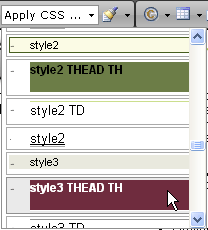

# Manage Content

1. [Mechanisms for enforcing user roles]() (insert, upload, delete rights) - RadEditor for ASP.NET AJAX is built with security in mind to facilitate integration even in large enterprise-wide systems. This requires strict definition and enforcing of user roles. With Telerik RadEditor administrators have the ability to control insert, upload, and delete rights for images, Flash, Windows Media™, and documents.

1. [Templates]() - RadEditor for ASP.NET AJAX allows you to insert chunks of HTML code obtained from external files (e.g. pre-formatted tables signatures etc.) Those files are called Templates and can be in any format that your server will allow you to read (HTML, Text files, etc.) Templates are similar to code snippets with the only difference that they are obtained from individual files, which the user can browse, upload, delete, etc.

1. [Cleaning Word Formatting]() – RadEditor for ASP.NET AJAX introduces a number of features, which help the user paste formatted content from Microsoft Word and other applications, and apply different types of format stripping. Among the tools are: "Paste from Word cleaning Fonts and Sizes" button, "Paste as HTML" button, Word Content in Clipboard Interception, etc.

1. [Content Filters]() - these are small code snippets, which are called in a sequence to process the editor content, when the editor mode (html/design/preview) is changed. Basically, the editor content is supplied to the filter chain and each filter gets a chance to modify it.

1. [Enhanced Handling of Styles]() - a powerful algorithm for style handling has been introduced, which allows CSS styles to be applied very intelligently, without overlapping of tags.

	

1. Code Indentation in HTML Mode - The Html mode has been enhanced to display nicely indented code by default, which is easier to read and modify.

## See Also

 * [Toolbars and Menus]()

 * [Standards Compliance and Browser Support]()
