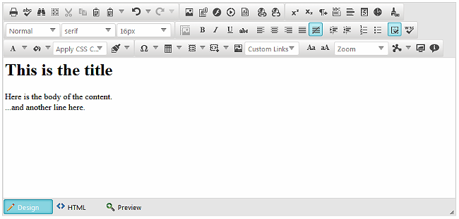
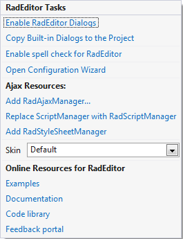
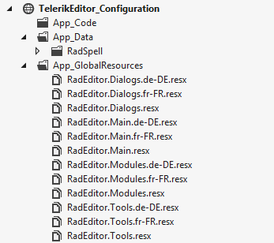
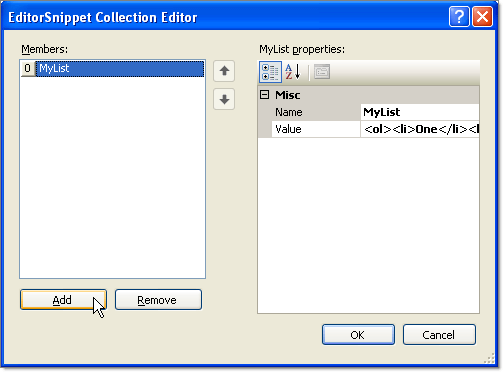
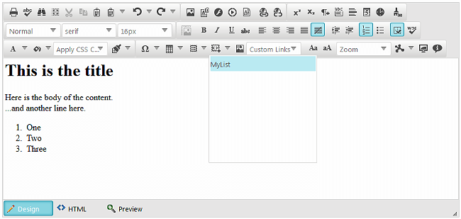

# Getting Started Overview

The following tutorial demonstrates using RadEditor in a web page and adding content. This walkthrough also shows how to assign a predefined skin to the editor and how to add HTML to a list of snippets.

>caption Figure 1: Shows a plain RadEditor control.

## How to Enable RadEditor Dialogs

1. Add a __RadEditor__ control from the ToolBox to an AJAX-enabled web page.

1. Right-click the __RadEditor__ control and select __Show Smart Tag__.

1. From the Smart Tag menu, select the __Enable RadEditor Dialogs__ link.

1. From the Smart Tag menu, select the __Enable spell check for RadEditor__ link.

>note To properly enable the spell checking examine the __Using Localization and Enabling the Spell Checking__ section.

>caption Figure 2: Shows all available RadEditor Smart Tag.

For further instructions and more information about the dialogs follow the articles in the [Dialogs section]().

## Using Localization and Enabling the Spell Checking

1. Right-click the project and select __Add | Add ASP.NET Folder | App_GlobalResources__.

1. Copy the contents of the files located in the directory __\[Controls Installation Folder]\App_GlobalResources files__ to your project __App_GlobalResources__ folder.

1. In the Solution Explorer, right-click the project and select __Add | Add ASP.NET Folder | App_Data__.

1. Copy the __\RadSpell__ directory to your project __App_Data__ folder. The files are located in the __[Controls Installation Folder]\App_Data__

>caption Figure 3: Shows the resulted project structure from the above steps.

For further instructions on these matters, please follow [the Localization section]() or[the Spellchecker one]() in the documentation.

## Configure RadEditor in the Properties Window

1. Open the RadEditor Smart Tag and select "Silk" from the __Skin__ drop down list.

1. In the Properties Window for the editor set the __Content__ property to `<h1>This is the title</h1> Here is the body of the content.   ...and another line here`.

1. Also in the Properties Window, locate the __Snippets__ property and click the ellipses to open the EditorSnippets Collection Editor. Click the Add button to create a new snippet. Set the __Name__ property to "MyList" and the __Value__ property to `<ol><li>One</li><li>Two</li><li>Three</li></ol>`.

	>caption Figure 4: Shows how an item is created in the EditorSnippets Collection Editor

	

1. Press __F5__ to run the application. Notice that the Content is formatted as HTML. Locate the Snippets drop down button and click the "MyList" entry to add your snippet to the current location of the text cursor.

>caption Figure 5: Shows the modified RadEditor control after adding HTML content and an item into the Snippet collection.

## Getting Started with Adaptive Editor

If the application built is designed to be phone-optimized, you can consider using the [Phone Layout of RadEditor](). To learn more about it, you can follow the [Phone Layout Getting Started]() and [Phone Layout Elements Structure]() articles.

## See Also

 * [Set Properties]()

 * [Getting Started Overview]()

 * [Disable RadEditor]()

 * [Skins]()

 * [Global Resource Files]()

 * [Spellchecker Overview]()

 * [Dialogs Introduction]()

 * [Phone Layout of RadEditor]()

 * [Phone Layout Getting Started]()

 * [Phone Layout Elements Structure]()
