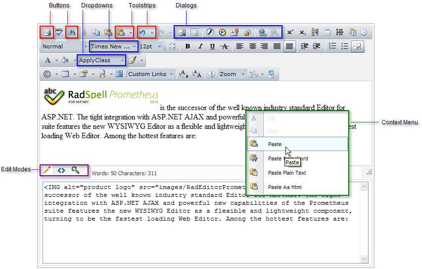

# RadEditor Structure

## 
>caption 

* __Toolbars -__ the main elements of the Telerik RadEditor are the Toolbars. They are in fact containers, which accommodate the buttons and dropdown lists of the various tools.

* __Buttons__ - the buttons are used to edit content, to launch different dialogs, to Undo / Redo the content, save or cancel the changes, etc.

* __Dropdowns -__ the dropdowns are used to format the font appearance (family, size, color, apply css class) as well as to insert objects into the content area such as html code snippets.

* __ToolStrip__ - ToolStrips are useful dropdowns that contain a group of tools with related functionality and can be a very convenient means of arranging tools used in the editor. You can see how to create a ToolStrip [here]().

* __Dialogs -__ the dialogs are used to insert objects into the content area such as images, links, media and flash files.

* __Context Menus__ -Shortcut menus thatinclude the commands that are commonly associated with an object on the screen. To activate an item's context menu, point to it with the screen pointer, then press and release the right mouse button once. With RadEditor, you can use the default context menus as well as specify custom ones for the various HTML elements (e.g. different context menus for images, tables, hyperlinks etc.) You can also disable the context menus for certain elements (e.g. for tables).

* __Modules -__ The modules are special tools used to provide extra information such as Tag Inspector, Real TimeHTML Viewer, Statistics module etc for the RadEditor users . Currently, there are three modules shipped out-of-the box with the editor: Tag Inspector, Real Time HTML Inspector and Statistics Module.

* __Editor Mode buttons -__ they are used to switch between the editor's viewing modes: Design, HTML and Preview.
