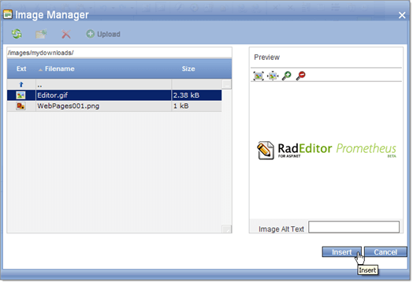

# Standards Compliance and Browser Support

## 

* [XHTML Compliance]()—Telerik RadEditor canprovide complete XHTML 1.1 compliance, which has the following two aspects:- The markup comprising the interface of the editor (toolbar, dialogs, etc.) is XHTML 1.1 compliant.- The the editor can produce XHTML 1.1 compliant content (the content being edited). RadEditor for ASP.NET AJAX creates XHTML by default and provides enhanced client-side XHTML filters.

* [WCAG 2.0 and Section 508 Accessibility Compliance]()—Telerik RadEditor satisfies the requirements for accessibility, which is a result of the following:- the interface of the Telerik RadEditor is **"Level AAA"** accessible (in accordance with the W3C Web Accessibility Guidelines 1.0).- the content generated by the Telerik RadEditor can become accessible if the author fills in all required fields (marked with a special accessibility icon ).

* [Keyboard Support Overview]()—RadEditor takes the authoring experience even closer to the usability of desktop applications, Telerik RadEditor introduces the ability to assign custom keyboard shortcuts to every tool. This can be done using the **ShortCut** property the EditorTool class. The shortcut mechanism will override the default shortcuts of the browser, like Ctrl+N, Ctrl+F, Ctrl+P, so you can use those combinations for custom purposes. Keyboard support is also a requirement for [WCAG 2.0 and Section 508 Accessibility Compliance](). You can find more information about setting the shortcuts [here]().

* [Cross-browser support]()—RadEditor for ASP.NET AJAX works in all major browsers: Internet Explorer 7.0+, FireFox (Current, previous and [ESR](https://www.mozilla.org/en-US/firefox/organizations/)), Safari 6.0+ and Opera 15.0+ (Blink) and 12.0+ (Presto). RadEditor is the first editor to support Safari and Opera.

* **Browsers' Popup Blockers do not catch RadEditor dialogs**—Telerik RadEditor can uses its own dialogs (see example below). The advantage of the own dialogs is that they will not be blocked by the integrated pop-up blocker in Windows XP Service Pack 2. Moreover, the status bar, which is mandatory for all browser windows in SP2, will not be displayed, preserving the proper graphic design of the dialogs.

	

## See Also

 * [Manage Content]()

 * [Toolbars and Menus]()
