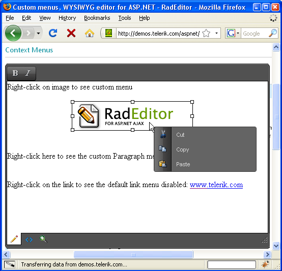

# Toolbars and Menus

## 

1. __Toolbars -__ You can fully customize the UI of RadEditor using its Tools collection. The collection contains the tools that are placed on the toolbar. You can arrange tools in __Groups__ and __ToolStrips__:

1. __Groups__ are the RadEditor's abstraction for Toolbars. Groups usually contain tools with similar or related functionality. You can find more information about toolbars in the following article: [Introduction to Toolbars]().

1. __ToolStrips__ are special tools that contain other tools. ToolsStrips are extremely useful for reducing toolbar clutter. A common use of toolstrip is the PasteStrip tool, which combines the Paste tools, such as Paste, PasteFromWord, PastePlainText, etc. You can find more information about the toolstrips in the following article: [How to create a ToolStrip]().

1. __Context sensitive buttons__ - some of the buttons on the Telerik RadEditor toolbars will change their state in real time to reflect the actual state of the cursor selection (i.e. bold, justification, etc.) Some buttons will be enabled if certain action can be performed with the current cursor selection (e.g. Unlink is enabled only if you have selected a hyperlink, Redo is not available if you haven't undone any action first). You can find more information how to add buttons to the toolbars [here]() and [here]().

1. __Advanced Tools -__RadEditor takes the user experience even closer to desktop word processors, thanks to its advanced tools:

1. Multilevel __Undo/Redo__ feature with action trails. They allow you to see the past actions and undo/redo one or more of them at once, just like in Microsoft Word

1. __InsertTable__ dropdown - allows to select the number of rows and columns you would like to create and insert at the cursor position in the editor's content area.

1. __ApplyCssClass__ dropdown- allows to apply predefined styles to the selected text.

1. __CustomLinks__ dropdown - allows to create a preset hyperlink on the selected text, number or image.

1. __FormatStripper__ - removes Word®, custom or all formatting from the selected or the whole text

1. __RealFontSize__ - allows to change the font size of the selected text in pixels or in points.

1. __ForeColor__/__BackColor__ tools with color pickers - allows to apply the desired background and foreground colors to a selection.

1. __Context menus__- RadEditor for ASP.NET AJAX provides context menus, which can be customized depending on the currently selected HTML element, e.g. you could have different context menus for IMG elements and TABLE elements. The context menus are available for Gecko-based browsers as well. You can also disable the context menus for certain elements (e.g. for tables).
>caption 

1. __Keyboard support__ - All UI elements of RadEditor for ASP.NET AJAX are fully accessible from the keyboard. This includes shortcuts to directly activate the tools on the toolbar and keyboard navigation within the toolbars:

1. Use __F10__ to move the focus on the toolbars

1. Use the arrows or __Tab__ / __Ctrl+Tab__ to navigate through the tools

1. When the focus is on a dropdown, use the __Up__ and __Down__ arrows to select an item

1. Press __Enter__ to activate the selected button or dropdown item

# See Also

 * [Manage Content]()

 * [Standards Compliance and Browser Support]()
