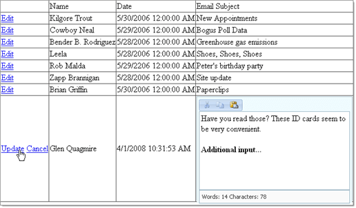

# Edit Template in Grid

You can use RadEditor in a **EditItemTemplate** of a **DataGrid**, taking advantage of the standard framework provided by the DataGrid control. The example below demonstrates:



## Configure the Web Application for RadEditor

In a new AJAX Enabled Web Application:

## Add Data File

1. Locate the Access database file "email.mdb" in the `\<Controls installation folder>\Live Demos\App_Data`.

1. In the Solution Explorer, copy the "email.mdb" file to the project's **App_Data** folder.

## Configure Controls in Designer

1. Add the DataGrid, RadEditor and label controls to your page. You can paste the ASP markup shown below.

>tip The key portion of markup to notice in the example below is the tag **EditItemTemplate** that contains the **RadEditor** .You can bind text from the database to the editor by assigning the **Content** property with an **Eval** statement:
>Content='<%# Eval("Body") %>'
>tip that this is done as an attribute of the `<telerik:RadEditor>` tag and not within the `<Content>` child element. Also note that the **Eval** statement is surrounded in single quotes.
>


````ASP.NET
<asp:DataGrid ID="MyDataGrid" runat="server" OnUpdateCommand="MyDataGrid_Update"
	OnEditCommand="MyDataGrid_Edit" AutoGenerateColumns="False" OnCancelCommand="MyDataGrid_CancelCommand">
	<Columns>
		<asp:EditCommandColumn EditText="Edit" CancelText="Cancel" UpdateText="Update" />
		<asp:TemplateColumn Visible="False">
			<ItemTemplate>
				<asp:Label ID="lblID" runat="server" Text='<%# DataBinder.Eval(Container.DataItem, "ID") %>' />
			</ItemTemplate>
		</asp:TemplateColumn>
		<asp:BoundColumn DataField="name" HeaderText="Name" ReadOnly="True" />
		<asp:BoundColumn DataField="date" HeaderText="Date" ReadOnly="True" />
		<asp:TemplateColumn HeaderText="Email Subject">
			<ItemTemplate>
				<asp:Label ID="lblField1" CssClass="text" runat="server" Text='<%# DataBinder.Eval(Container.DataItem, "Subject") %>' />
			</ItemTemplate>
			<EditItemTemplate>
				<telerik:RadEditor RenderMode="Lightweight" ID="RadEditor1" runat="server" Content='<%# Eval("Body") %>' EditModes="Design"
					Skin="Vista" Width="300px" Height="200px">
					<Tools>
						<telerik:EditorToolGroup>
							<telerik:EditorTool Name="Cut" />
							<telerik:EditorTool Name="Copy" />
							<telerik:EditorTool Name="Paste" />
						</telerik:EditorToolGroup>
					</Tools>
					<Modules>
						<telerik:EditorModule Name="RadEditorStatistics" ScriptFile="" />
					</Modules>
				</telerik:RadEditor>
			</EditItemTemplate>
		</asp:TemplateColumn>
	</Columns>
</asp:DataGrid>
````


## Handle Events in Code-Behind

1. Add the namespaces **System.Data.OleDb** and **Telerik.Web.UI** to your "uses" (C#) or "Imports" (VB) portion of the code-behind.

1. In the code-behind, create helper methods to connect to the Email table and populate the grid:


	**C#**
	
		// Returns a connection to the Access Database
		private OleDbConnection CreateConnection()
		{
			OleDbConnection connection = new OleDbConnection();
			connection.ConnectionString =
					"Provider=Microsoft.Jet.OLEDB.4.0;Data Source=" +
					Request.MapPath("\\App_Data\\email.mdb") + ";User ID=;Password=;";
			connection.Open();
			return connection;
		}
		// Populates the grid with all columns and rows of the "Email" table.
		private void ReadAllRecords()
		{
			OleDbConnection connection = CreateConnection();
			OleDbCommand command2 = new OleDbCommand("SELECT * FROM email", connection);
			MyDataGrid.DataSource = command2.ExecuteReader();
			MyDataGrid.DataBind();
			connection.Close();
		} 	
		
	**VB**
	
		' Returns a connection to the Access Database
		Private Function CreateConnection() As OleDbConnection
			Dim connection As New OleDbConnection()
			connection.ConnectionString = "Provider=Microsoft.Jet.OLEDB.4.0;Data Source=" + Request.MapPath("\App_Data\email.mdb") + ";User ID=;Password=;"
			connection.Open()
			Return connection
		End Function
		' Populates the grid with all columns and rows of the "Email" table.
		Private Sub ReadAllRecords()
			Dim connection As OleDbConnection = CreateConnection()
			Dim command2 As New OleDbCommand("SELECT * FROM email", connection)
			MyDataGrid.DataSource = command2.ExecuteReader()
			MyDataGrid.DataBind()
			connection.Close()
		End Sub


1. Create event handlers for the grid Update, Edit and Cancel events. Also handle the Page_Load event to initially populate the grid. Replace the event handler code with the example below:


	**C#**
	
		protected void Page_Load(object sender, EventArgs e)
		{
			if (!IsPostBack)
			{
				ReadAllRecords();
			}
		}
		protected void MyDataGrid_Update(object sender, DataGridCommandEventArgs e)
		{
			RadEditor radEditor = ((RadEditor)e.Item.FindControl("RadEditor1"));
			string content = radEditor.Content;
			string itemID = ((Label)e.Item.FindControl("lblID")).Text;
			const string updateCommand = "UPDATE Email SET [Date] = Now(), [Body] = @content WHERE [ID] = @nid";
			OleDbConnection connection = CreateConnection();
			OleDbCommand command = new OleDbCommand(updateCommand, connection);
			command.Parameters.AddWithValue("content", content);
			command.Parameters.AddWithValue("nid", Convert.ToInt32(itemID));
			command.ExecuteNonQuery();
			connection.Close();
			MyDataGrid.EditItemIndex = -1;
			ReadAllRecords();
		}
		protected void MyDataGrid_Edit(object sender, DataGridCommandEventArgs e)
		{
			MyDataGrid.EditItemIndex = e.Item.ItemIndex;
			ReadAllRecords();
		}

		protected void MyDataGrid_CancelCommand(object source, DataGridCommandEventArgs e)
		{
			ReadAllRecords();
		} 			

	**VB**
	
	    Protected Sub Page_Load(ByVal sender As Object, ByVal e As EventArgs)
	        If Not IsPostBack Then
	            ReadAllRecords()
	        End If
	    End Sub
	
	    Protected Sub MyDataGrid_Update(ByVal sender As Object, ByVal e As DataGridCommandEventArgs)
	        Dim radEditor As RadEditor = (DirectCast(e.Item.FindControl("RadEditor1"), RadEditor))
	        Dim content As String = radEditor.Content
	        Dim itemID As String = (DirectCast(e.Item.FindControl("lblID"), Label)).Text
	        Const updateCommand As String = "UPDATE Email SET [Date] = Now(), [Body] = @content WHERE [ID] = @nid"
	        Dim connection As OleDbConnection = CreateConnection()
	        Dim command As New OleDbCommand(updateCommand, connection)
	        command.Parameters.AddWithValue("content", content)
	        command.Parameters.AddWithValue("nid", Convert.ToInt32(itemID))
	        command.ExecuteNonQuery()
	        connection.Close()
	        MyDataGrid.EditItemIndex = -1
	        ReadAllRecords()
	    End Sub
	    Protected Sub MyDataGrid_Edit(ByVal sender As Object, ByVal e As DataGridCommandEventArgs)
	        MyDataGrid.EditItemIndex = e.Item.ItemIndex
	        ReadAllRecords()
	    End Sub
	
	    Protected Sub MyDataGrid_CancelCommand(ByVal source As Object, ByVal e As DataGridCommandEventArgs)
	        ReadAllRecords()
	    End Sub


## See Also

 * [Set Properties]()

 * [Overview]()
