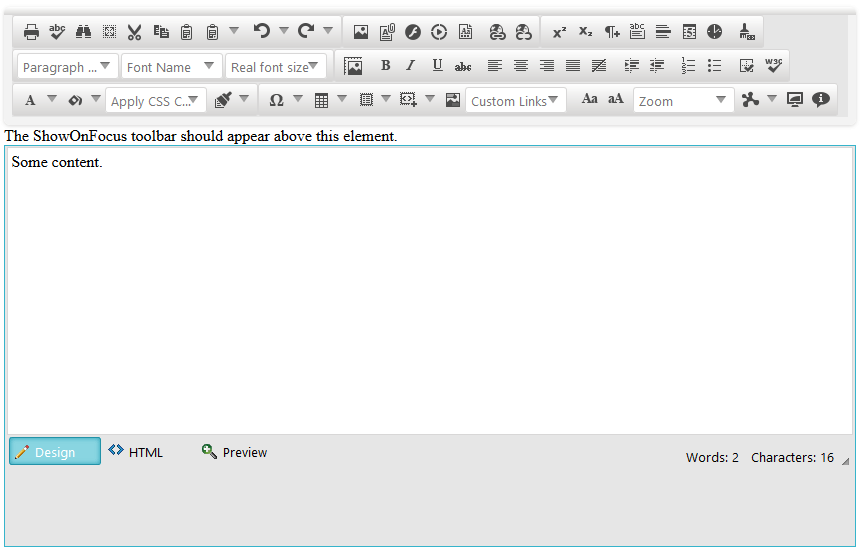

# Move ShowOnFocus Toolbar to a Different Location

In this article you will learn how to move the toolbar's popup element of **RadEditor** to a different location on the page when `ToolbarMode` is set to `ShowOnFocus`.

This situation is useful when there is some description (or another DOM element) above **RadEditor** that needs to remain visible after toolbar is shown. The following steps show the overall technique to move the toolbar (You can also see a code example in **Example 1**):

1. Wrap the DOM element that needs to be visible and **RadEditor** in an element with `position: relative` style.
1. Handle the [OnClientLoad event]() of **RadEditor**;
1. In the **OnClientLoad** event handler, get the **RadEditor** element and its relative parent (by using [jQuery.offsetParent](https://api.jquery.com/offsetParent/) method) and get its position;
1. Get the **RadWindow** instance of the toolbar popup—`editor.get_toolAdapter().get_window()`;
1. Handle the [show event]() of the popup to implement the logic for replacing the **RadWindow** popup;
1. In the **OnClientLoad** event handler, get the popup's height;
1. And use the **RadWindow** `moveTo()` method to reposition the popup based on the relative parent's position by considering the popup hight from step 6.

>caption Figure 1: The result from the code in **Example 1**.



>caption Example 1: Move **ShowOnFocus** toolbar of **RadEditor** based on a relative parent.

````ASP.NET
<%-- Fake page content --%>
<div style="height:200px; width:200px;">
</div>

<div id="wrapper" style="position: relative; width: 98%;">
    <asp:Label Text="The ShowOnFocus toolbar should appear above this element." runat="server" />

    <telerik:RadEditor ID="RadEditor1" runat="server" ToolbarMode="ShowOnFocus"
         OnClientLoad="OnClientLoad" Skin="Silk">
        <Content>
            Some content.
        </Content>
    </telerik:RadEditor>
</div>

<script>
    function OnClientLoad(editor, args) {
        var $ = $telerik.$;
        var editorElm = editor.get_element();
        var relativeParentPos = $(editorElm).offsetParent().position();

        editor.get_toolAdapter().get_window().add_show(function (sender, args) {
            var popupElementHeight = $(sender.get_popupElement()).height();
            sender.moveTo(relativeParentPos.left, relativeParentPos.top - popupElementHeight);
        })
    }
</script>
````


