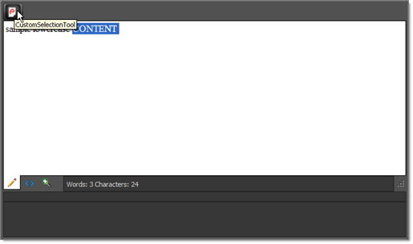

# Obtain Current Editor's Selection as HTML

When implementing custom tools or dialogs, you may need to obtain the current editor selection in HTML form. The following solution shows how to do this using RadEditor cross-browser compatible, client-side methods. Use the client-side **getSelectionHtml()** method to retrieve the selected HTML and the **pasteHtml()** method to replace the HTML of the current selection.

The example below shows how to obtain the current selection using a custom button, convert it to upper case and then paste it back (replacing the original text).

1. Add the custom CustomSelectionTool button to the editor toolbar:

	**ASP.NET**
	
		
		...
		<telerik:RadEditor runat="server" ID="RadEditor1">
			<Tools>
				<telerik:EditorToolGroup>
					<telerik:EditorTool Name="CustomSelectionTool" />
				</telerik:EditorToolGroup>
			</Tools>
			<Content>        
				sample lowercase content    
			</Content>
		</telerik:RadEditor>

1. Add the CustomSelectionTool javascript command under the editor declaration in your aspx / ascx:

	**JavaScript**
			 
		Telerik.Web.UI.Editor.CommandList["CustomSelectionTool"] = function(commandName, editor, args)
		{   
			// To get the selected Html   
			var currentSelectedHtml = editor.getSelectionHtml();   
			// Convert it to upper case   
			currentSelectedHtml = currentSelectedHtml.toUpperCase();
			// To insert a Html portion at the current cursor position, you can use:   
			editor.pasteHtml(currentSelectedHtml);
		};

