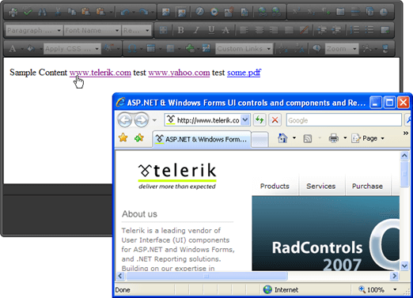

# Open Link in a New Window When Clicked

The code below demonstrates how to iterate RadEditor document links when the editor is loaded. The code sets the link target attribute to so that the link is opened in a new window when clicked. You can use this approach to modify the attributes and events of all HTML elements in the editor content area. This example opens the editor in **Preview EditorMode** so that clicking the links will have the expected behavior.



````JavaScript
<script type="text/javascript">
	function OnClientLoad(editor)
	{
		var links = editor.get_document().getElementsByTagName("A");
		for (var i = 0; i < links.length; i++)
		{
			var link = links[i];
			link.setAttribute("target", "#");
		}
	}
</script>
````

````ASP.NET
<telerik:RadEditor ID="RadEditor1" runat="server" Skin="Default" OnClientLoad="OnClientLoad"
	EditModes="Preview">
	<Content>       
		Sample Content        
		<a href="httpwww.telerik.com&quot;>www.telerik.com</a>
		test
		<a href="http://www.yahoo.com">www.yahoo.com</a>
		test
		<a href="http://www.test.com/some.pdf">some.pdf</a>
	</Content>
</telerik:RadEditor>
````


