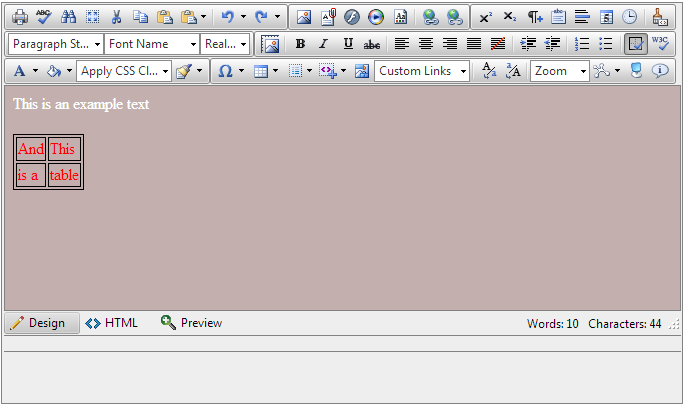
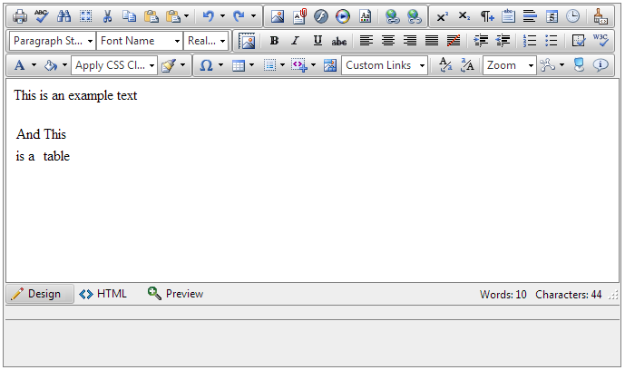

# Custom Stylization

Customizing the RadEditor’s content could be achieved with two properties, **ContentAreaCssFile** and **CSSFiles**. The values of these properties are the relative path to a CSS file, where are placed the styling rules for the default design of the content area. (COMMENT: This last sentence does not make sense. Please revise.)

>warning Both properties work only in **ContentAreaMode="Iframe"** mode. In **“DIV”** mode the content area stylization should be done with an ordinary link to the CSS file in the **head** element using the **.reContentArea** as parent for all desired child elements in the CSS selectors.

## Differences between the two approaches

When it comes to stylization for the default design rules there are no differences in the setup for the two approaches. Using CSS selectors of HTML elements will set the default CSS rules for the content. For example, to change the background color of the content area, the CSS file for both approaches will look like this:

````CSS
body
{
  background-color: red;
  background-image: url(image_path);
  color: black;
}
````

The biggest difference is that the **ContentAreaCssFile** property is intended for default settings like the example above and using custom class names (Example: **.redText**) in the CSS selectors will not affect the content design.

Use the **CSSFiles** property so that users can choose a different predefined set of class names, populated from the CSS file/s or override from the **CssClasses** property. The class names could be selected from a dropdown menu (**Apply CSS class** tool) for the desired element in the content and with that to change its class name and respectively the styling and/or formatting with predefined styling rules from the pointed CSS file. (COMMENT: This last sentence does not make sense. Please revise.)

The following example shows how to set a default body background and an option in the **Apply CSS class** dropdown for text with white color:

````ASP.NET
<telerik:radeditor runat="server" id="RadEditor1">
	<CssFiles>
		<telerik:EditorCssFile Value="~/ContentAreaCssFile.css" />
	</CssFiles>
	<CssClasses>
		<telerik:EditorCssClass Name="Black text" Value=".blackText" />
	</CssClasses>
</telerik:radeditor>
````

````CSS
body
{
	background-color: red;
	color: white;
}

.blackText 
{
	color: black;
}
````


## Using ContentAreaCssFile property

The following example shows how to set a default background for the content area:

Setting the property from the markup

````ASP.NET
<telerik:radeditor id="RadEditor1" runat="server" ContentAreaCssFile="~/ContentAreaCssFile.css">
</telerik:radeditor>
````

Setting the property from the Code-behind

````C#
RadEditor1.ContentAreaCssFile = "~/ContentAreaCssFile.css";
````
````VB
RadEditor1.ContentAreaCssFile = "~/ContentAreaCssFile.css"
````

Setting the CSS rules

````CSS
body
{
	background-color: red;
	color: white;
}
````

Note that the **RadEditor** control has some default styling for some of the elements inside the content area so that the user could easily interact with them in **Design** mode. Using the **ContentAreaCssFile** property for custom stylization will override the default one. One example for an element with such stylization is the **table**.

In addition, to preserve or override this default stylization and preserve the user-friendly interface, you could follow this [online live demo project](http://demos.telerik.com/aspnet-ajax/editor/examples/settingcontentareadefaults/defaultcs.aspx#qsf-demo-source) for the whole CSS file or use these example CSS rules:

````CSS
body 
{
padding:3px;
background-image: none;
margin: 0;
text-align: left;
word-wrap: break-word;
}

form 
{
	background-color:#efefef;
	border: 1px dashed #555;
}

table 
{
	border-right: 1px dashed #999;
	border-bottom: 1px dashed #999;
}

table td 
{
	padding: 1px;
	border-top: 1px dashed #999;
	border-left: 1px dashed #999;
}

table th 
{
	padding: 1px;
	border-top: 1px dashed #000;
	border-left: 1px dashed #000;
}
````

## Using CSSFiles property

This example shows how to populate the **Apply CSS class** dropdown and define the CSS rules for the corresponding options.

Setting the property from the markup

````ASP.NET
<telerik:radeditor runat="server" id="RadEditor1" >
	<CssFiles>
		<telerik:EditorCssFile Value="~/ContentAreaCssFile.css" />
	</CssFiles>
</telerik:radeditor>
````

Setting the property from the Code-behind

````C#
RadEditor1.CssFiles.Add("~/ContentAreaCssFile.css");
````
````VB
RadEditor1.CssFiles.Add("~/ContentAreaCssFile.css")
````


Setting the CSS rules

````CSS
.redText 
{
	color:red;
}

.greenText 
{
	color:green;
}
````


Result:


>note Note that using a link to a CSS file in the head element with global CSS selectors will affect the content of the RadEditor control as well. Using the **CssFiles** property will override the CSS rules from these files. Also, using an empty property will clear them.

The names populated in the dropdown menu could be modified from the property **CSSClasses** with the attributes **Name** and **Value**. **Name** holds the value to the text that appears in the dropdown menu and **Value** – the class name for the selected element.

Example:

Setting the property from the markup

````ASP.NET
<CssClasses>
	<telerik:EditorCssClass Name="Red Text" Value=".redText" />
	<telerik:EditorCssClass Name="Green Text" Value=".greenText" />
</CssClasses>
````

Setting the property from the Code-behind

````C#
EditorCssClass redText = new EditorCssClass("Red Text", ".redText");
EditorCssClass greenText = new EditorCssClass("Green Text", ".greenText");
RadEditor1.CssClasses.Add(redText);
RadEditor1.CssClasses.Add(greenText);
````
````VB
EditorCssClass redText = New EditorCssClass("Red Text", ".redText")
EditorCssClass greenText = New EditorCssClass("Green Text", ".greenText")
RadEditor1.CssClasses.Add(redText)
RadEditor1.CssClasses.Add(greenText)
````


Result:


>note A class name (Value) set within the **CSSClasses** property, which does not exist as selector in one of the CSS files, will not be populated in the menu. The opposite - if there is a class name not set within the **CSSClasses** , but exists in a CSS file will be restricted also. (COMMENT: This last sentence does not make sense. Please revise.)

## User functionality for previewing the content without custom stylization

The built-in tool **Show/Hide Borders** gives the possibility to the users to preview the content without the set default customization. This is because after sending, submitting or sending the content outside the scope of the Editor’s iframe, the stylization is not included and does not depend on the CSS files pointed from the properties. This tool (button) actually disables the CSS links in the head element of the iframe.

The following example shows the functionality with this custom CSS rules:

````CSS
body 
{
background-color:rgba(155, 119, 119, 0.58);
color: white;
}

table 
{
	border:1px solid black;
	color: red;
}

table td 
{
	border:1px solid black;
}
````

Result:

With the tool turned ON:



With the tool turned OFF:



## See Also

 * [Default Font for Editable Content]()

 * [Set Editor Background and Color]()

 * [Set Defaults]()

 * [Content Area Appearance Problems]()
