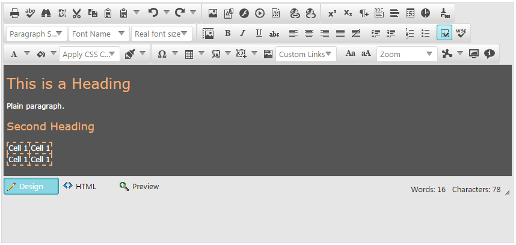

# Decorating Div Content Area

This help article explains how to decorate the content area of **RadEditor** when **ContentAreaMode** property is set to **Div**.

As learned from [Setting Default Stylization]() and [Using ContentAreaCssFile Property]() articles, when **ContentAreaMode** is set to **Div**, external CSS files cannot decorate the content area.

This is because the `<div>` element rendered as content area does not have a `<head>` element. Therefore, any styles that should decorate the content area should be loaded directly in the page, where **RadEditor** is loaded. 

The recommended approach is to target the elements in the content are using the **reContentArea** class and prevent the usage of global styles in the page.

The following example shows how you can style the content are when the content area is rendered as `<div>` element.

>caption Figure 1: The result from the decoration in Example 1.



>caption Example 1: CSS styles that decorate RadEditor with ContentAreaMode set to Div.

````ASP.NET 
<style>
    /* Default styles for the content area */
    div.reContentArea {
        font-family: Verdana;
        font-size: 12px;
        color: white;
        background-color: #555;
        text-align: left;
        word-wrap: break-word;
    }

        div.reContentArea h1,
        div.reContentArea h2,
        div.reContentArea h3 {
           color:#f2af77;
           font-weight:normal;
        }

        div.reContentArea table,
        div.reContentArea table td {
            border-collapse:collapse;
            border:2px dashed #f2af77;
        }
</style>

<telerik:RadEditor ID="Editor" runat="server" ContentAreaMode="Div" Skin="Silk">
    <Content>
        <h1>This is a Heading</h1>
        <p>Plain paragraph.</p>
        <h2>Second Heading</h2>
        <table>
            <tr><td>Cell 1</td><td>Cell 1</td></tr>
            <tr><td>Cell 1</td><td>Cell 1</td></tr>
        </table>
    </Content>
</telerik:RadEditor>

````


## See Also

* [ContentAreaCssFile property]()

* [Setting Default Stylization]()

* [Using ContentAreaCssFile Property]()

* [CSS Styles]()

* [External CSS Files]()