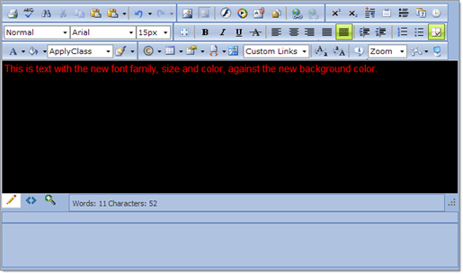

# Set Editor Background and Color


Set the RadEditor background and font color by using one of the following methods:

## Via CSS

The rich text content area of RadEditor is an editable IFRAME element. This IFRAME is a separate document that has its own CSS styles that originate from the RadEditor skin. The default appearance in the content area can be overridden by setting the editor's __CssFiles__ property to point to your own CSS file, for example:

````ASPNET
	<telerik:radeditor runat="server" ID="RadEditor1">
	 <CssFiles>
	     <telerik:EditorCssFile Value="~/EditorContentArea.css" />
	 </CssFiles>
	</telerik:radeditor> 
````


The CSS file should contain the following class:

````XML
	body
	{
	  background-color: red;
	  background-image: url(image_path);
	  color: black;
	}
````


>caption 



To style other HTML elements in the content area you need to define global css classes for them, e.g. __table__, __td__, __td__, __div__, __span__, etc

## 

Using Client-Side Code

Use the __get_contentArea()__JavaScript method to get a reference to the content area style client object. You can use the style client object to set style properties.

````ASPNET
	<telerik:RadEditor
	   ID="RadEditor1"
	   OnClientLoad="OnClientLoad"
	   runat="server">
	</telerik:RadEditor>
	...
	<script type="text/javascript">
		function OnClientLoad(editor, args) {
			var style = editor.get_contentArea().style;
			style.backgroundImage = "none";
			style.backgroundColor = "black";
			style.color = "red";
			style.fontFamily = "Arial";
			style.fontSize = 15 + "px";
		}
	</script> 
````


# See Also

 * [Content Area Appearance Problems]()
