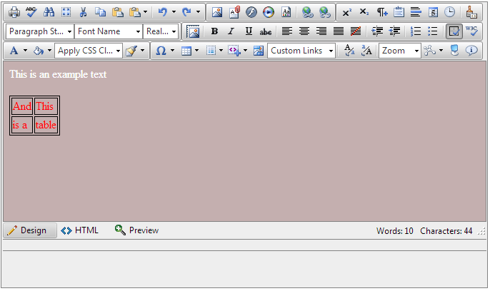
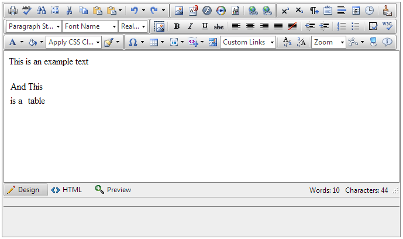

# Using ContentAreaCssFile Property

This article examines the main purpose of the **ContentAreaCssFile** property, its usage and the concepts about it.

Here is a list with the sections in this article:

1. [Concepts](#concepts)
1. [Basic Usage](#basic-usage)
1. [Show/Hide Border tool](#showhide-border-tool)


## Concepts

At a first glance the approach below will give you the same results as if the [CssFiles collection]() is used. Although, it is different by concept: 

1. Most important: Using the **ContentAreaCssFile** property will not prevent styles from the main page to decorate the content area of **RadEditor**;
2. All styles from the **ContentAreaCssFile.css** file will not decorate the content in Preview mode;
3. All styles form the **ContentAreaCssFile.css** file can be toggled via the [Show/Hide Border tool](#showhide-border-tool) ().

## Basic Usage

>important This approach is available only when [ContentAreaMode]() is iframe. Using a content area rendered as a DIV element does not offer native capabilities to add external CSS files.

By default, the editor's content area is always decorated by an external CSS file. This file is not part of the [CssFiles collection]() and its purpose is different. 

This file is configured via the **ContentAreaCssFile** property and it decorates some of the elements in the content area in order to improve the user experience. The property exposed enables you to override the rules and define ones of your own (see **Example 2**).

In addition to override this default stylization and preserve the user-friendly interface you could follow this [online live demo project](http://demos.telerik.com/aspnet-ajax/editor/examples/settingcontentareadefaults/defaultcs.aspx#qsf-demo-source) for the [whole CSS file](http://demos.telerik.com/aspnet-ajax/editor/examples/settingcontentareadefaults/EditorDefaultStylizaton.css) or use these example CSS rules:

>caption Example 1: Default ContentAreaCssFile.css contents.

````CSS
body 
{
padding:3px;
background-image: none;
margin: 0;
text-align: left;
word-wrap: break-word;
}

form 
{
	background-color:#efefef;
	border: 1px dashed #555;
}

table 
{
	border-right: 1px dashed #999;
	border-bottom: 1px dashed #999;
}

table td 
{
	padding: 1px;
	border-top: 1px dashed #999;
	border-left: 1px dashed #999;
}

table th 
{
	padding: 1px;
	border-top: 1px dashed #000;
	border-left: 1px dashed #000;
}
````


>caption Example 2: Overriding the defalt ContentAreaCssFile.css file in the markup.


````ASP.NET
<telerik:radeditor id="RadEditor1" runat="server" ContentAreaCssFile="~/ContentAreaCssFile.css">
</telerik:radeditor>
````

>caption Example 3: Overriding the defalt ContentAreaCssFile.css file from the code behind.

````C#
RadEditor1.ContentAreaCssFile = "~/ContentAreaCssFile.css";
````
````VB
RadEditor1.ContentAreaCssFile = "~/ContentAreaCssFile.css"
````

>caption Example 4: Sample of a custom ContentAreaCssFile.css file.

````CSS
body
{
	background-color: red;
	color: white;
}
````

## Show/Hide Border tool

The built-in tool **Show/Hide Borders** enables the end-user to preview the content without the styles from the **ContentAreaCssFile.css**. This tool disables the CSS link (that imports the ContentAreaCssFile.css file to the content area) in the head element of the iframe.

The following example demonstrates the tool's behavior:

>caption Example 5: Sample of a custom ContentAreaCssFile.css file.

````CSS
body 
{
background-color:rgba(155, 119, 119, 0.58);
color: white;
}

table 
{
	border:1px solid black;
	color: red;
}

table td 
{
	border:1px solid black;
}
````

Results:

>caption Figure 1: **Show/Hide Borders** tool turned ON



>caption Figure 2: **Show/Hide Borders** tool turned OFF



## See Also

* [Setting Default Stylization]()

* [CSS Styles]()

* [External CSS Files]()