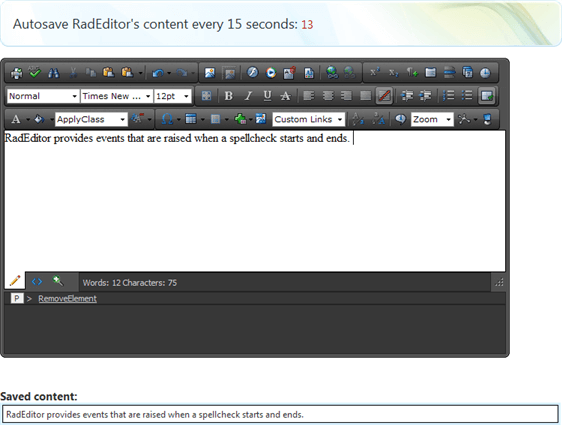

# Auto Save with Ajax


## 

This example demonstrates how to implement autosave functionality using RadEditor for ASP.NET AJAX and an MS AJAX Timer. In the example the editor's content is read on the server in the Timer OnTick event, and fed into a label. In a real world scenario the content would be saved into a database or other temporary storage.
>caption 



The Timer is configured to perform an AJAX request every 15 seconds. However, it is not advisable to do so without checking whether the user is using the AJAX SpellCheck at the time of sending the content. While it is in AJAX SpellCheck mode, the editor's content contains additional formatting inserted by the spellchecker to highlight mistaken words. As a result, it is not desireable to save the content while in spellcheck mode.

RadEditor provides events that are raised when a spellcheck starts and ends. The example demonstrates how to attach to these events, and stops the Timer during spellchecking, and restarts it when the spellcheck is finished.

````JavaScript
	
	
	        function OnClientLoad(sender, args)
	        {
	            var timer = $find("<%=Timer1.ClientID %>");
	            //Attach to the spellCheckLoaded event as the spell itself is loaded with AJAX         
	            sender.add_spellCheckLoaded(function ()
	            {
	                var spell = sender.get_ajaxSpellCheck();
	                spell.add_spellCheckStart(function (sender, args)
	                {
	                    timer._stopTimer();
	                });
	                spell.add_spellCheckEnd(function (sender, args)
	                {
	                    //Restart the timer;                         
	                    timer._startTimer();
	                });
	            });
	        }
	
	
````


