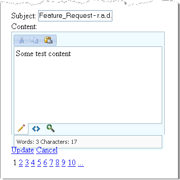

# Codeless Save in Database ASP.NET

With the new data binding introduced since ASP.NET 2.0, you can easily edit the rich-text content in your database with RadEditor. To use RadEditor for content editing in your SQL Server database:

* Add an DataSource object and configure Select, Update, Insert and Delete commands

* Add a DataBound object such as FormView and set its DataSourceID to point to the created DataSource

* Edit the EditItemTemplate and InsertItemTemplate tags in the ASP.NET markup by adding RadEditor and binding it to the rich-text column in your database



Configure a SqlDataSource. Be sure to define the delete, insert, select and update commands.

````ASP.NET
<asp:SqlDataSource ID="SqlDataSource1" runat="server" ConnectionString="<%$ ConnectionStrings:MailConnectionString2 %>"
	DeleteCommand="DELETE FROM Mails WHERE (MailID = @MailID)" InsertCommand="INSERT INTO Mails(MailID, Received, Subject, [Content]) VALUES (@MailID,@Received,@Subject, @Content)"
	SelectCommand="SELECT MailID, Received, Subject, [Content] FROM Mails" UpdateCommand="UPDATE Mails SET Subject=@Subject, [Content]=@Content, Received=@Received where MailID=@MailID">
	<DeleteParameters>
		<asp:Parameter Name="MailID" />
	</DeleteParameters>
	<UpdateParameters>
		<asp:Parameter Name="Subject" />
		<asp:Parameter Name="Content" />
		<asp:Parameter Name="Received" />
		<asp:Parameter Name="MailID" />
	</UpdateParameters>
	<InsertParameters>
		<asp:Parameter Name="MailID" />
		<asp:Parameter Name="Received" />
		<asp:Parameter Name="Subject" />
		<asp:Parameter Name="Content" />
	</InsertParameters>
</asp:SqlDataSource>
````

Add a **FormView** control to your page. Select **Choose DataSource** from the **Smart Tag**. Choosing the data source will populate the FormView templates with appropriate controls and bindings. For columns that should have editors, replace the generated TextBox controls with RadEditor controls. Change the RadEditor declaration to bind the **Content** property to the database column that contains the text: `Content='<%# Bind("Content") %>'`

Here is a sample of the entire FormView and RadEditor declarations. Also notice that the FormView DataKeyNames property is populated with the primary key column name:

````ASP.NET
<asp:FormView ID="FormView1" runat="server" AllowPaging="True" DataSourceID="SqlDataSource1"
	DataKeyNames="MailID">
	<EditItemTemplate>
		MailID:
		<asp:TextBox ID="MailIDTextBox" runat="server" Text='<%# Bind("MailID") %>'>        </asp:TextBox>
		<br />
		Received:
		<asp:Calendar ID="Calendar1" runat="server" SelectedDate='<%# Bind("Received") %>'
			VisibleDate='<%# Bind("Received") %>'></asp:Calendar>
		<br />
		Subject:
		<asp:TextBox ID="SubjectTextBox" runat="server" Text='<%# Bind("Subject") %>'>        </asp:TextBox>
		<br />
		Content:
		<telerik:RadEditor ID="RadEditor1" runat="server" Skin="Vista" Width="300px" Height="200px"
			Content='<%# Bind("Content") %>'>
			<Tools>
				<telerik:EditorToolGroup>
					<telerik:EditorTool Name="Cut" />
					<telerik:EditorTool Name="Copy" />
					<telerik:EditorTool Name="Paste" />
				</telerik:EditorToolGroup>
			</Tools>
			<Modules>
				<telerik:EditorModule Name="RadEditorStatistics" />
			</Modules>
		</telerik:RadEditor>
		<br />
		<asp:LinkButton ID="UpdateButton" runat="server" CausesValidation="True" CommandName="Update"
			Text="Update">        </asp:LinkButton>
		<asp:LinkButton ID="UpdateCancelButton" runat="server" CausesValidation="False" CommandName="Cancel"
			Text="Cancel">        </asp:LinkButton>
	</EditItemTemplate>
	<InsertItemTemplate>
		MailID:
		<asp:TextBox ID="MailIDTextBox" runat="server" Text='<%# Bind("MailID") %>'>        </asp:TextBox>
		<br />
		Received:
		<asp:Calendar ID="Calendar1" runat="server" SelectedDate='<%# Bind("Received") %>'
			VisibleDate='<%# Bind("Received") %>'></asp:Calendar>
		<br />
		Subject:
		<asp:TextBox ID="SubjectTextBox" runat="server" Text='<%# Bind("Subject") %>'>        </asp:TextBox>
		<br />
		Content:
		<telerik:RadEditor ID="RadEditor1" runat="server" Skin="Vista" Width="300px" Height="200px"
			Content='<%# Bind("Content") %>'>
			<Tools>
				<telerik:EditorToolGroup>
					<telerik:EditorTool Name="Cut" />
					<telerik:EditorTool Name="Copy" />
					<telerik:EditorTool Name="Paste" />
				</telerik:EditorToolGroup>
			</Tools>
			<Modules>
				<telerik:EditorModule Name="RadEditorStatistics" />
			</Modules>
		</telerik:RadEditor>
		<br />
		<asp:LinkButton ID="InsertButton" runat="server" CausesValidation="True" CommandName="Insert"
			Text="Insert">        </asp:LinkButton>
		<asp:LinkButton ID="InsertCancelButton" runat="server" CausesValidation="False" CommandName="Cancel"
			Text="Cancel">        </asp:LinkButton>
	</InsertItemTemplate>
	<ItemTemplate>
		MailID:
		<asp:Label ID="MailIDLabel" runat="server" Text='<%# Bind("MailID") %>'></asp:Label><br />
		Received:
		<asp:Calendar ID="Calendar1" runat="server" SelectedDate='<%# Bind("Received") %>'
			VisibleDate='<%# Bind("Received") %>'></asp:Calendar>
		<br />
		Subject:
		<asp:Label ID="SubjectLabel" runat="server" Text='<%# Bind("Subject") %>'></asp:Label><br />
		Content:
		<asp:Label ID="ContentLabel" runat="server" Text='<%# Bind("Content") %>'></asp:Label><br />
		<asp:LinkButton ID="EditButton" runat="server" CausesValidation="False" CommandName="Edit"
			Text="Edit">        </asp:LinkButton>
		<asp:LinkButton ID="DeleteButton" runat="server" CausesValidation="False" CommandName="Delete"
			Text="Delete">        </asp:LinkButton>
		<asp:LinkButton ID="NewButton" runat="server" CausesValidation="False" CommandName="New"
			Text="New">        </asp:LinkButton>
	</ItemTemplate>
</asp:FormView>
````

Here is an example connection string as it would appear in Web.Config.

````XML
<connectionstrings>    
	<add name="MailConnectionString2" connectionString="Data Source=localhost; Initial Catalog=Mail; Integrated Security=True" providerName="System.Data.SqlClient" />
</connectionstrings>
````


