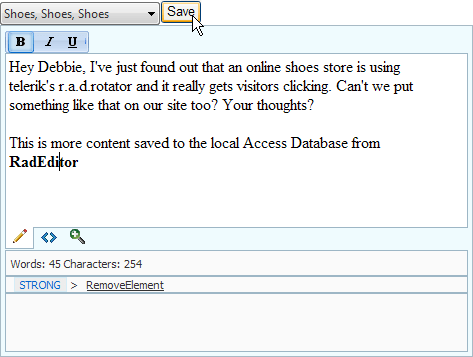

# Save in a Database


The example below demonstrates displaying database content to a RadEditor and saving changes to the database.
>caption 



## Configure the Web Application for RadEditor

In a new AJAX Enabled Web Application:

## Add Data File

1. Locate the Access database file "email.mdb" in the \__<Controls Installation Folder>\Live Demos\App_Data.__

1. In the Solution Explorer, copy the "email.mdb" file to the project's __App_Data__ folder.

## Configure Controls in Designer

1. Add a __RadComboBox__ from the ToolBox to the web page. Set the RadComboBox properties:

1. __AutoPostBack__ = __True__

1. __Skin__ = __Vista__

1. __AllowCustomText__ = __True__

1. Add a __Standard Button__ control from the ToolBox to the web page. Set the Button __ID__ property to "btnNew". Set the __Text__ property to "New".

1. Add a __Standard Button__ control from the ToolBox to the web page. Set the Button __ID__ property to "btnSave". Set the __Text__ property to "Save".

1. Open the RadEditor Smart Tag and set the the __Skin__ to __Vista__ from the drop down list.

## Configure Editor Tools

1. In the Property Window, click the RadEditor __Tools__ property ellipses. This step will open the EditorToolGroup Collection Editor dialog.

1. In the EditorToolGroup Collection Editor dialog, click the __Add__ button. This will add an EditorToolGroup item to the collection.

1. Click the EditorToolGroup item __Tools__ property ellipses. This step will open the EditorTool Collection Editor dialog.

1. Click the EditorTool Collection __Add__ button. In the properties for the EditorTool, locate the Name property, click the drop down arrow and select "Bold" from the list.

1. Click the EditorTool Collection __Add__ button. In the properties for the EditorTool, locate the Name property, click the drop down arrow and select "Italic" from the list.

1. Click the EditorTool Collection __Add__ button. In the properties for the EditorTool, locate the Name property, click the drop down arrow and select "Underline" from the list.

1. Click the __OK__ button to close the EditorTool Collection Editor dialog.

1. Click the __OK__ button to close the EditorToolGroup Collection Editor dialog.

1. The ASP.NET markup for the steps so far should look something like the example below:

````ASPNET
	<telerik:RadComboBox
	   ID="RadComboBox1"
	   runat="server"
	   AutoPostBack="True"
	   OnSelectedIndexChanged="RadComboBox1_SelectedIndexChanged"
	   Skin="Vista"
	   AllowCustomText="True">
	</telerik:RadComboBox>
	<asp:Button ID="btnNew" runat="server" OnClick="btnNew_Click" Text="New" />
	<asp:Button ID="btnSave" runat="server" Text="Save" OnClick="btnSave_Click" /><br />
	<telerik:RadEditor ID="RadEditor1" runat="server" Skin="Vista" Width="500px" Height="400px">               
	   <Tools>
	       <telerik:EditorToolGroup>
	           <telerik:EditorTool Name="Bold" />
	           <telerik:EditorTool Name="Italic" />
	           <telerik:EditorTool Name="Underline" />
	       </telerik:EditorToolGroup>
	   </Tools>
	</telerik:RadEditor> 
````


## Handle Events in Code-Behind

1. In the designer, double-click the surface of the web page to navigate to the Page_Load event handler. Replace the event handler with the following code:

>tabbedCode

````C#
		protected void Page_Load(object sender, EventArgs e)
		{
			if (!IsPostBack)
			{
				ReadAllEmail();
			}
		} 
````
````VB.NET
		Protected Sub Page_Load(ByVal sender As Object, ByVal e As EventArgs)
			If Not IsPostBack Then
				ReadAllEmail()
			End If
		End Sub
````
>end

1. Add a series of helper methods to create a connection to the Access database, update, insert and read records:

>tabbedCode

````C#
		// Helper Methods
		// Returns a connection to the Access Database
		private OleDbConnection CreateConnection()
		{
			OleDbConnection connection = new OleDbConnection();
			connection.ConnectionString =
					"Provider=Microsoft.Jet.OLEDB.4.0;Data Source=" +
					Request.MapPath("\\App_Data\\email.mdb") + ";User ID=;Password=;";
			connection.Open();
			return connection;
		}
		// Reads the "email" table and binds to the RadComboBox
		private void ReadAllEmail()
		{
			OleDbCommand command = new OleDbCommand("SELECT ID, Subject FROM email", CreateConnection());
			RadComboBox1.DataSource = command.ExecuteReader();
			RadComboBox1.DataTextField = "Subject";
			RadComboBox1.DataValueField = "ID";
			RadComboBox1.DataBind();
		}
		// Reads a single "email" table record and returns the contents as a string
		private string ReadEmail(string id)
		{
			OleDbCommand command = new OleDbCommand("SELECT Body from Email where ID = @id", CreateConnection());
			command.Parameters.AddWithValue("id", id);
			OleDbDataReader reader = command.ExecuteReader();
			if (reader.Read())
			{
				return reader.GetString(0);
			}
			return "";
		}
		// Inserts a single "email" table record
		private void InsertEmail(string subject, string body)
		{
			OleDbCommand command = new OleDbCommand("INSERT INTO Email (Subject, Body) VALUES (@subject, @body)", CreateConnection());
			command.Parameters.AddWithValue("subject", RadComboBox1.Text);
			command.Parameters.AddWithValue("body", RadEditor1.Content);
			command.ExecuteNonQuery();
			connection.Close();
		}
		// Updates a single "email" table record for a given id.
		private void UpdateEmail(int id, string subject, string body)
		{
			OleDbCommand command = new OleDbCommand("UPDATE Email SET Subject = @subject, Body = @body WHERE ID = @id", CreateConnection());
			command.Parameters.AddWithValue("subject", subject);
			command.Parameters.AddWithValue("body", body);
			command.Parameters.AddWithValue("id", id);
			command.ExecuteNonQuery();
			connection.Close();
		} 
````
````VB.NET
		' Helper Methods
		' Returns a connection to the Access Database
		Private Function CreateConnection() As OleDbConnection
			Dim connection As New OleDbConnection()
			connection.ConnectionString = "Provider=Microsoft.Jet.OLEDB.4.0;Data Source=" + Request.MapPath("\App_Data\email.mdb") + ";User ID=;Password=;"
			connection.Open()
			Return connection
		End Function
		' Reads the "email" table and binds to the RadComboBox
		Private Sub ReadAllEmail()
			Dim command As New OleDbCommand("SELECT ID, Subject FROM email", CreateConnection())
			RadComboBox1.DataSource = command.ExecuteReader()
			RadComboBox1.DataTextField = "Subject"
			RadComboBox1.DataValueField = "ID"
			RadComboBox1.DataBind()
		End Sub
		' Reads a single "email" table record and returns the contents as a string
		Private Function ReadEmail(ByVal id As String) As String
			Dim command As New OleDbCommand("SELECT Body from Email where ID = @id", CreateConnection())
			command.Parameters.AddWithValue("id", id)
			Dim reader As OleDbDataReader = command.ExecuteReader()
			If reader.Read() Then
				Return reader.GetString(0)
			End If
			Return ""
		End Function
		' Inserts a single "email" table record
		Private Sub InsertEmail(ByVal subject As String, ByVal body As String)
			Dim command As New OleDbCommand("INSERT INTO Email (Subject, Body) VALUES (@subject, @body)", CreateConnection())
			command.Parameters.AddWithValue("subject", RadComboBox1.Text)
			command.Parameters.AddWithValue("body", RadEditor1.Content)
			command.ExecuteNonQuery()
			connection.Close()
		End Sub
		' Updates a single "email" table record for a given id.
		Private Sub UpdateEmail(ByVal id As Integer, ByVal subject As String, ByVal body As String)
			Dim command As New OleDbCommand("UPDATE Email SET Subject = @subject, Body = @body WHERE ID = @id", CreateConnection())
			command.Parameters.AddWithValue("subject", subject)
			command.Parameters.AddWithValue("body", body)
			command.Parameters.AddWithValue("id", id)
			command.ExecuteNonQuery()
			connection.Close()
		End Sub
````
>end

1. In the designer, double-click the RadComboBox control to create a __SelectedIndexChanged__ event handler. Replace the event handler with the code below. In this snippet, the __SelectedValue__ contains the ID for the selected record.

>tabbedCode

````C#
		protected void RadComboBox1_SelectedIndexChanged(object o, Telerik.Web.UI.RadComboBoxSelectedIndexChangedEventArgs e)
		{
			RadEditor1.Content = ReadEmail((o as RadComboBox).SelectedValue);
		} 
````
````VB.NET
		Protected Sub RadComboBox1_SelectedIndexChanged(ByVal o As Object, ByVal e As Telerik.Web.UI.RadComboBoxSelectedIndexChangedEventArgs) _
		Handles RadComboBox1.SelectedIndexChanged
			RadEditor1.Content = ReadEmail((TryCast(o, RadComboBox)).SelectedValue)
		End Sub
````
>end

1. In the designer, double-click the "btnNew" Button control to create a __Click__ event handler. Replace the event handler with the code below.

>tabbedCode

````C#
		protected void btnNew_Click(object sender, EventArgs e)
		{
			RadComboBox1.SelectedIndex = -1;
			RadEditor1.Content = "";
		} 
````
````VB.NET
		Protected Sub btnNew_Click(ByVal sender As Object, ByVal e As EventArgs) _
		Handles btnNew.Click
			RadComboBox1.SelectedIndex = -1
			RadEditor1.Content = ""
		End Sub
````
>end

1. In the designer, double-click the "btnSave" Button control to create a __Click__ event handler. Replace the event handler with the code below.

>tabbedCode

````C#
		protected void btnSave_Click(object sender, EventArgs e)
		{
			if (RadComboBox1.SelectedIndex == -1)
				InsertEmail(RadComboBox1.Text, RadEditor1.Content);
			else
				UpdateEmail(
					Convert.ToInt32(RadComboBox1.SelectedValue),
					RadComboBox1.Text,
					RadEditor1.Content);
			ReadAllEmail();
		} 	
````
````VB.NET
		Protected Sub btnSave_Click(ByVal sender As Object, ByVal e As EventArgs) _
		Handles btnSave.Click
			If RadComboBox1.SelectedIndex = -1 Then
				InsertEmail(RadComboBox1.Text, RadEditor1.Content)
			Else
				UpdateEmail(Convert.ToInt32(RadComboBox1.SelectedValue), RadComboBox1.Text, RadEditor1.Content)
			End If
			ReadAllEmail()
		End Sub
````
>end

1. Press __F5__ to run the application. As you change selections in the RadComboBox list, the content of the RadEditor should change in unison. Make changes to content and click the save button. Navigate to and from the edited record to verify that the content has been saved to the database.

# See Also

 * [Save In Database](http://demos.telerik.com/aspnet/prometheus/Editor/Examples/SaveInDatabase/DefaultCS.aspx)
