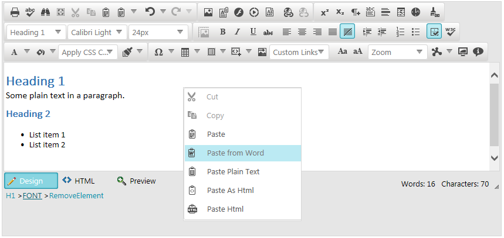

# Clean MS Word Formatting 


This article explains how __RadEditor__ handles content pasted from MS Word, and whatbuilt-in mechanisms are available to control the pasting behavior.

__RadEditor__ provides a number of tools that help users paste formatted text from MS Word, which, as a resultis cleaned from unnecessary tags, comments and MS-Word-specific style formatting attributes.

>note As of IE11, Microsoft have included a built-inmechanism that handles the HTML formatting when pasting MS Word content. Due to that, __RadEditor__ has minor control over the MS Word content pasted under Internet Explorer 11.You can find more details about the browser dependency when pasting in the __RadEditor__ in the[Pasting in RadEditor]()article.
>

>caption Figure 1: MS Word content is pasted as proper HTML markup in the RadEditor.



## Strip MS Word Content via Paste Tools

__RadEditor__ exposes two easy-to-use built-in tools, which enable end-users to get proper HTMLfrom pasted MS Word content - __Paste from Word__ (in __Figure 1__) and	__Paste from Word, strip font__.

These tools are categorized as built-in clipboard tools. You can find more details about how they behave in the Using the Built-in Clipboard Tools section of the	[Overview]() article.

## Automatic On-paste Content Stripping

>important The __StripFormattingOptions__ property replaces the deprecated StripFormattingOnPaste property.
>


The major __RadEditor__ mechanism for on-paste content cleaning and stripping is the	__StripFormattingOptions__ functionality. It enables you to choose a specific configuration	of generic or MS-Word-specific stripping options to be processed during paste. In the lists below you can find all possible options:

Generic options:

* __All__ - strips all HTML formatting and pastes plain text.

* __AllExceptNewLines__ - clears all tags except <br> and new lines (\n) on paste.

* __Css__ - strips CSS styles on paste.

* __Font__ - strips Font tags on paste.

* __None__ - pastes the clipboard content as is. If MS Word formatting exists, the user isprompted to clean it.

* __NoneSupressCleanMessage__ - does not strip anything on paste and does not showthe prompt about MS Word content being pasted (see [Overview]() article).

* __Span__ - strips Span tags on paste.

MS Word specific options:

* __ConvertWordLists__ - converts Word ordered/unordered lists to HTML tags.

* __MSWord__ - strips Word-specific tags on Paste, preserving fonts and text sizes.

* __MSWordNoFonts__ - strips Word-specific tags on paste, preserving text sizes only.

* __MSWordNoMargins__ - strips Word-specific tags and margins, preserving fonts and text sizes.

* __MSWordRemoveAll__ - strips Word-specific tag on paste, removing both fonts and text sizes.

>note Enabling the __NoneSupressCleanMessage__ option, will prevent the client-side[OnClientPasteHtml]()event from firing when using the native browser paste options (the browser’s context menu, or the Ctrl+V shortcut).
>


__Example 1__: How to set multiple values to the __StripFormattingOptions__ property.

````ASPNET
	    <telerik:RadEditor runat="server" ID="RadEditor1" StripFormattingOptions="MsWord,Span,Css,ConvertWordLists">
	    </telerik:RadEditor>
````


>tabbedCode

````C#
	
	    protected void Page_Load(object sender, EventArgs e)
	    {
	        RadEditor1.StripFormattingOptions = EditorStripFormattingOptions.Span | EditorStripFormattingOptions.MSWordRemoveAll;
	    }
	
````


````VB
	
	    Protected Sub Page_Load(ByVal sender As Object, ByVal e As EventArgs)
	        RadEditor1.StripFormattingOptions = EditorStripFormattingOptions.Span Or EditorStripFormattingOptions.MSWordRemoveAll
	    End Sub
	
````


>end

>tip Optionally, you can use the client-side[fire]()method to strip the content on submit or on page-load.	This approach is showcased in the[Clean MS Word Formatting on Page Load and on Submit]()article.
>


# See Also

 * [Overview]()

 * [Demo: Cleaning Word Formatting](http://demos.telerik.com/aspnet-ajax/editor/examples/cleaningwordformatting/defaultcs.aspx)

 * [Set Properties]()
