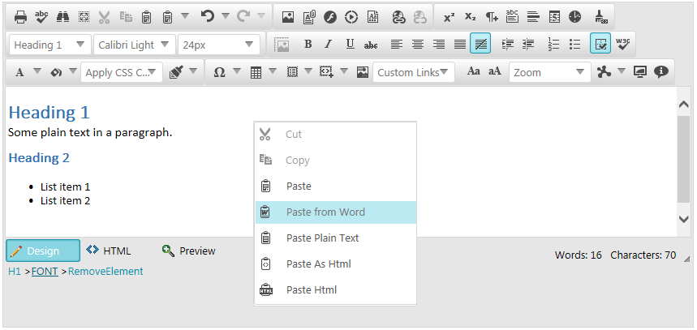

# Clean MS Word Formatting 

This article explains how **RadEditor** handles content pasted from MS Word, and what built-in mechanisms are available to control the pasting behavior.

**RadEditor** provides a number of tools that help users paste formatted text from MS Word, which, as a result is cleaned from unnecessary tags, comments and MS-Word-specific style formatting attributes.

>note As of IE11, Microsoft have included a built-in mechanism that handles the HTML formatting when pasting MS Word content. Due to that, **RadEditor** has minor control over the MS Word content pasted under Internet Explorer 11.You can find more details about the browser dependency when pasting in the **RadEditor** in the [Pasting in RadEditor]() article.

>caption Figure 1: MS Word content is pasted as proper HTML markup in the RadEditor.



## Strip MS Word Content via Paste Tools

**RadEditor** exposes two easy-to-use built-in tools, which enable end-users to get proper HTML from pasted MS Word content - **Paste from Word** (in **Figure 1**) and	**Paste from Word, strip font**.

These tools are categorized as built-in clipboard tools. You can find more details about how they behave in the Using the Built-in Clipboard Tools section of the [Overview]() article.

## Automatic On-paste Content Stripping

>important The **StripFormattingOptions** property replaces the deprecated StripFormattingOnPaste property.

The major **RadEditor** mechanism for on-paste content cleaning and stripping is the **StripFormattingOptions** functionality. It enables you to choose a specific configuration of generic or MS-Word-specific stripping options to be processed during paste. In the lists below you can find all possible options:

Generic options:

* **All** - strips all HTML formatting and pastes plain text.
* **AllExceptNewLines** - clears all tags except <br> and new lines (\n) on paste.
* **Css** - strips CSS styles on paste.
* **Font** - strips Font tags on paste.
* **None** - pastes the clipboard content as is. If MS Word formatting exists, the user is prompted to clean it.
* **NoneSupressCleanMessage** - does not strip anything on paste and does not show the prompt about MS Word content being pasted (see [Overview]() article).
* **Span** - strips Span tags on paste.

MS Word specific options:

* **ConvertWordLists** - converts Word ordered/unordered lists to HTML tags.
* **MSWord** - strips Word-specific tags on Paste, preserving fonts and text sizes.
* **MSWordNoFonts** - strips Word-specific tags on paste, preserving text sizes only.
* **MSWordNoMargins** - strips Word-specific tags and margins, preserving fonts and text sizes.
* **MSWordRemoveAll** - strips Word-specific tag on paste, removing both fonts and text sizes.

>note Enabling the **NoneSupressCleanMessage** option, will prevent the client-side [OnClientPasteHtml]() event from firing when using the native browser paste options (the browser’s context menu, or the Ctrl+V shortcut).

>caption Example 1: How to set multiple values to the **StripFormattingOptions** property.

````ASP.NET
<telerik:RadEditor RenderMode="Lightweight" runat="server" ID="RadEditor1" StripFormattingOptions="MsWord,Span,Css,ConvertWordLists">
</telerik:RadEditor>
````


````C#
protected void Page_Load(object sender, EventArgs e)
{
	RadEditor1.StripFormattingOptions = EditorStripFormattingOptions.Span | EditorStripFormattingOptions.MSWordRemoveAll;
}
````
````VB
Protected Sub Page_Load(ByVal sender As Object, ByVal e As EventArgs)
	RadEditor1.StripFormattingOptions = EditorStripFormattingOptions.Span Or EditorStripFormattingOptions.MSWordRemoveAll
End Sub
````

>tip Optionally, you can use the client-side [fire]() method to strip the content on submit or on page-load.	This approach is showcased in the [Clean MS Word Formatting on Page Load and on Submit]() article.

## See Also

 * [Overview]()

 * [Demo: Cleaning Word Formatting](http://demos.telerik.com/aspnet-ajax/editor/examples/cleaningwordformatting/defaultcs.aspx)

 * [Set Properties]()
