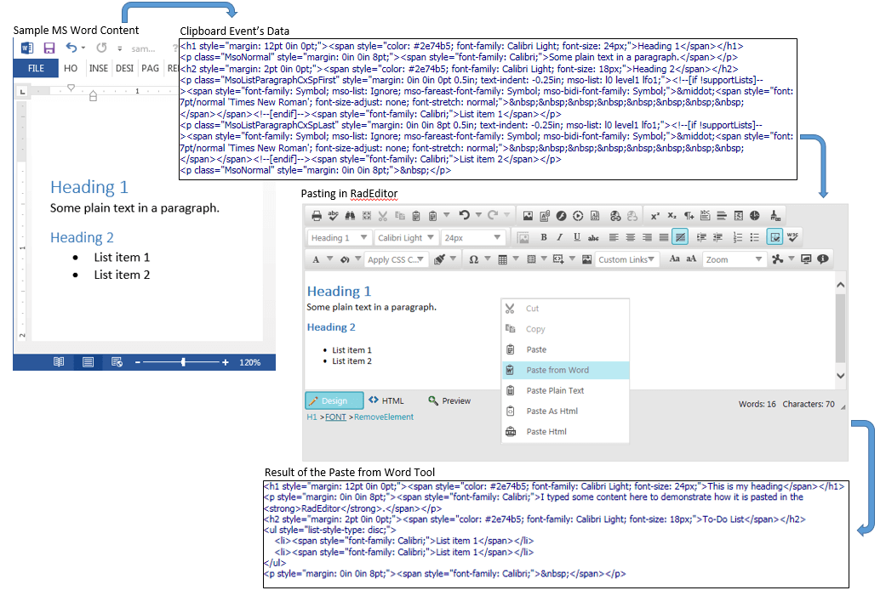
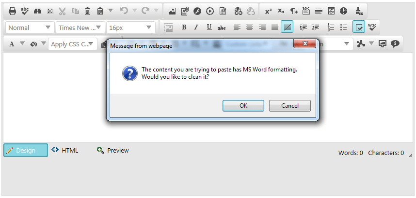
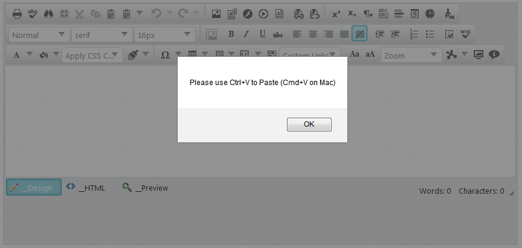
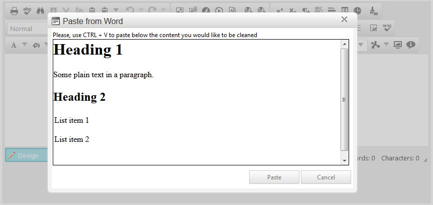
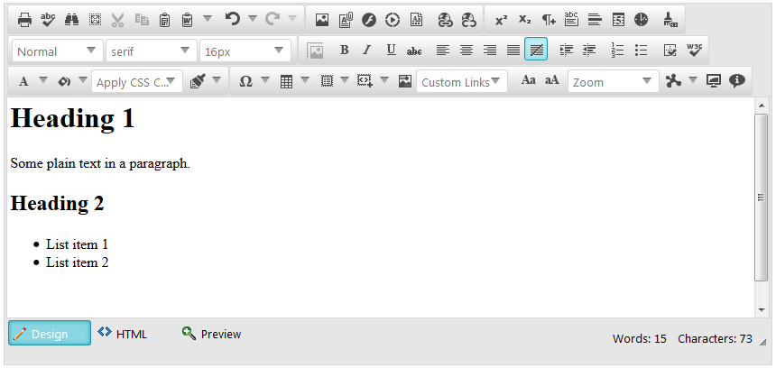

# Pasting Content Overview


In this article you will find basic concepts of how __RadEditor__	interacts with pasted content, how it can be configured to fit different requirements, and what built-in tools can help the end-user with pasting.

Here is a list with the sections in this article:

1. [RadEditor and the Browser’s Clipboard](#radeditor-and-the-browser’s-clipboard) - Explains more about the browser dependency in pasting.

1. [End-user Experience](#end-user-experience) - Demonstrates what happens by default, when user pastes content.

1. [Using the StripFormattingOptions Property](#using-the-stripformattingoptions-property) - Shows how to configure the built-in on-paste actions.

1. [Using the Built-in Clipboard Tools](#using-the-built-in-clipboard-tools) - Provides details about built-in tools which the user can use.

## RadEditor and the Browser’s Clipboard

Basically, the __RadEditor__’s paste functionality uses the browser’s DOM clipboard events.Therefore, any content pasted, is first processed by the browser. Images, HTML, MS Word, plaintext etc., are data types that are first translated to HTML by the browser and then fetched viathe clipboard event’s data to the editor.

Subsequently, the editor can execute logic (Using the StripFormattingOptions Property)that only transforms the received HTML content to improve the markup, in order to facilitatefurther changes by the __RadEditor__ tools. You can find a simple diagram of how pasting works in__Figure 1__. As you can see, the __RadEditor__’s pasting functionalityheavily depends on the clipboard data provided by the browser.

>important When it comes to cross-application clipboard data transfers (e.g., pasting files, pasting from desktop applications etc.),	you should note that the __RadEditor__ handles only the HTML content provided by the browser. Transferring complex data types should	be supported by the browser, so it can be provided as proper HTML to the __RadEditor__ .
>

>caption Figure 1: pasting from MS Word in RadEditor



In case pasting precedes without any automatic on-paste stripping(e.g., __StripFormattingOptions__ is set to __None__), the user is enabled to use the[Strip Formatting Tools]()on an already pasted content and manually remove unwanted formatting.

## End-user Experience

By default, __RadEditor__ is configured to paste content as it is copied.The only exception is when MS Word content has been pasted.When such contentis detected, a confirm dialog opens. That allows the end user to choose whetherthe content is to be cleaned up by __RadEditor__, or pasted as it is (__Figure 2__).
>caption Figure 2: Default Configuration – Pasting from MS Word.



### Using the StripFormattingOptions Property

You can fine-tune the way pasting behaves via the __StripFormattingOptions__ property.A full list with the available options and their description is available in the [Cleaning MS Word Content]() article.

For example, to provide the default pasting experience, but suppress the confirm message (__Figure 2__),you can enable both __ConvertWordLists__ and __MSWordNoMargins__ options.This can be done either in the__RadEditor__ markup declaration (__Example 1__) or via the code behind (__Example 2__).

__Example 1__: Keeping the default MS Word pasting behavior but removing the confirmation message through the markup.

````ASPNET
			<telerik:RadEditor ID="RadEditor1" runat="server" 
				StripFormattingOptions="ConvertWordLists, MSWordNoMargins">
			</telerik:RadEditor>
	
````


__Example 2__: Keeping the default MS Word pasting behavior but removing the confirmation message via the code behind.


````ASPNET
			<telerik:RadEditor ID="RadEditor1" runat="server">
			</telerik:RadEditor>
	
````
````C#
	
		RadEditor1.StripFormattingOptions = 
	    EditorStripFormattingOptions.ConvertWordLists | EditorStripFormattingOptions.MSWordNoMargins;
	
	
````
````VB
	
			RadEditor1.StripFormattingOptions =
			EditorStripFormattingOptions.ConvertWordLists Or EditorStripFormattingOptions.MSWordNoMargins
	
	
````


### Using the Built-in Clipboard Tools

__RadEditor__ provides a set of built-in tools that enable the user to interact with the browser’sclipboard. You can find the list below.

>note The __Cut__ , __Copy__ and __Paste__ tools use the native browser’s	client-side commands to trigger	the corresponding clipboard operation. Some browsers restrict such clipboard manipulations due	to security matters, and thus the tools to not apply any changes. In such cases, the __RadEditor__ prompts the end-user to use the keyboard shortcut combination to cut, copy or paste content ( __Figure 3__ ).
>More details about this security restriction is available in the[	Midas editor module security preferences MDN](https://developer.mozilla.org/en-US/docs/Midas/Security_preferences)article.
>

>caption Figure 3: Result when user tries to paste when clipboard manipulations are stopped by the browser.



* __Cut__—performs a clipboard cut operation.

* __Copy__—performs a clipboard copy operation.

* __Paste__—performs a clipboard paste operation.

* __[Paste from Word]()__—pastes the content and strips unnecessary XML, HTML and comment element.

* __Paste from Word, strip font__—performs the same operation as Paste from Word tool and additionally removes any font-related formatting (e.g., font size, color, etc.).

* __Paste Plain Text__—pastes the copied data as plain text, HTML tags are stripped down, and all styles are removed.

* __Paste as Html__—pastes the copied content as HTML markup.

* __Paste Html__—enables the user to either type or paste HTML markup and insert it into the content. This tool opens a dialog for the content to be pasted.

These tools (excluding the __Paste Html__) directly process the pasted content, where available.	In cases where clipboard manipulation is not permitted (see the note above), the tools open a	paste dialog in which the user can paste the desired content.

In __Figure 1__, the __Paste from Word__ tool is used and the content is cleaned	and pasted directly into the __RadEditor__.	In __Figure 4__, you can see how the tool acts when the browser restricts the clipboard manipulation—a dialog opens	for the content to be pasted. After pressing the __Paste__ button of the dialog, the content is again cleaned to a proper,	readable HTML markup as in __Figure 1__.
>caption Figure 4: Using Paste from Word tool when clipboard manipulation is restricted.



# See Also

 * [Clean MS Word Formatting ]()

 * [Strip Formatting Tools]()

 * [Overview]()

 * [Add Standard Buttons]()
