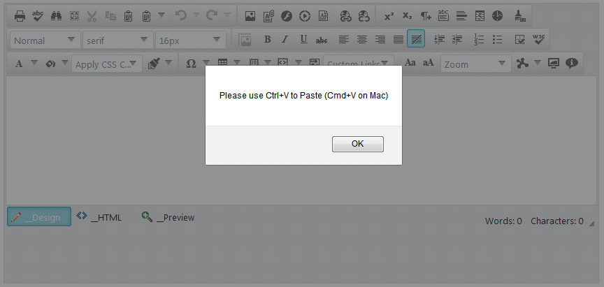
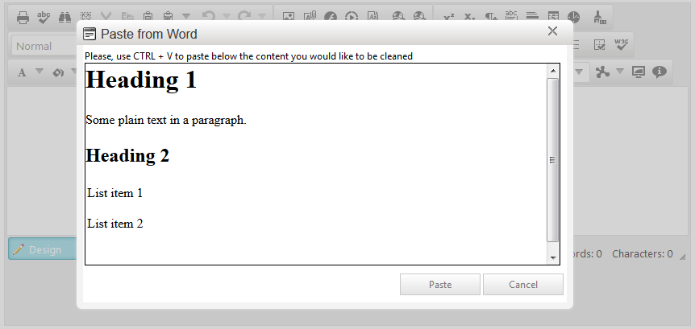

# Pasting Content Overview

In this article you will find basic concepts of how **RadEditor** interacts with pasted content, how it can be configured to fit different requirements, and what built-in tools can help the end-user with pasting.

Here is a list with the sections in this article:

1. [RadEditor and the Browser Clipboard](#radeditor-and-the-browser-clipboard) - Explains more about the browser dependency in pasting.
1. [End-user Experience](#end-user-experience) - Demonstrates what happens by default, when user pastes content.
1. [Using the StripFormattingOptions Property](#using-the-stripformattingoptions-property) - Shows how to configure the built-in on-paste actions.
1. [Using the Built-in Clipboard Tools](#using-the-built-in-clipboard-tools) - Provides details about built-in tools which the user can use.

## RadEditor and the Browser Clipboard

Basically, the **RadEditor**’s paste functionality uses the browser’s DOM clipboard events.Therefore, any content pasted, is first processed by the browser. Images, HTML, MS Word, plain text etc., are data types that are first translated to HTML by the browser and then fetched via the clipboard event’s data to the editor.

Subsequently, the editor can execute logic (Using the StripFormattingOptions Property)that only transforms the received HTML content to improve the markup, in order to facilitate further changes by the **RadEditor** tools. You can find a simple diagram of how pasting works in **Figure 1**. As you can see, the **RadEditor**’s pasting functionality heavily depends on the clipboard data provided by the browser.

>important When it comes to cross-application clipboard data transfers (e.g., pasting files, pasting from desktop applications etc.),	you should note that the **RadEditor** handles only the HTML content provided by the browser. Transferring complex data types should	be supported by the browser, so it can be provided as proper HTML to the **RadEditor** .

>caption Figure 1: pasting from MS Word in RadEditor


In case pasting precedes without any automatic on-paste stripping(e.g., **StripFormattingOptions** is set to **None**), the user is enabled to use the [Strip Formatting Tools]() on an already pasted content and manually remove unwanted formatting.

## End-user Experience

By default, **RadEditor** is configured to paste content as it is copied.The only exception is when MS Word content has been pasted.When such content is detected, a confirm dialog opens. That allows the end user to choose whether the content is to be cleaned up by **RadEditor**, or pasted as it is (**Figure 2**).

>caption Figure 2: Default Configuration – Pasting from MS Word.


### Using the StripFormattingOptions Property

You can fine-tune the way pasting behaves via the **StripFormattingOptions** property.A full list with the available options and their description is available in the [Cleaning MS Word Content]() article.

For example, to provide the default pasting experience, but suppress the confirm message (**Figure 2**),you can enable both **ConvertWordLists** and **MSWordNoMargins** options.This can be done either in the **RadEditor** markup declaration (**Example 1**) or via the code behind (**Example 2**).

>caption Example 1: Keeping the default MS Word pasting behavior but removing the confirmation message through the markup.

````ASP.NET
<telerik:RadEditor RenderMode="Lightweight" ID="RadEditor1" runat="server" 
	StripFormattingOptions="ConvertWordLists, MSWordNoMargins">
</telerik:RadEditor>
````


>caption Example 2: Keeping the default MS Word pasting behavior but removing the confirmation message via the code behind.

````ASP.NET
<telerik:RadEditor RenderMode="Lightweight" ID="RadEditor1" runat="server">
</telerik:RadEditor>
````

````C#	
RadEditor1.StripFormattingOptions = 
EditorStripFormattingOptions.ConvertWordLists | EditorStripFormattingOptions.MSWordNoMargins;
````
````VB
RadEditor1.StripFormattingOptions =
EditorStripFormattingOptions.ConvertWordLists Or EditorStripFormattingOptions.MSWordNoMargins
````


### Using the Built-in Clipboard Tools

**RadEditor** provides a set of built-in tools that enable the user to interact with the browser’s clipboard. You can find the list below.

>note The **Cut** , **Copy** and **Paste** tools use the native browser’s	client-side commands to trigger	the corresponding clipboard operation. Some browsers restrict such clipboard manipulations due	to security matters, and thus the tools to not apply any changes. In such cases, the **RadEditor** prompts the end-user to use the keyboard shortcut combination to cut, copy or paste content ( **Figure 3** ).
>More details about this security restriction is available in the [	Midas editor module security preferences MDN](https://developer.mozilla.org/en-US/docs/Midas/Security_preferences) article.

>caption Figure 3: Result when user tries to paste when clipboard manipulations are stopped by the browser.



* **Cut**—performs a clipboard cut operation.

* **Copy**—performs a clipboard copy operation.

* **Paste**—performs a clipboard paste operation.

* **[Paste from Word]()**—pastes the content and strips unnecessary XML, HTML and comment element.

* **Paste from Word, strip font**—performs the same operation as Paste from Word tool and additionally removes any font-related formatting (e.g., font size, color, etc.).

* **Paste Plain Text**—pastes the copied data as plain text, HTML tags are stripped down, and all styles are removed.

* **Paste as Html**—pastes the copied content as HTML markup.

* **Paste Html**—enables the user to either type or paste HTML markup and insert it into the content. This tool opens a dialog for the content to be pasted.

These tools (excluding the **Paste Html**) directly process the pasted content, where available.	In cases where clipboard manipulation is not permitted (see the note above), the tools open a	paste dialog in which the user can paste the desired content.

In **Figure 1**, the **Paste from Word** tool is used and the content is cleaned	and pasted directly into the **RadEditor**.	In **Figure 4**, you can see how the tool acts when the browser restricts the clipboard manipulation—a dialog opens	for the content to be pasted. After pressing the **Paste** button of the dialog, the content is again cleaned to a proper,	readable HTML markup as in **Figure 1**.

>caption Figure 4: Using Paste from Word tool when clipboard manipulation is restricted.



## See Also

 * [Clean MS Word Formatting ]()

 * [Strip Formatting Tools]()

 * [Overview]()

 * [Add Standard Buttons]()
