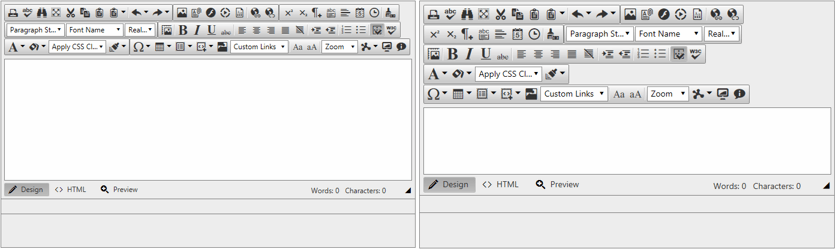

# Elastic Design

This article explains the **elastic design capabilities RadEditor offers**.	The example below shows the simple approach you can use to scale the control by only changing its default font size.

>note The elastic design capabilities in the RadEditor control are available only when [RenderMode]() is set to *Lightweight* .

@[template](/_templates/common/render-mode.md#resp-design-desc "slug-el: no, slug-fl: editor/mobile-support/fluid-design")

## Elastic Design with RadEditor

>caption Figure 1: Comparison between a RadEditor with the default 12px font size and with increased font-size



**RadEditor** does not create elastic design by itself, but can fit in a page that follows this pattern.This means that you can change its font size without breaking the control's appearance - if the new size is larger than the original,the elements in the control will simply increase their size.This fluid layout is achieved by using `em` units for setting dimensions and paddings in the control,instead of `px` because em units are tied to the font size.This allows dimensions and sizes to scale with the font size.

@[template](/_templates/common/font-size-notes.md#note-and-example "control: RadEditor")

>caption **Example 2**: How to increase the font size of a RadEditor as shown in Figure 1.

````ASP.NET
<style type="text/css">
	div.RadEditor,
	div.RadEditor .reToolBarWrapper,
	.reToolBarWrapper .reToolBar,
	div.RadEditor .reToolBar div.reDropDownBody {
	    font-size: 18px;
	
	}
</style>

<telerik:RadEditor runat="server" ID="RadEditor1" RenderMode="Lightweight"></telerik:RadEditor>
````

## See Also

 * [Render Modes]()

 * [Fluid Design]()

@[template](/_templates/common/font-size-notes.md#related-resources)
