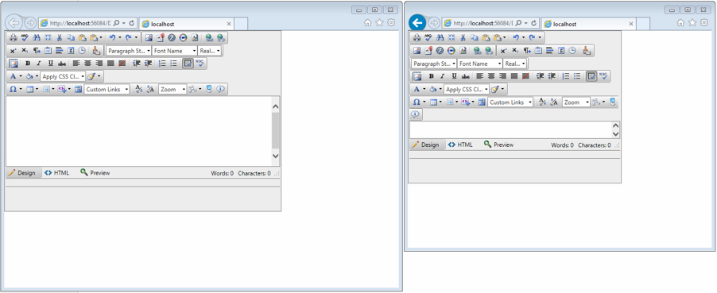

# Fluid Design


This article explains the **fluid design capabilities RadEditor offers**.	The example below shows how you can set its size in percent so it can resize with its parent element and refresh it when needed.

Generally, responsive design means that the page and its content are able to adapt to different screen resolutions without deteriorating the user experience.	This often includes [changing the font size]() and having dimensions set in percent.

## Fluid Design with RadEditor
>caption Figure 1: RadEditor with dimensions set to 100% that occupies its entire parent element



You can set the **Width** and **Height** properties of the **RadEditor** in **percent**.This lets it resize together with its parent element. The control has no way of knowing its parent size has changed, however,so the developer needs to invoke the `repaint() `[client-side method]() of the map so it can recalculate its elements (toolbar, modules etc.).You can find a small sample in **Example 1**.

**Example 1**: Markup and script that provide a fluid RadEditor that changes size with the browser viewport

````XML
	 		<style type="text/css">
				html, body, form {
					margin: 0;
					padding: 0;
					height: 100%;
				}
			</style>
	
			<script type="text/javascript">
				function repaintEditor() {
					$find("<%= RadEditor1.ClientID %>").repaint();
				}
	
				var TO = false;
	
				$telerik.$(window).resize(function () {
					if (TO !== false)
						clearTimeout(TO);
					TO = setTimeout(repaintEditor, 200);
				});
			</script>
	
			<div style="width: 70%; height: 70%;">
				<telerik:RadEditor runat="server" ID="RadEditor1" Width="100%" Height="100%"></telerik:RadEditor>
			</div>
````


# See Also

 * [Elastic Design]()

 * [RadEditor Object]()
