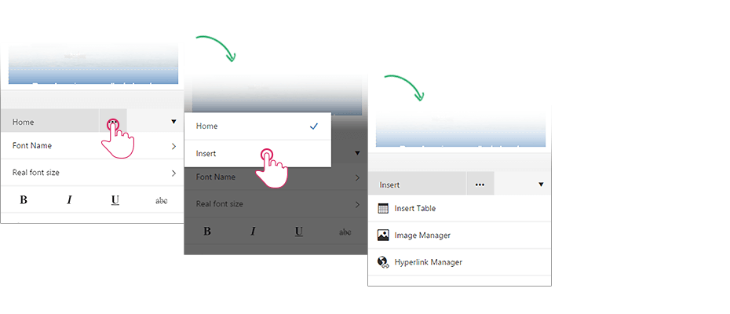

# Mobile Dialogs

This help article shows how to open, configure and customize the mobile dialogs of **RadEditor** when optimized for **phone layout** and explains the advantages they offer to the end user. 

* [Advantages](#advantages)

* [Open Built-in Dialogs](#open-built-in-dialogs)

* [Configure Built-in Dialogs](#configure-built-in-dialogs)

* [Customize Built-in Dialogs](#customize-built-in-dialogs)

## Advantages

To get better user experience when inserting objects and configuring HTML attributes in mobile devices, **RadEditor** provides a specific rendering for its dialogs for phone devices (**Figure 1**):

* The dialogs are always in full screen mode.

* Complex configuration is split in sub dialogs.

* Larger controls are used (e.g., buttons, dropdowns, color pickers, etc.).

>caption **Figure 1**: RadEditor dialogs (Insert Table, Insert Image, Insert Link, Find and Replace) on a mobile device.

 

## Open Built-in Dialogs

To open the mobile dialogs you should initially open the [ToolZone](), pop-up the Tab Chooser from the Tool Navigator and then select the **Insert** Tab. Then you will be provided with the list of the available dialogs (**Figure 2**).

>caption **Figure 2**: Open RadEditor mobile dialogs.

Mobile dialogs are also used when editing attributes of selected HTML elements (e.g., **Table Properties** and **Table Border** dialogs) and when performing find & replace operations.

>tip You can find more details on the end user experience of the mobile dialogs in the [Phone Layout End User Experience]() article.

## Configure Built-in Dialogs

Dialogs in **mobile rendering** are configured just like the desktop-oriented dialogs. You should define the dialog HTTP handler according the [Dialogs Overview]() article. *The full list of the required and optional web.config settings is available in the [web.config Settings Overview]() article*.

To setup the paths for the Insert dialogs follow the instruction from the [File Browser Dialogs Overview]() article.

## Customize Built-in Dialogs

You can customize the built-in mobile dialogs the way described in the [ExternalDialogsPath Property]() help article. The only difference comes in the `Mobile` prefix, being added to .ascx file names of the mobile dialogs (e.g., `[Installation_Directory]\EditorDialogs\MobileImageManager.ascx`). The mobile dialogs of **RadEditor** are also located in the same folder that holds the rest of the dialogs (e.g., `[Installation_Directory]\EditorDialogs\`).

## See Also

* [Phone Layout Overview]()

* [Dialogs Overview]()

* [File Browser Dialogs Overview]()

* [web.config Settings Overview]()
