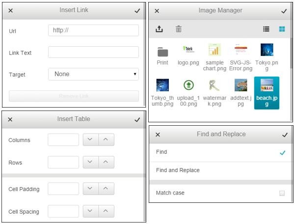
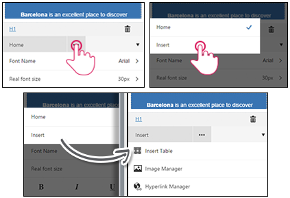

# Mobile Dialogs

This help article lists the advantages of the mobile dialogs of **RadEditor** when optimized for **phone layout** and shows how to open, configure and customize them. 

* [Overview](dialogs#overview)

* [Open Insert Dialogs](dialogs#open-insert-dialogs)

* [Configure Built-in Dialogs](dialogs#configure-built-in-dialogs)

* [Customize Built-in Dialogs](dialogs#customize-built-in-dialogs)

## Overview

To get a better user experience when inserting objects and configuring HTML attributes in mobile devices, **RadEditor** provides a specific rendering for its dialogs (**Figure 1**):

* Dialogs always pop-up in full screen mode.

* Complex configuration is split in sub dialogs.

* Larger controls are used (e.g., buttons, dropdowns, color pickers, etc.).

>caption **Figure 1**: RadEditor dialogs (Insert Link, Insert Image, Insert Table, Find and Replace) in mobile device.

 

## Open Insert Dialogs

To open mobile insert dialogs you should initially open the ToolZone, pop-up the TabStrip from the Tool Navigator and then select the **Insert** Tab. Then you will be provided with the list of the available dialogs (**Figure 2**).

>caption **Figure 2**: Open RadEditor mobile dialogs.

Mobile dialogs are also used when editing attributes of selected HTML elements (e.g., **Table Property** and **Table Border** dialogs) and when performing find & replace operations.

## Configure Built-in Dialogs

Dialogs in the **mobile rendering** are configured just like the regular dialogs:

1. Define the `Telerik.Web.UI.DialogHandler` HTTP handler in the web.config file, as illustrated in the [Dialogs Overview]() article. *The full list of the required and optional web.config settings is available in the [web.config Settings Overview]() article*.

1. Configure the view/upload/delete paths for the File Browser Dialogs, as illustrated in the [File Browser Dialogs Overview]() article.

## Customize Built-in Dialogs

You can customize the built-in mobile dialogs the way described in the [ExternalDialogsPath Property]() help article. The only difference comes in the`Mobile` prefix, being added to .ascx file names of the mobile dialogs (e.g., `[Installation_Directory]\EditorDialogs\MobileImageManager.ascx`). The mobile dialogs of **RadEditor** are also located in the same folder that holds the rest of the dialogs (e.g., `[Installation_Directory]\EditorDialogs\`).

## See Also

* [Phone Layout Overview]()

* [Dialogs Overview]()

* [File Browser Dialogs Overview]()

* [web.config Settings Overview]()
