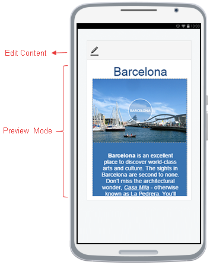

# Elements Structure

You can find the default elements structure of the **RadEditor** with **Phone Layout** rendering in **Figure 1** and details on the phone specific elements below the figure.

>caption **Figure 1**: Elements Structure of RadEditor with Phone-optimized Mobile rendering. 

 

* **Header Toolbar** - A basic toolbar, located on top of the editor.

	* **Edit Content** - A button that lets you start editing the content.
	
	* **Toggle ToolZone** - A button that opens/closes the ToolZone(Toolbar). You can use it to start/end formatting the selection or inserting HTML elements (e.g., hyperlinks, images, tables).
	
	* **Toggle View Mode** - A button that toggles between Design and HTML viewing modes.
	
	* **Exit Full Screen** - A button that turns off the full screen mode. You can press it when finished with the content editing.
	
* **Content Area** - The place which stores and displays the content to edit.

* **ToolZone(Toolbar)** - The main toolbar used for formatting the selection and inserting HTML elements (e.g., hyperlinks, images, tables).

	* **Tools Navigator**
	
		* **Tab Chooser** - Navigator to different predefined set of tools (e.g., **Home**, **Insert**, **Table**, **Link**, **Image**). The **Insert** option (**Figure 2**) opens a list with the [mobile dialogs](). The **Table**, **Link**, **Image** options open mobile dialogs to configure attributes for the corresponding HTML element.
		
			>caption **Figure 2**: Navigation to the mobile Insert Dialogs of RadEditor with Phone Layout.
			
			
		
		* **Hide Tools Arrow** - Closes the current ToolZone and navigates to the previous tab.
		
	* **DropDowns** - Various dropdowns for selecting predefined font names/sizes, CSS classes, paragraph styles, etc.
	
	* **Buttons** - Various buttons for list, indent/outdent, align, bold, italic, underline, etc.
	
	* **Color Pickers** - Mobile color pickers to control the foreground, background and border colors of HTML elements.

You can find the full description of all the tools from the toolbar in the [Toolbars Overview]() article. You can also customize the default toolbar of the mobile editor as per the [Phone Layout ToolBar Configuration]() article.

## See Also

* [Phone Layout Overview]()
* [Phone Layout Dialogs]()
* [Phone Layout ToolBar Configuration]()
* [Toolbars Overview]()