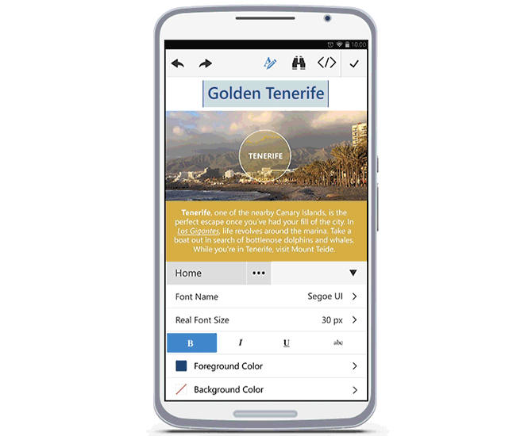

# End User Experience

You can find here some basic examples how **Phone Layout** can be used by the end-user.  

## Start Editing

>caption Figure 1: Phone Layout in non-editable mode.

Initially, **RadEditor** is loaded in non-editable mode (**Figure 1**). In order to start editing the content (full screen mode), the user should tap either the content, or the **Edit Content** button (). 

>caption Figure 2: Full screen mode

In full screen mode, user can edit the text and operate with the header tools. 

## Using the Tools

>caption Figure 3: Toggling the Toolzone.

The toolzone can be shown by pressing the **Toggle Toolzone** button from the Header Tools (). Using the tools will affect the current selection. 

The animation in **Figure 4** shows how user would be able to use the tools and edit or format the content.

>caption Figure 4: User experience with content editing. 

## Using Tabs and Contextual Tabs

>caption Figure 5: Changing the Tab.

!()[]

To change the current tab, user should press the **Tab Chooser** button (). As shown in **Figure 5**, a pop-up with all available tabs will be shown. Tapping on one of them, will load the corresponding tools from this tab into the toolzone.

Additionally, tabs can be configured to be shown only when a certain element is selected. This can be controlled via the **Context** property of the **EditorToolGroup** items. You can read more about that in the [Toolbar Configuration]() article. In **Figure 6**, you can see how selecting an `` element in the content, opening the toolzone, automatically shows the built-in **Image** tab.

>caption Figure 6: Working with contextual tabs.

## Toggling HTML Mode

>caption Figure 7: Toggling HTML mode.

The user can edit the content as HTML by switching to HTML mode. This is done by tapping  the **Toggle HTML** button () from the header tools. This will show the content's HTML. Once user is done, tapping the same button will switch the mode back to Design. 

## See Also

* [Getting Started]()
* [Elements Structure]()
* [Toolbar Configuration]()