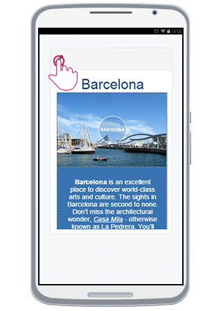
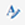
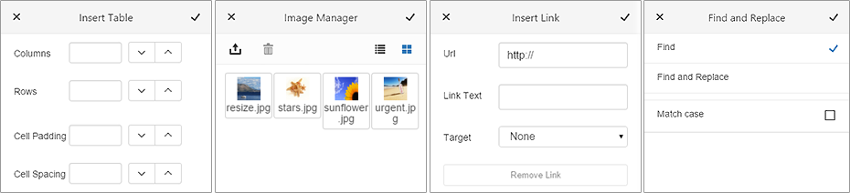
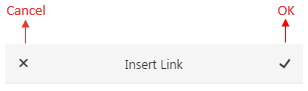
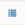
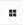

# Phone Layout End User Experience

This article shows some basic examples how the end user can interact with the phone-optimized RadEditor control:

* [Start Editing](#start-editing)

* [Using the Tools](#using-the-tools)

* [Using Tabs and Contextual Tabs](#using-tabs-and-contextual-tabs)

* [Toggling HTML Mode](#toggling-html-mode)

* [Using Built-in Mobile Dialogs](#using-built-in-mobile-dialogs)
	* [Common Elements](#common-elements)
	* [Hyperlink Manager](#hyperlink-manager)
	* [File Browser Dialogs](#file-browser-dialogs)
	* [Insert Table](#insert-table)
	* [Find and Replace](#find-and-replace)

 

## Start Editing

Initially, **RadEditor** is loaded in **Preview** mode (**Figure 1**). In order to start editing the content (full screen mode), the user should tap either the content, or the **Edit Content** button (). 

>caption Figure 1: Phone Layout in Preview mode and how to start editing

In full screen mode, user can edit the text and operate with the header tools.

>caption Figure 2: Full screen mode where you can edit the content

## Using the Tools

The **ToolZone** can be shown by pressing the **Toggle ToolZone** button from the Header Tools (). Using the tools will affect the current selection.

>caption Figure 3: Toggling the ToolZone.

 

The animation in **Figure 4** shows how a user would be able to use the tools and edit or format the content.

>caption Figure 4: User experience with content editing. 

## Using Tabs and Contextual Tabs

To change the current tab, the user should press the **Tab Chooser** button (). As shown in **Figure 5**, a pop-up with all available tabs will be shown. Tapping on one of them, will load the corresponding tools from this tab into the **ToolZone**.

>caption Figure 5: Changing the Tab.

Additionally, tabs can be configured to be shown only when a certain element is selected. This can be controlled via the **Context** property of the **EditorToolGroup** items. You can read more about that in the [Toolbar Configuration]() article.

In **Figure 6**, you can see how selecting an `` element in the content and opening the **ToolZone**, automatically shows the built-in **Image** tab.

>caption Figure 6: Working with contextual tabs.

## Toggling HTML Mode

The user can edit the content as HTML by switching to HTML mode. This is done by tapping  the **Toggle HTML** button () from the header tools. This will show the content's HTML. Once user is done, tapping the same button will switch the mode back to Design. 

>caption Figure 7: Toggling HTML mode.

## Using Built-in Mobile Dialogs

With the creation of the phone-optimized **RadEditor**, built-in dialogs also have been also re-designed in order to expose a more user-friendly UI under phone devices. You can learn more details about how to configure the built-in dialogs in the [Mobile Dialogs]() article.

>caption Figure 8: Built-in Mobile Dialogs (Insert Table, Insert Image, Insert Link, Find and Replace). 

### Common Elements

All built-in dialogs have **OK**/**Insert** and **Cancel** buttons that are used to perform the dialog's action and to cancel operation. With the mobile-optimized dialogs, these buttons are placed at the top toolbar of the dialog. 

>caption Figure 9: OK and Cancel buttons of the mobile-optimized built-in dialogs.  

### Hyperlink Manager

* **Url** (text input)—the URL of the link to be inserted.
* **Link Text** (text input)—the text of the link.
* **Target** (select input)—the target attribute of the link. 

### File Browser Dialogs

*  **Upload**—opens an UI for the user to upload a file *(available if __UploadPaths__ property is configured)
 
*  **Delete**—deletes the selected file *(available if __DeletePaths__ property is configured)*.
 
*  **List View**—toggles the view mode to **List**.

*  **Thumbnail View**—toggles the view mode to **Thumbnails**.

### Insert Table

*  **Increase/Decrease** (spin buttons)—enables the user to increase or decrease the value in the numeric text-box.

* **Columns** (numeric text-box)—sets the number of the table's columns. 
  
* **Rows** (numeric text-box)— sets the number of the table's rows.
 
* **Cell Padding** (numeric text-box)—adds a padding to the table's cells. 
 
* **Cell Spacing** (numeric text-box)—adds spacing between the table's cells.

### Find and Replace 

* **Find** and **Find and Replace** (radio buttons)—Toggles between the two modes.
* **Match Case** (check-box)—Defines whether to match the case.  

## See Also

* [Getting Started]()
* [Elements Structure]()
* [Toolbar Configuration]()
* [Mobile Dialogs]()

