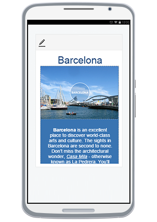

   

# Phone Layout Getting Started

This article showcases the basic steps needed to get started with the **Phone Layout** of **RadEditor** in your project. 

>caption Figure 1: Preview mode of RadEditor  with Phone Layout under a mobile device.
 

>caption Figure 2: Full screen (editable) mode  of RadEditor with Phone Layout.
 

>important **Phone Layout** is supported only under browsers where [Flex Model](https://developer.mozilla.org/en-US/docs/Web/Guide/CSS/Flexible_boxes) is available.

You can utilize the **Phone Layout** by following these steps:

1. Set up **RadEditor** on an ASP.NET page by following the general [Getting Started]() article.

1. Set the RenderMode property of RadEditor either to Auto or Mobile
	(*You can find out more about the differences of these two options in the [Render Modes]() help article*);

1. Adjust the viewport of your page by putting this meta tag in the `<head>` element of the page:

		<meta name="viewport" content="width=device-width, initial-scale=1" />

	(*You can read more about why this is needed in MDN's [Using the viewport meta tag to control layout on mobile browsers](https://developer.mozilla.org/en-US/docs/Mozilla/Mobile/Viewport_meta_tag) article*)

1. Run the created page under your phone's browser.

Initially, the **RadEditor** will load in **Preview** mode (**Figure 1**). Clicking the **Edit Content** button () will enable editing and the **Phone Layout** will switch to full screen mode(**Figure 2**).

You can find further details about using the **Phone Layout** as end-user in the [End User Experience]() article.

You can continue reading the [Toolbar Configuration]() article to learn how to rearrange, add or remove tools regarding **Phone Layout**.

## See Also 

* [Phone Layout Overview]()
* [Element Structure]()
* [End User Experience]()
* [Basic Configurations]() 
