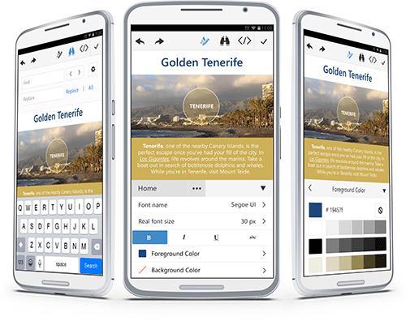

# Phone Layout Overview

As of **Q2 2015**, **RadEditor** provides **Mobile** rendering, that is especially designed for mobile devices and facilitates the user experience with UI based on native mobile applications.

>caption Figure 1: RadEditor with Phone-optimized Mobile rendering. 

Among the core features of the Phone Layout **Mobile** rendering are:

* Interactive fullscreen-editing;
* Improved built-in tools and UI for optimal experience in mobile browsers;
* Full control over the selection, via built-in highlight functionality;
* Contextual toolbar for tables, images and hyperlinks;
* Touch-optimized UI to easily navigate through multiple tools - toggle the device's keyboard, switch to HTML mode, etc.;
* Flexible design, enabling you to re-arrange the toolbars;
* and many more features.

<!-- * Mobile UI comfortable not only for Phones, but also for Tablets; -->

## See Also

* [Getting Started with Phone Layout]()
* [Element Structure]()
