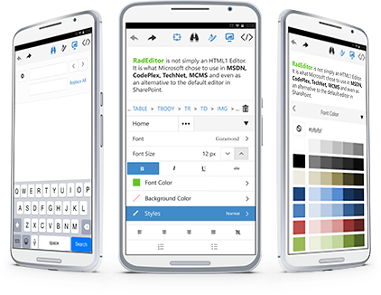

# Phone Layout Overview

As of **Q2 2015**, **RadEditor** provides **Mobile** rendering, that is especially designed for mobile devices and facilitates the user experience with UI based on native mobile applications.

>caption Figure 1: RadEditor with Mobile rendering. 

<!--  -->

Among with the mobile-optimized UI, the **Mobile** rendering provides:

* Interactive fullscreen-editing layout;
* Improved built-in tools and UI for optimal experience for the mobile browsers;
* Full control over the selection, via built-in highlight functionality;
* Contextual toolbar for tables, images and hypelinks;
* Buttons to easily navigate through multiple tools, toggle the device's keyboard, switch to HTML mode, etc.;
* Flexible design, enabling you to re-arrange the toolbars;
* and many more features.

<!-- * Mobile UI comfortable not only for Phones, but also for Tablets; -->

## See Also

* [Mobile's Rendering Structure]()
* [Getting Started with Mobile Rendering]()