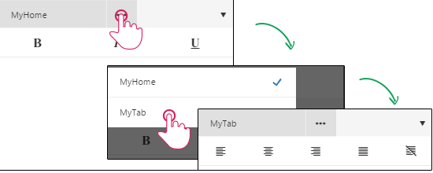

# Phone Layout Toolbar Configuration

This article explains some basic configuration options, that will enable you to rearrange the tools and tabs shown in **RadEditor**'s **ToolZone**:

* [Configuring Header Tools](#configuring-header-tools)
 
* [Configuring Tabs and Tools](#configuring-tabs-and-tools)

* [Configuring Contextual Tabs](#configuring-contextual-tabs)

## Configuring Header Tools

The header tools can be controlled via the **HeaderTools** collection of **RadEditor**. This collection can contain plain built-in or custom tools, by adding them as **EditorHeaderTool** item. The header tools are extended with an additional **Position** property, that instructs the tool to be show either in the left or the right tool-group. If a position is not configured it will show in the left tool-group by default.   

>caption Figure 1: The output from the code examples in **Example 1**, **Example 2** and **Example 3**.


>caption Example 1: Rearranging header tools via markup.


````ASP.NET
<telerik:RadEditor runat="server" ID="RadEditor1" RenderMode="Mobile" 
    Width="100%" Skin="Bootstrap"> 
    <HeaderTools>
        <telerik:EditorHeaderTool Name="Undo"/>
        <telerik:EditorHeaderTool Name="Redo"/>
        <telerik:EditorHeaderTool Name="MobileEdit" Position="Right"/>
        <telerik:EditorHeaderTool Name="ToggleScreenMode" Position="Right"/>
    </HeaderTools>
</telerik:RadEditor>
````

>caption Example 2: Rearranging header tools from the code behind.

````ASP.NET 
<telerik:RadEditor runat="server" ID="RadEditor1" RenderMode="Mobile" 
    Width="100%" Skin="Bootstrap"> 
</telerik:RadEditor>
````
````C#
RadEditor1.HeaderTools.Add(new EditorHeaderTool("Undo", EditorHeaderToolPosition.Left));
RadEditor1.HeaderTools.Add(new EditorHeaderTool("Redo", EditorHeaderToolPosition.Left));
RadEditor1.HeaderTools.Add(new EditorHeaderTool("MobileEdit", EditorHeaderToolPosition.Right));
RadEditor1.HeaderTools.Add(new EditorHeaderTool("ToggleScreenMode", EditorHeaderToolPosition.Right));
````
````VB
RadEditor1.HeaderTools.Add(New EditorHeaderTool("Undo", EditorHeaderToolPosition.Left))
RadEditor1.HeaderTools.Add(New EditorHeaderTool("Redo", EditorHeaderToolPosition.Left))
RadEditor1.HeaderTools.Add(New EditorHeaderTool("MobileEdit", EditorHeaderToolPosition.Right))
RadEditor1.HeaderTools.Add(New EditorHeaderTool("ToggleScreenMode", EditorHeaderToolPosition.Right))
````

>caption Example 3: Rearranging header tools from the ToolsFile.

````ASP.NET
<telerik:RadEditor runat="server" ID="RadEditor1" RenderMode="Mobile" 
    Width="100%" Skin="Bootstrap" ToolsFile="ToolsFile.xml"> 
</telerik:RadEditor>
````
````XML
<root>
  <headertools>
    <tool name="Undo"/>
    <tool name="Redo"/>
    <tool name="MobileEdit" Position="Right"/>
    <tool name="ToggleScreenMode" Position="Right"/>
  </headertools>
  <tools>
    ...
  </tools>
</root>
````

You can find a full list of the built-in tools in the [Toolbars Overview](), and a full list of the elements and attributes for the ToolsFile's xml schema in [Using ToolsFile.xml]().

## Configuring Tabs and Tools

In the following examples you can see how you can configure the **ToolZone** of **Phone Layout** with additional **Tabs** and **Tools**.

>caption Figure 2: The generated tabs and tools from the code in **Example 4**, **Example 5** and **Example 6**.



>caption Example 4: Configuring Tabs and Tools via markup.

````ASP.NET 
<telerik:RadEditor runat="server" ID="RadEditor1" RenderMode="Mobile"
    Width="100%" Skin="Bootstrap">
    <Tools>
        <telerik:EditorToolGroup Tab="MyHome">
            <telerik:EditorTool Name="Bold" />
            <telerik:EditorTool Name="Italic" />
            <telerik:EditorTool Name="Underline" />
        </telerik:EditorToolGroup>
        <telerik:EditorToolGroup Tab="MyTab">
            <telerik:EditorTool Name="JustifyLeft" />
            <telerik:EditorTool Name="JustifyCenter" />
            <telerik:EditorTool Name="JustifyRight" />
            <telerik:EditorTool Name="JustifyFull" />
            <telerik:EditorTool Name="JustifyNone" />
        </telerik:EditorToolGroup>
    </Tools>
</telerik:RadEditor>
````

>caption Example 5: Configuring Tabs and Tools from the code behind.

````ASP.NET 
<telerik:RadEditor runat="server" ID="RadEditor1" RenderMode="Mobile"
    Width="100%" Skin="Bootstrap">
</telerik:RadEditor>
````
````C#
EditorToolGroup myHome = new EditorToolGroup();
myHome.Tab = "MyHome";

myHome.Tools.Add(new EditorTool("Bold"));
myHome.Tools.Add(new EditorTool("Italic"));
myHome.Tools.Add(new EditorTool("Underline"));

EditorToolGroup myTab = new EditorToolGroup();
myTab.Tab = "MyTab";

myTab.Tools.Add(new EditorTool("JustifyLeft"));
myTab.Tools.Add(new EditorTool("JustifyCenter"));
myTab.Tools.Add(new EditorTool("JustifyRight"));
myTab.Tools.Add(new EditorTool("JustifyFull"));
myTab.Tools.Add(new EditorTool("JustifyNone"));

RadEditor1.Tools.Add(myHome);
RadEditor1.Tools.Add(myTab);
````
````VB
Dim myHome As New EditorToolGroup()
myHome.Tab = "MyHome"

myHome.Tools.Add(New EditorTool("Bold"))
myHome.Tools.Add(New EditorTool("Italic"))
myHome.Tools.Add(New EditorTool("Underline"))

Dim myTab As New EditorToolGroup()
myTab.Tab = "MyTab"

myTab.Tools.Add(New EditorTool("JustifyLeft"))
myTab.Tools.Add(New EditorTool("JustifyCenter"))
myTab.Tools.Add(New EditorTool("JustifyRight"))
myTab.Tools.Add(New EditorTool("JustifyFull"))
myTab.Tools.Add(New EditorTool("JustifyNone"))

RadEditor1.Tools.Add(myHome)
RadEditor1.Tools.Add(myTab)
````

>caption Example 6: Configuring Tabs and Tools via ToolsFile.

````ASP.NET 
<telerik:RadEditor runat="server" ID="RadEditor1" RenderMode="Mobile"
    Width="100%" Skin="Bootstrap" ToolsFile="ToolsFile.xml">
</telerik:RadEditor>

````
````XML
<root>
  <tools>
    <tools tab="MyHome">
      <tool name="Bold" />
      <tool name="Italic" />
      <tool name="Underline" />
    </tools>
    <tools tab="MyTab">
      <tool name="JustifyLeft" />
      <tool name="JustifyCenter" />
      <tool name="JustifyRight" />
      <tool name="JustifyFull" />
      <tool name="JustifyNone" />
    </tools>
  </tools>
</root>
````

As shown, you can add tabs and tools with the same approach used in the plain **RadEditor** ([Add Standard Buttons]()). Additionally, you should define the Tab property, so to configure a title for the **Tab**.

You can find a full list of the built-in tools in the [Toolbars Overview](), and a full list of the elements and attributes for the ToolsFile's xml schema in [Using ToolsFile.xml]().

## Configuring Contextual Tabs

Contextual tabs can be created by [adding a Tab](#configuring-tabs-and-tools). Next, set a CSS selector value to the **Context** property of the **EditorToolGroup**. By that, when user selects an element that fits the requirement of the given selector, the tab will be automatically selected and when the **ToolZone** is toggled, the tools from this tab will be shown. 

>caption Figure 3: The contextual tab behavior implemented in **Example 7**, **Example 8** and **Example 9**.


>caption Example 7: Adding a contextual tab via markup.


````ASP.NET 
<telerik:RadEditor runat="server" ID="RadEditor1" RenderMode="Mobile"
    Width="100%" Skin="Bootstrap">
    <Tools>
        <telerik:EditorToolGroup Tab="Home">
			...
        </telerik:EditorToolGroup>
        <telerik:EditorToolGroup Tab="Paragraph" Context="p, div">
            <telerik:EditorTool Name="FontName" />
            <telerik:EditorTool Name="FontSize" />
        </telerik:EditorToolGroup>
    </Tools>
    <Content>
        <p>Paragraph with some example text</p>
    </Content>
</telerik:RadEditor>

````

>caption Example 8: Adding a contextual tab from the code behind.

````ASP.NET 
<telerik:RadEditor runat="server" ID="RadEditor1" RenderMode="Mobile"
    Width="100%" Skin="Bootstrap">
    <Content>
        <p>Paragraph with some example text</p>
    </Content>
</telerik:RadEditor>
````
````C#
EditorToolGroup home = new EditorToolGroup();
home.Tab = "MyHome";

// Add tools to the Home tab.

EditorToolGroup paragraphTab = new EditorToolGroup();
paragraphTab.Tab = "Paragraph";
paragraphTab.Context = "p, div";

paragraphTab.Tools.Add(new EditorTool("FontName"));
paragraphTab.Tools.Add(new EditorTool("FontSize"));

RadEditor1.Tools.Add(home);
RadEditor1.Tools.Add(paragraphTab);
````
````VB
Dim home As New EditorToolGroup()
home.Tab = "MyHome"

' Add tools to the Home tab.

Dim paragraphTab As New EditorToolGroup()
paragraphTab.Tab = "Paragraph"
paragraphTab.Context = "p, div"

paragraphTab.Tools.Add(New EditorTool("FontName"))
paragraphTab.Tools.Add(New EditorTool("FontSize"))

RadEditor1.Tools.Add(home)
RadEditor1.Tools.Add(paragraphTab)
````

>caption Example 9: Adding a contextual tab via ToolsFile.

````ASP.NET 
<telerik:RadEditor runat="server" ID="RadEditor1" RenderMode="Mobile"
    Width="100%" Skin="Bootstrap" ToolsFile="ToolsFile.xml">
    <Content>
        <p>Paragraph with some example text</p>
    </Content>
</telerik:RadEditor>

````
````XML
<root>
  <tools>
    <tools tab="Home">
      ...
    </tools>
    <tools tab="Paragraph" context="p, div">
      <tool name="FontName" />
      <tool name="FontSize" />
    </tools>
  </tools>
</root>
````

## See Also

* [Phone Layout Elements Structure]()
* [Phone Layout Getting Started]()
* [Toolbars Overview]()
* [Using ToolsFile.xml]()


