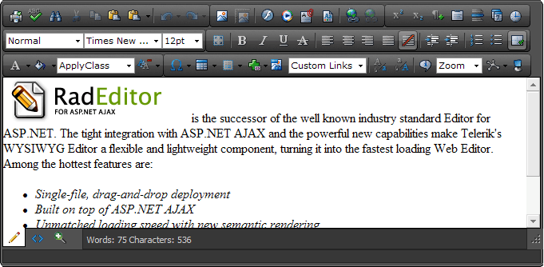

# Editor Overview

## 
>caption 

>caption 

Thank you for choosing __Telerik RadEditor for ASP.NET AJAX!____RadEditor for ASP.NET AJAX__ is the successor for the well-known industry standard Editor for ASP.NET. The tight integration with ASP.NET AJAX and powerful new capabilities of the suite features the new WYSIWYG Editor as a flexible and lightweight component, turning it into the fastest loading Web Editor. Among the hottest features are: 

* Unmatched loading speed

* Minimal script size

* New semantic rendering

* [Out-of-the-box XHTML-enabled output]()

* Industry-best cross-browser support

* [Single-file, drag-and-drop deployment]() (all editor resources, including the dialogs reside in the same DLL)

* Multilevel undo/redo with action trails

* [7 ways to paste from Word]()

* [AJAX-based file browser dialogs]()

* [Full keyboard accessibility]()

* [Flexible skinning mechanism]()

* [Simplified and intuitive toolbar configuration]()

* Ability to have editors with different skins on the same page

# See Also

 * [Overview]()

 * [RadEditor Structure]()

 * [Set Properties]()

 * [WCAG 2.0 and Section 508 Accessibility Compliance]()

 * [XHTML Compliance]()
