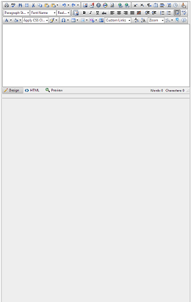
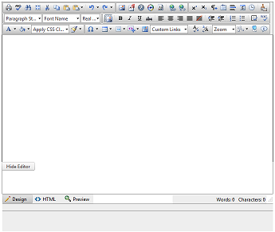

# Appearance Issues with Initially Hidden Editor

When an editor is set with an initially hidden wrapper,	its layout may appear broken when it is shown dynamically.	This article contains examples of the most common scenarios in	which similar issues occur and offers ways to resolve them.

## Common Problem

The dimensions of the Editor’s separate elements are calculated dynamically via JavaScript. This logic and the rendering of the controlare greatly depended on editor being visible. For example, the content area’s height is set after calculating the toolbar and the modules section height.

When the editor is placed in an initially hidden container and the page rendering starts, the calculation logic breaks, because the control’s	HTML elements do not have proper height. On showing the container dynamically, the height of the editor appears incorrect and in some cases	the content area is not clickable or editable (commonly described as disabled).

## Editor added with AJAX to the page in a wrapper with Visible=false

In this scenario, Telerik’s Editor is added to the page during a partial post back and its parent is notvisible initially, this is changed on the server. In this case, the layout is broken because the CSS styles of the editor are not yet loaded when the HTML is rendered, so the control does not have all its appearance rules available when it has to calculate its layout. This may cause an issue with the editor’s dimensions.

>important This issue is fixed since **2014 Q1** version of the **Telerik UI for ASP.NET AJAX** suite.	The solution to this problem is achieved by implementing a logic that verifies that the needed resources are loaded and recalculates the editor’s dimensions.
>
>This behavior may cause a small flickering, due to possible delay of CSS resources. If this causes any inconvenience	(e.g. the delay is about 3-5 sec.) with the user experience, you can try [enabling the CDN support](http://www.telerik.com/help/aspnet-ajax/stylesheetmanager-cdn-support.html) or using the workarounds from **Examples 1-3**.

>caption Figure 1: Example of the broken layout.



The workaround for this problem is to register the RadEditor’s CSS files manually on the page. For this case follow **Example 1**.

>note You should add the needed stylesheets for all child controls depending on the `ToolbarMode`. See **Example 2**.

>caption Example 1: Showing and hiding a RadEditor control dynamically via AJAX.

````ASP.NET
<html xmlns="http://www.w3.org/1999/xhtml">
	<head runat="server">
		<telerik:RadStyleSheetManager ID="SSH1" EnableStyleSheetCombine="true" runat="server">
			<StyleSheets>
				<telerik:StyleSheetReference Assembly="Telerik.Web.UI" Name="Telerik.Web.UI.Skins.Editor.css" />
				<telerik:StyleSheetReference Assembly="Telerik.Web.UI" Name="Telerik.Web.UI.Skins.Default.Editor.Default.css" />
				<telerik:StyleSheetReference Assembly="Telerik.Web.UI" Name="Telerik.Web.UI.Skins.Window.css" />
				<telerik:StyleSheetReference Assembly="Telerik.Web.UI" Name="Telerik.Web.UI.Skins.Default.Window.Default.css" />
			</StyleSheets>
		</telerik:RadStyleSheetManager>

	</head>
	<body>
		<form id="form1" runat="server">
			<telerik:RadScriptManager runat="server" ID="RadScriptManager1"></telerik:RadScriptManager>

			<asp:UpdatePanel runat="server">
				<ContentTemplate>
					<div id="wrapper" runat="server">
						<telerik:RadEditor RenderMode="Lightweight" ID="RadEditor1" runat="server">
						</telerik:RadEditor>
					</div>

					<telerik:RadButton RenderMode="Lightweight" runat="server" ID="RadButton1" Text="Show Editor" OnClick="RadButton1_Click">
					</telerik:RadButton>

				</ContentTemplate>
			</asp:UpdatePanel>
		</form>
	</body>
</html>	
````
````C#
protected void Page_Load(object sender, EventArgs e)
{
	if (!Page.IsPostBack) wrapper.Visible = false;
}
protected void RadButton1_Click(object sender, EventArgs e)
{
	wrapper.Visible = !wrapper.Visible;
}
````
````VB
Protected Sub Page_Load(sender As Object, e As EventArgs) Handles Me.Load
	If Not Page.IsPostBack Then
		wrapper.Visible = False
	End If
End Sub

Protected Sub RadButton1_Click(sender As Object, e As EventArgs)
	wrapper.Visible = Not wrapper.Visible
End Sub
````

>caption Example 2: Showing an initially hidden RadEditor with ToolbarMode=RibbonBar. It requires that the proper stylesheets get registered. This example includes a skin from the Telerik.Web.UI.Skins assembly as well.

````ASP.NET
<telerik:RadStyleSheetManager ID="SSH1" EnableStyleSheetCombine="true" runat="server">
	<StyleSheets>
		<telerik:StyleSheetReference Assembly="Telerik.Web.UI" Name="Telerik.Web.UI.Skins.EditorLite.css" />
		<telerik:StyleSheetReference Assembly="Telerik.Web.UI.Skins" Name="Telerik.Web.UI.Skins.MaterialLite.Editor.Material.css" />
		<telerik:StyleSheetReference Assembly="Telerik.Web.UI" Name="Telerik.Web.UI.Skins.RibbonBarLite.css" />
		<telerik:StyleSheetReference Assembly="Telerik.Web.UI.Skins" Name="Telerik.Web.UI.Skins.MaterialLite.RibbonBar.Material.css" />
		<telerik:StyleSheetReference Assembly="Telerik.Web.UI" Name="Telerik.Web.UI.Skins.WindowLite.css" />
		<telerik:StyleSheetReference Assembly="Telerik.Web.UI.Skins" Name="Telerik.Web.UI.Skins.MaterialLite.Window.Material.css" />
	</StyleSheets>
</telerik:RadStyleSheetManager>
<asp:UpdatePanel ID="Updatepanel1" runat="server">
	<ContentTemplate>
		<asp:Button ID="Button1" Text="show editor" runat="server" OnClick="Button1_Click" />
		<asp:Panel ID="Panel1" runat="server" Visible="false">
			<telerik:RadEditor runat="server" ID="RadEditor1" RenderMode="Lightweight" Skin="Material" ToolbarMode="RibbonBar"></telerik:RadEditor>
		</asp:Panel>
	</ContentTemplate>
</asp:UpdatePanel>
````
````C#
protected void Button1_Click(object sender, EventArgs e)
{
	Panel1.Visible = true;
}
````
````VB
Protected Sub Button1_Click(sender As Object, e As EventArgs)
	Panel1.Visible = True
End Sub
````

>caption Example 3: If the other options do not help, you can try calling the repaint() method of the editor after its resources are loaded. The example below is a stub, you should tweak it once you see if this approach helps (e.g., add timeouts or intervals and counters). You can try calling it from the browser console manually first to determine if it helps.

````JavaScript
function repaintEditors() {
	try {
		$telerik.$(".RadEditor").each(function (index, elem) {
			if (elem.control && elem.control.repaint) elem.control.repaint();
		});
	}
	catch (ex) {
		//jQuery and/or Telerik libraries are not loaded (yet)
	}
}
Sys.Application.add_load(repaintEditors);
````


## Initially Hidden Wrapper Made Visible via JavaScript

The editor is often hidden due to design requirements and shown with JavaScript. This causes the control layout being incorrect and the content area – disabled.You can examine **Figure 2**, which shows the result of the mentioned issue.

>caption Figure 2: Broken layout of the RadEditor control, due to the initial visibility of the wrapper.



To resolve this, call the **repaint()** method of the editor, after the container is shown.You can examine the exact scenario and the described solution in **Example 4**.

>caption Example 4: Showing and hiding the RadEditor control dynamically.

````ASP.NET
<div id="wrapper" style="display:none;">
	<telerik:RadEditor RenderMode="Lightweight" ID="RadEditor1" runat="server">
	</telerik:RadEditor>
</div>

<telerik:RadButton RenderMode="Lightweight" runat="server" ID="RadButton1" Text="Toggle Visibility"
	OnClientClicked="OnClientClicked" AutoPostBack="false">
</telerik:RadButton>

<script type="text/javascript">
	function OnClientClicked(sender, args) {
		var editor = $find("<%= RadEditor1.ClientID %>");
		var wrapper = $get("wrapper");
		var isEditorVisible = editor.isVisible();

		if (isEditorVisible) {
			$telerik.$(wrapper).hide(); // jQuery approach
			//wrapper.style.display = "none"; // JS approach
		} else {
			$telerik.$(wrapper).show(); // jQuery approach
			//wrapper.style.display = ""; // JS approach

			editor.repaint();
		}
	}
</script>	
````


## The RadEditor Control is Moved in the DOM

Sometimes the editor is moved in the DOM to another place to offer editing capabilities there. Due to such actions its content area appears disabled.This is happening because the editor’s functionality highly dependent on its parent elements along with the initially attached events to the editable iframe element. A common related scenario is when a [RadEditor is placed inside a RadWindow’s ContentTemplate to provide a popup editing](http://www.telerik.com/help/aspnet-ajax/window-troubleshooting-radeditor-in-radwindow.html).

To resolve this, the editor’s **onParentNodeChanged()** method must be called each timethe editor is moved into another DOM element. Working example of such a scenario is available in **Example 5**.

>caption Example 5: Moving the RadEditor in different DOM elements.

````ASP.NET
<div class="container">
	<telerik:RadEditor RenderMode="Lightweight" ID="RadEditor1" runat="server">
	</telerik:RadEditor>
	<telerik:RadButton RenderMode="Lightweight" runat="server" ID="RadButton1" Text="Move editor here" 
		AutoPostBack="false" OnClientClicked="OnClientClicked" CssClass="button"></telerik:RadButton>
</div>

<div class="container">
	<telerik:RadButton RenderMode="Lightweight" runat="server" ID="RadButton2" Text="Move editor here" 
		AutoPostBack="false" OnClientClicked="OnClientClicked" CssClass="button"></telerik:RadButton>
</div>

<script type="text/javascript">
	function OnClientClicked(sender, args) {
		var btnElement = sender.get_element();
		var editor = $find("<%= RadEditor1.ClientID %>");
		var editorElement = editor.get_element();
		var buttonsParent = btnElement.parentElement;
		var editorsParent = editorElement.parentElement;


		editorsParent.removeChild(editorElement);
		buttonsParent.insertBefore(editorElement, btnElement);

		editor.onParentNodeChanged();
	};
</script>	
````


## Using Width in Percent

Due to fluid layout requirements of the applications, the editor’s **Width** property may be set to a percentage value.This lets the control resize along with the browser window resizing. If the width becomes insufficient the editor’s height will increase and may overlay other controls on the page.

>caption Figure 3: Example of an editor that is too narrow.


The solution for this problem is to attach a handler to the resize event of the window object, which implements logic that invokes the **repaint()** method. **Example 6** provides an example of such a scenario and the workaround.

>caption Example 6: Setting the Width property in percent.

````ASP.NET
<body>
	<form id="form1" runat="server">
		<telerik:RadScriptManager ID="RadScriptManager1" runat="server">
		</telerik:RadScriptManager>

		<div style="width: 60%;">
			<telerik:RadEditor RenderMode="Lightweight" runat="server" ID="RadEditor1"
				Width="100%" OnClientLoad="OnClientLoad">
		
			</telerik:RadEditor>
		</div>

		<script type="text/javascript">
			function OnClientLoad(editor, args) {
				$telerik.addExternalHandler(window, "resize", function () {
					editor.repaint();
				});
			}
		</script>
	</form>
</body>	
````


## See Also

 * [RadEditor Object]()

 * [Getting a Reference to RadEditor]()

 * [Telerik static client library](http://www.telerik.com/help/aspnet-ajax/telerik-static-client-library.html)

 * [RadEditor Does Not Work in RadWindows](http://www.telerik.com/help/aspnet-ajax/window-troubleshooting-radeditor-in-radwindow.html)

 * [Telerik’s CDN Support Overview](http://www.telerik.com/help/aspnet-ajax/stylesheetmanager-cdn-support.html)
