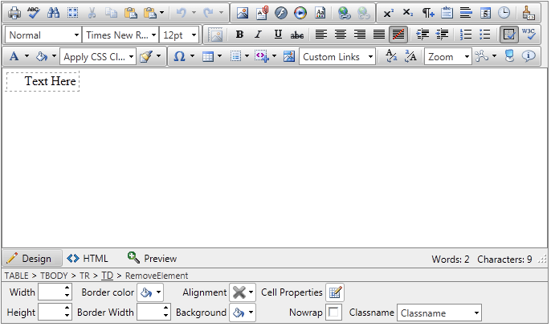

# Appearance of Undesired White Spaces in IE9

## Undesired white spaces added when pasting or deleting content into table cells

**PROBLEM**

When there is a table, placed within the HTML mode of the Editor, after switching between HTML and Design view in IE9, occasionally the content is broken down to a separate line:

````HTML
<table>
	<tbody>
		<tr>
			<td>
			Text Here</td>
		</tr>
	</tbody>
</table>
````


That leads up to undesired empty space added by the browser in the begining of the cell, caused by the white spaces between the opening `<td>` tag and the text inside the cell. The issue could be experienced in one of the following scenarios:

* Copy and paste the text inside the cell.

* Place the mouse cursor at the beginning of the cell and press Backspace.

Note, that this behavior is not connected with the RadEditor's implementation, but is a general editable iFrame issue.



**SOLUTION**

A possible solution is to render the page in IE8 mode which could be obtained by placing the following meta tag in your markup:

````HTML
<meta http-equiv="X-UA-Compatible" content="IE=EmulateIE8" />
````


