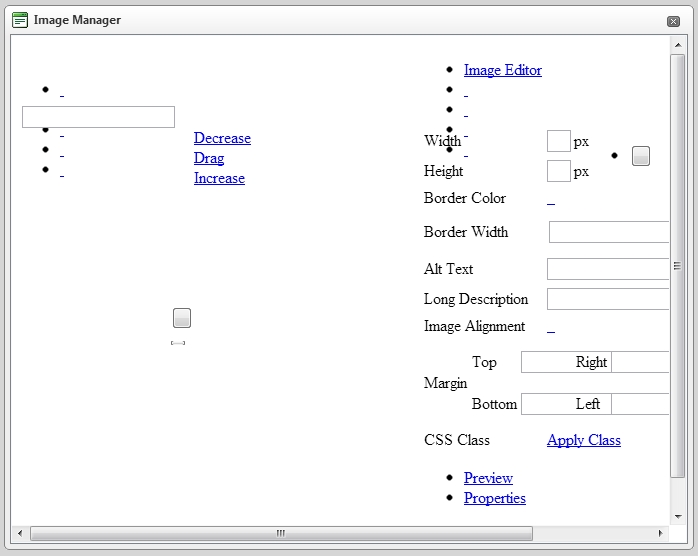

# Broken File Browser Dialogs

## Unregistered handler for RadAsyncUpload breaks the File Browser dialogs of RadEditor in Q3 2012

**PROBLEM**

If the Telerik.Web.UI.WebResource.axd handler is not registered AsyncUpload will	not function correctly and the File Browser (ImageManager, DocumentManager,	MediaManager, etc) dialogs will look in a similar way:



**SOLUTION**

To provide better File Upload experience and usability, starting from Q3 2012,	RadAsyncUpload is enabled out-of-the box in RadEditor's File Browser dialogs.	Therefore the handler for the AsyncUpload should be registered in the web.config	explicitly:

````XML
<httphandlers>
	<add path="Telerik.Web.UI.DialogHandler.aspx" type="Telerik.Web.UI.DialogHandler" verb="*" validate="false" />
	<add path="Telerik.Web.UI.WebResource.axd" type="Telerik.Web.UI.WebResource" verb="*" validate="false" />
</httphandlers>
...
<handlers>
	<add name="Telerik_Web_UI_DialogHandler_aspx" verb="*" preCondition="integratedMode" path="Telerik.Web.UI.DialogHandler.aspx" type="Telerik.Web.UI.DialogHandler" />
	<add name="Telerik_Web_UI_WebResource_axd" verb="*" preCondition="integratedMode" path="Telerik.Web.UI.WebResource.axd" type="Telerik.Web.UI.WebResource" />
</handlers>
````


Both Telerik.Web.UI.DialogHandler.aspx and Telerik.Web.UI.WebResource.axd handlers can be registered in the web.config file via the RadEditor's smart tag.
