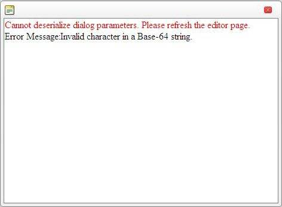

# Cannot Deserialize Dialog Parameters. Invalid character in a Base-64 string.

**Error:**

Cannot Deserialize Dialog Parameters. Invalid character in a Base-64 string.



**Solution:**

The way dialog parameters are serialized was changed due to a security issue in a previous release of the Telerik UI for ASP.NET AJAX. The parameters are now using a random key each time the application is restarted. This means that if the user leaves the page in the browser and the application is restarted, the spell dialog will stop working after that, because the encryption key has changed.

A specific encryption key could be forced for the editor/spell dialogs with the following application setting in the web.config:

You can use any combination of letters and numbers - the key has no specific format. 46 bytes is 46 characters. For example you can use **2u4kjbfoiuhtk2lh4bgl4i2gbvhjbajhbk3jhtrgkjhrtgkjf324** as a key value

````XML
<appSettings>
	<add key="Telerik.Web.UI.DialogParametersEncryptionKey" value="2C23234234D4566DC4AD6A-63D6-4db9-A3FB-3adfasd6846D"/> 
</appSettings>
````


This way the dialogs will always use the same key and the "cannot deserialize..." error will not appear even after the application is restarted.

The same workaround is used if the web application is hosted in a web farm scenario where multiple web servers are used to handle page requests.
