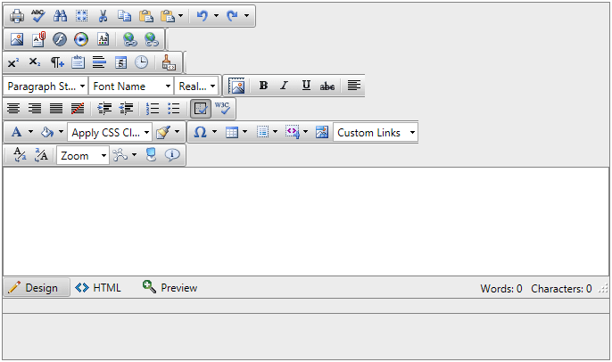

# Inner Toolbars are Displayed in Multiple Lines


## 

__PROBLEM__

RadEditor's content inherits the styles present on the page and therefore when CSS styles are applied through global selectors (tag names)the elements in the RadEditor may not have the expected rendering. For instance, if there are styles set to every unordered list on the page it would	affect the RadEditor toolbars in a similar way:

````XML
		ul { 
			float: none !important;
		} 
````


>caption 



__SOLUTION__

You could avoid this behavior by setting the default settings of the RadEditor's elements explicitly after the global selector. The example above will be fixed with the following styles:

````XML
		ul { 
			float: none !important;
		} 
		ul.reToolbar { 
			float: left !important; 
		}
````


