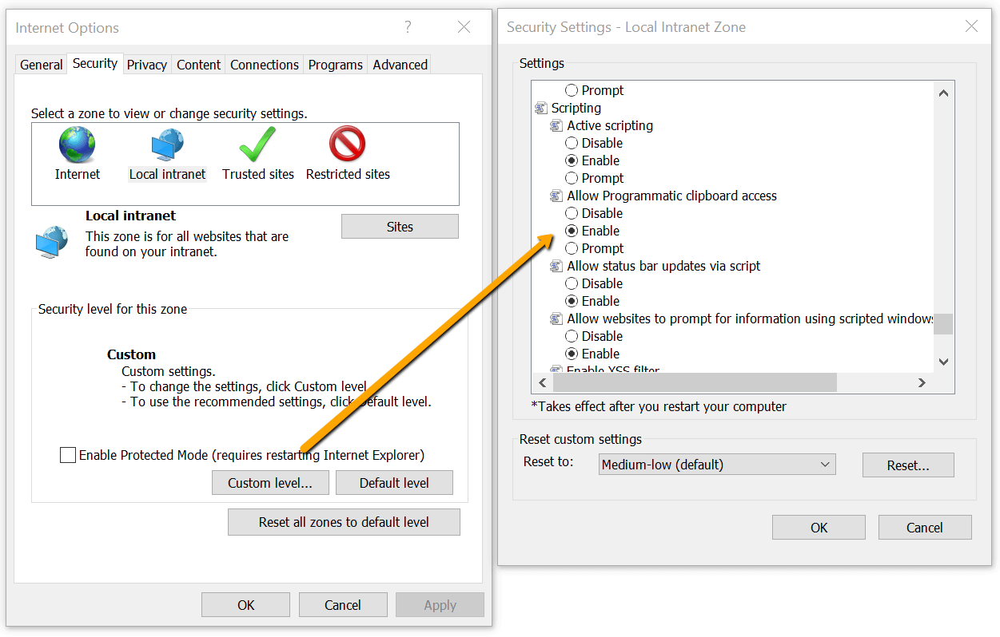

# Pasting Issues Under IE

This article lists some common problems and difficulties related to pasting in **RadEditor** using Internet Explorer.

## Nothing Is Pasted in RedEditor when Using IE

The most common reason for this problem is that the client-side programmatic access to the clipboard is disabled.

### Resolution:

Enable the programmatic clipboard access so that the built-in mechanism of **RadEditor** can properly process the content to be pasted. To do that go to Tools -> Internet Options -> Security -> Custom Level -> Allow Programmatic clipboard access as shown in the following image.

## Pasting Content from MS Word Using IE11 has Different Output Compared to Other Browsers

With IE11, pasting from MS Word is a native feature. Before **RadEditor** can processes the content, IE11 has already transformed the MS Word content to HTML. Thus, the built-in mechanisms of **RadEditor** can only receive that plain HTML content that is being pasted and does not improve it.

You can read more about how **RadEditor** handles pasting in the [Pasting Content Overview]() article.
