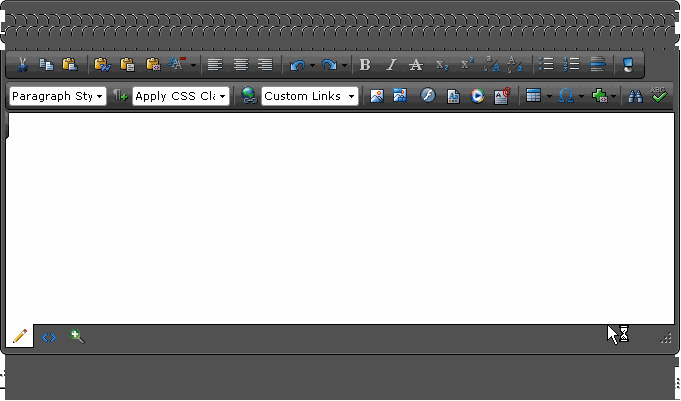

# RadEditor Display Issue in Firefox 2.0

## 

__PROBLEM__

When I view the for ASP.NET AJAX version of the RadEditor in FireFox 2.0.x.x, it has a display issue. There is a bunch of extra toolbar space appearing above the toolbars (looks like a bunch of tool bar end caps in two long rows) and there's an extra gray bar tacked on to the bottom of the editor window:
>caption 

This happens both when I install and utilize the editor myself and when I view the RadEditor on the Telerik site with FireFox.

__SOLUTION__

The problem is due to that the __Minimum Font Size__ of FireFox is set to a value different from __None__. In order to fix the problem go to :Tools -> Options -> Fonts & Colors -> Advanced -> Set the "Minimum Font Size" to None.
